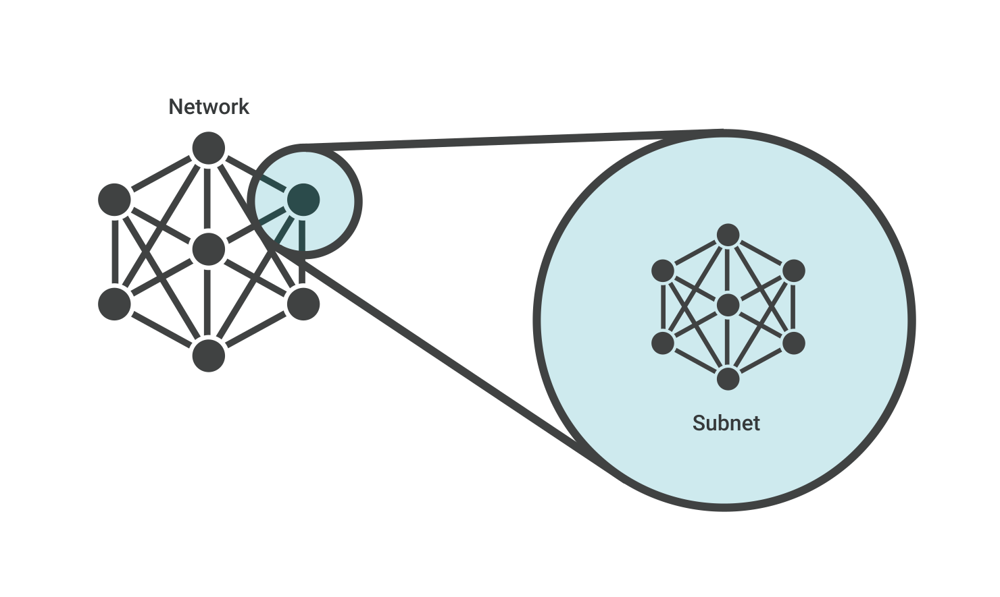

# 6.Subnets

A subnet is a range of [IP addresses](https://www.cloudflare.com/learning/dns/glossary/what-is-my-ip-address/) within a network that are reserved so that they're not available to everyone within the network, essentially dividing part of the network for private use. In a VPC these are private IP addresses that are not accessible via the public Internet, unlike typical IP addresses, which are publicly visible.

