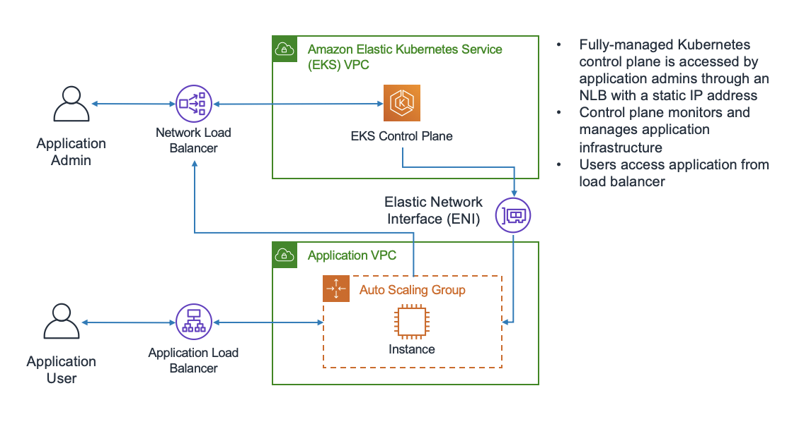

# 7.EKS

Amazon Elastic Kubernetes Service (Amazon EKS) is a fully-managed, certified Kubernetes conformant service that simplifies the process of building, securing, operating, and maintaining Kubernetes clusters on AWS. Amazon EKS integrates with core AWS services such as CloudWatch, Auto Scaling Groups, and IAM to provide a seamless experience for monitoring, scaling and load balancing your containerized applications.

