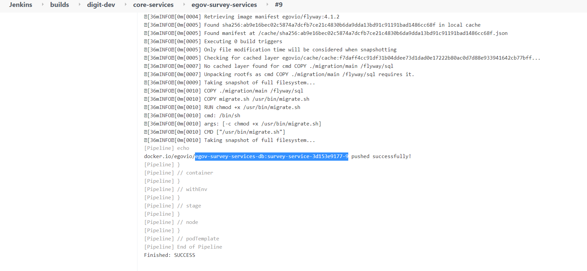
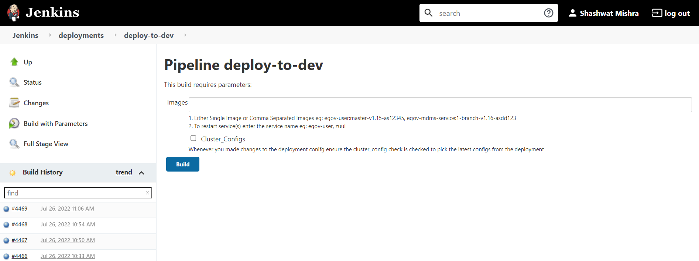

# Section 7: Build & Deploy Instructions

## Overview

Follow the instructions on this page to build and deploy applications on DIGIT.


eGov recommends [CD/CI be set up](broken-reference) before developing on top of DIGIT. This ensures that new modules can be developed and deployed in a streamlined way. DIGIT ships with CI as code as part of the DevOps repository. Run the [CI installer to setup DIGIT CD/CI](broken-reference) prior to developing on DIGIT.&#x20;


## **Steps**

**Step 1:** Add entry in build-config.yaml file in the **master** branch of the forked MDMS repository. This will set up the job pipeline in Jenkins. Make sure to also add the same config to the feature branch you are working on. Refer to this [example here](https://github.com/egovernments/DIGIT-OSS/blob/6faf040bfecdc9b023e5578adf1e8c3480c8458b/build/build-config.yml#L255).  &#x20;

**Step 2**: Follow the instructions for the [persister](section-2-integrate-persister-and-kafka/add-persister-configuration.md#deployment-of-persister-configuration), [indexer](section-5-other-advanced-integrations/add-indexer-configuration.md#deployment-of-indexer-configuration) and [PDF service ](section-5-other-advanced-integrations/certificate-generation.md#deployment-of-pdf-service)configuration.&#x20;

**Step 3:** Go to the Jenkins build page, select "Job Builder" and click on "Build now". This will pull config from build\_config.yaml and identify all modules that need to be built.&#x20;

**Step 4**: Once the build is done, go to your Jenkins build page. The service will appear under the repository path in which it has been added, i.e. if the service is added under core-services, it will show up in the core-services section on the aforementioned page.

**Step 5**: Most likely, you will be working on a feature branch for this module and not on "master". Click on "Build with parameters" for the module and search for the branch name in the filter box. Select the feature branch you are working on and then click "Build". This will make sure that Jenkins builds the module pulling code from the branch you prefer.

**Step 6:** Click on "Console Output". If the build pipeline and docker registries have been set up properly as part of CD/CI setup, the docker image will be built and pushed to the registry. The console output will have the docker image ID for the module. Scroll down to the bottom and copy the following information -&#x20;

**Step 7:** After copying the docker image ID, go to your Jenkins server home page, click on "Deployments" and scroll to find your deployment environment. Deployment environments have the template of **deploy-to-\<env name>** and get created as part of CD/CI setup. If multiple environments have been configured, you will see multiple **deploy-to-\*** entries.&#x20;

**Step 8:** It is best practice to always test out any new module in the dev environment. Select the environment you would like to deploy to and click on the "Run" icon on the right-hand side of the page against the environment. In the Images text box, paste the copied docker image ID and click "Build". Refer to the screenshot below.

Jenkins will now take care of deploying the new image to the DIGIT environment.&#x20;

**Step 9:** Test your new service by testing out the APIs via Postman.&#x20;
