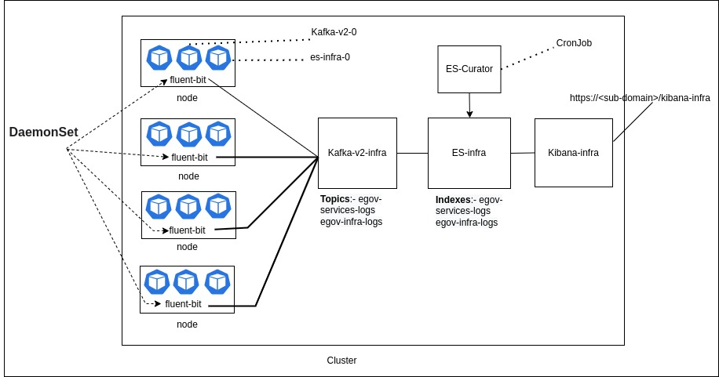

# eGov Logging Setup

## Pre-reads

Know about fluent-bit [https://github.com/fluent/fluent-bit](https://github.com/fluent/fluent-bit)\
Know about es-curator[ https://github.com/elastic/curator](https://github.com/elastic/curator)

## Pre-requisites 

* DIGIT uses [golang](https://golang.org/doc/install#download) (required v1.13.3) automated scripts to deploy the builds onto Kubernetes - [Linux](https://golang.org/dl/go1.13.3.linux-amd64.tar.gz) or [Windows](https://golang.org/dl/go1.13.3.windows-amd64.msi) or [Mac](https://golang.org/dl/go1.13.3.darwin-amd64.pkg)
* All DIGIT services are packaged using helm charts[ Installing Helm](https://helm.sh/docs/intro/install/)
* [kubectl](https://kubernetes.io/docs/tasks/tools/install-kubectl-linux/) is a CLI to connect to the kubernetes cluster from your machine
* [Install Visualstudio](https://code.visualstudio.com/download) IDE Code for better code/configuration editing capabilities
* Git

### Logging Architecture:

<figure><figcaption>
Logging Architecture Dig
</figcaption></figure>

### Logging Deployment Steps:

1.  Clone the following [DIGIT-DevOps](https://github.com/egovernments/DIGIT-DevOps) repo (If not already done as part of Infra setup), you may need to [install git](https://docs.github.com/en/github/creating-cloning-and-archiving-repositories/cloning-a-repository-from-github/cloning-a-repository) and then run [git clone](https://docs.github.com/en/github/creating-cloning-and-archiving-repositories/cloning-a-repository-from-github/cloning-a-repository) it to your machine.

    `git clone -b release https://github.com/egovernments/DIGIT-DevOps`
2. Implement the kafka-v2-infra and elastic search infra setup into the existing cluster
3.  Deploy the fluent-bit, kafka-connect-infra, and es-curator into your cluster, either using Jenkins deployment Jobs or go lang deployer&#x20;

    `go run main.go deploy -e <environment_name> 'fluent-bit,kafka-connect-infra,es-curator`'
4. Create Elasticsearch Service Sink Connector. You can run the below command in playground pods, make sure curl is installed before running any curl commands
   1. Delete the Kafka infra sink connector if already exists with the Kafka connection, using the below command
      1.  Use the below command to check Kafka infra sink connector

          `curl http://kafka-connect-infra.kafka-cluster:8083/connectors/`
      2.  To delete the connector

          `curl -X DELETE http://kafka-connect-infra.kafka-cluster:8083/connectors/egov-services-logs-to-es`
   2.  The Kafka Connect Elasticsearch Service Sink connector moves data from Kafka-v2-infra to Elasticsearch infra. It writes data from a topic in  Kafka-v2-infra to an index in Elasticsearch infra.

       `curl -X POST http://kafka-connect-infra.kafka-cluster:8083/connectors/ -H 'Content-Type: application/json' -H 'Cookie: SESSIONID=f1349448-761e-4ebc-a8bb-f6799e756185' -H 'Postman-Token: adabf0e8-0599-4ac9-a591-920586ff4d50' -H 'cache-control: no-cache' -d '{ "name": "egov-services-logs-to-es", "config": { "connector.class": "io.confluent.connect.elasticsearch.ElasticsearchSinkConnector", "connection.url": "http://elasticsearch-data-infra-v1.es-cluster-infra:9200", "type.name": "general", "topics": "egov-services-logs", "key.ignore": "true", "schema.ignore": true, "value.converter.schemas.enable": false, "key.converter": "org.apache.kafka.connect.storage.StringConverter", "value.converter": "org.apache.kafka.connect.json.JsonConverter", "transforms": "TopicNameRouter", "transforms.TopicNameRouter.type": "org.apache.kafka.connect.transforms.RegexRouter", "transforms.TopicNameRouter.regex": ".*", "transforms.TopicNameRouter.replacement": "egov-services-logs", "batch.size": 50, "max.buffered.records": 500, "flush.timeout.ms": 600000, "retry.backoff.ms": 5000, "read.timout.ms": 10000, "linger.ms": 100, "max.in.flight.requests": 2, "errors.log.enable": true, "errors.deadletterqueue.topic.name": "egov-services-logs-to-es-failed", "tasks.max": 1 } }'`
   3.  You can verify sink Connector by using the below command

       `curl http://kafka-connect-infra.kafka-cluster:8083/connectors/`
5.  Deploy the kibana-infra to query the elasticseach infra egov-services-logs indexes data.&#x20;

    `go run main.go deploy -e <environment_name> 'kibana-infra'`
6. `You can access the logging to https://<sub-domain_name>/kibana-infra`

### Troubleshooting:

1. If the data is not receiving to elasticsearch infra's egov-services-logs index from kafka-v2-infra topic egov-services-logs.
   1.  Ensure that the elasticsearch sink connector is available, use the below command to check

       `curl http://kafka-connect-infra.kafka-cluster:8083/connectors/`
   2.  Also, make sure kafka-connect-infra is running without errors

       `kubectl logs -f deployments/kafka-connect-infra -n kafka-cluster`
   3. Ensure elasticsearch infra is running without errors
2.  In the event that none of the above services are having issues, take a look at the fluent-bit logs and restart it if necessary.

