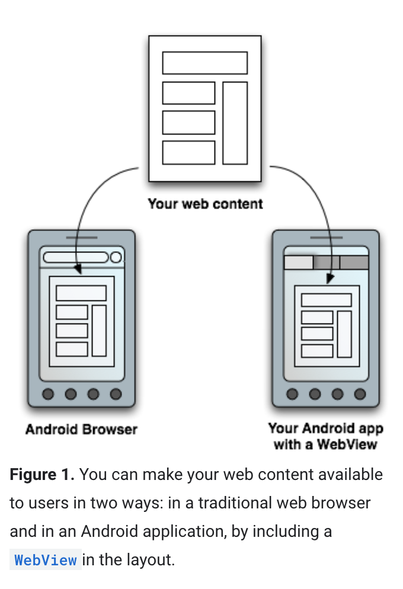
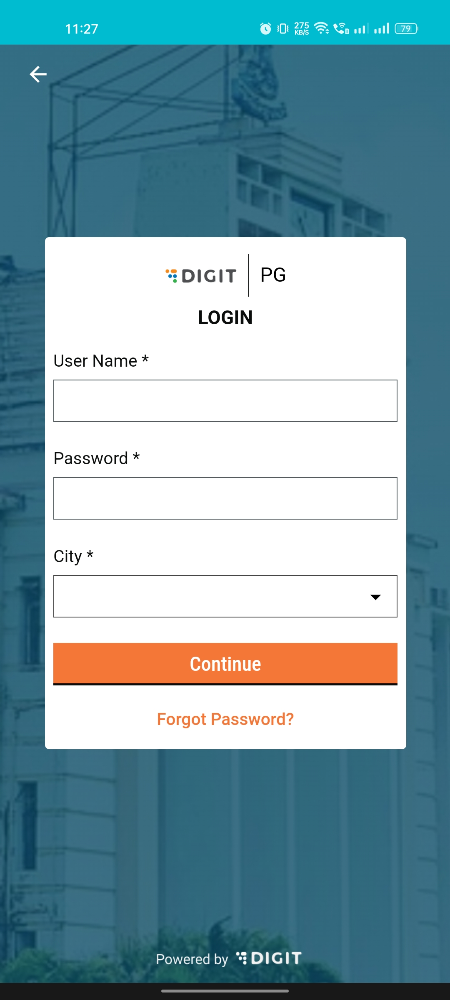
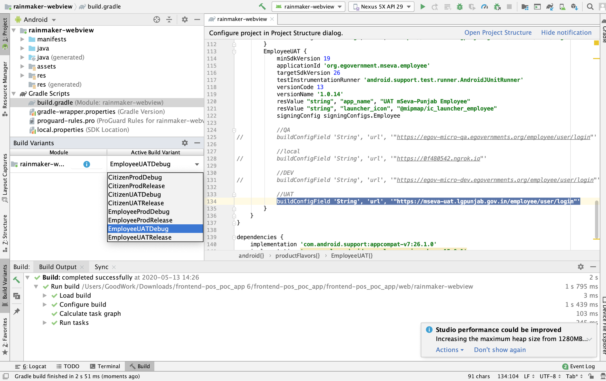
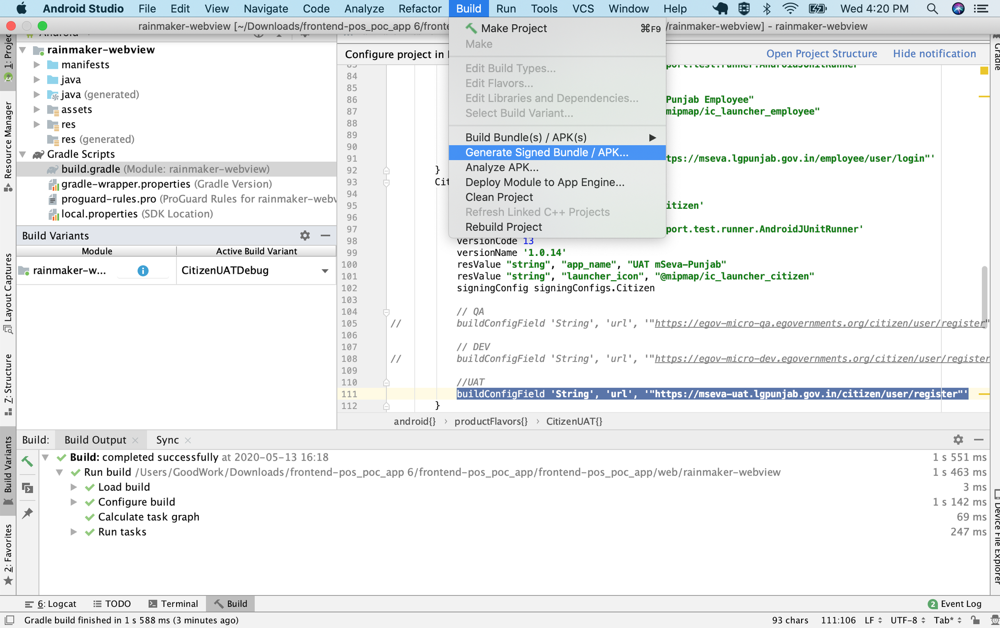
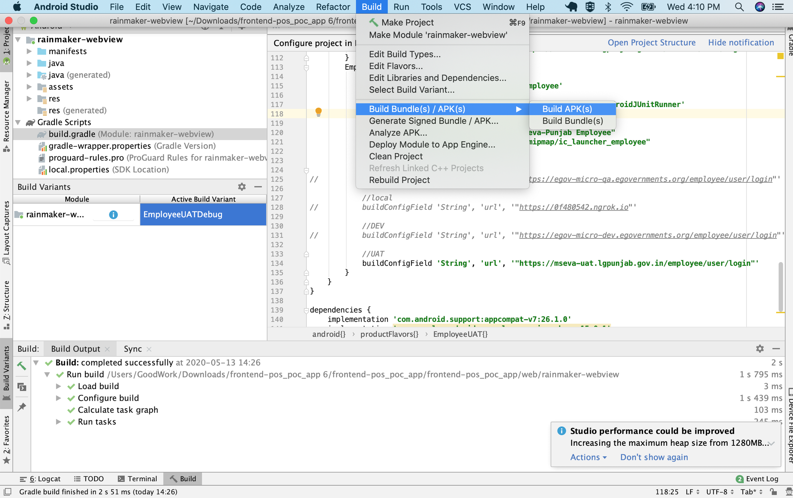
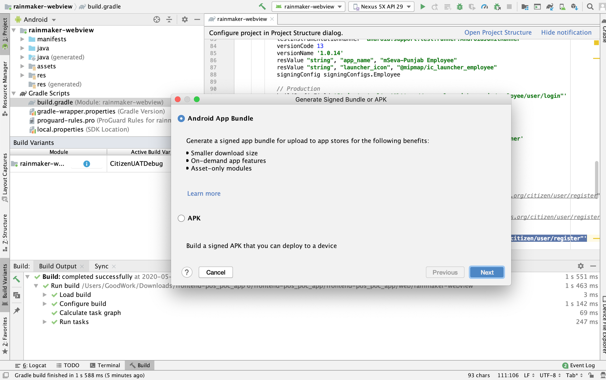
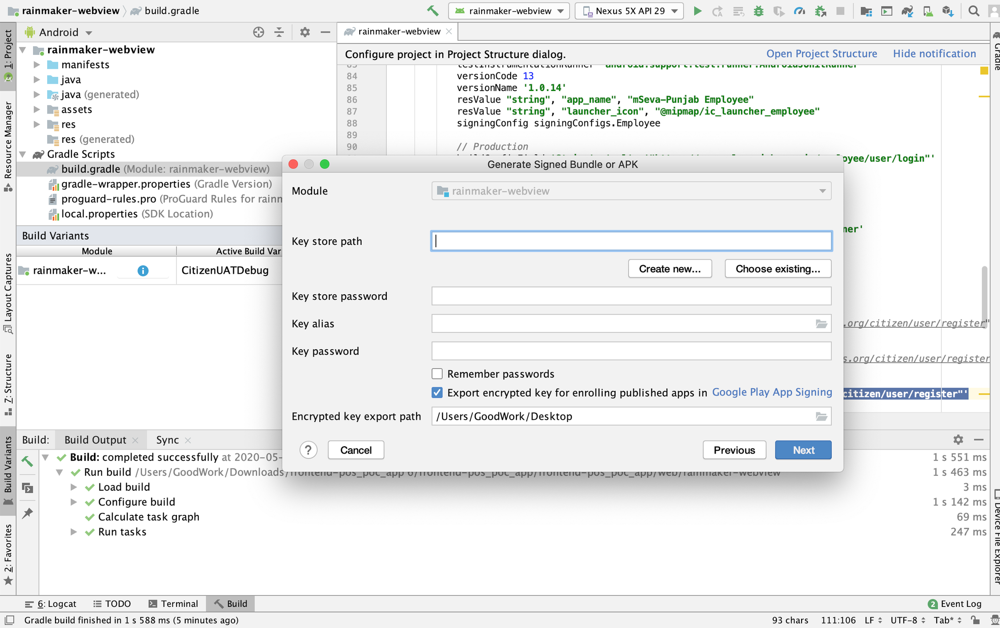

# Android Web View & How To Generate APK

## Overview

This document will help us to generate the APK for Citizen and Employee applications.

## Steps

### 1. Android Web View 

Android offers a variety of ways to present content to a user. To provide a user experience that’s consistent with the rest of the platform, it’s usually best to build a native app that incorporates framework-provided experiences, such as [Android App Links](https://developer.android.com/training/app-links) or [Search](https://developer.android.com/guide/topics/search). Additionally, you can use Google Play-based experiences, such as [App Actions](https://developer.android.com/guide/actions) and [Slices](https://developer.android.com/guide/slices), where Google Play services are available. Some apps, however, may need increased control over the UI. In this case, a `WebView` is a good option for displaying trusted first-party content.

<figure><figcaption></figcaption></figure>

In Egov we will create only a responsive web app, we will not create native apps(Android, IOS), we just use the Android web view to render the out web application

<figure><figcaption></figcaption></figure>

### 2. Generate APK For Citizen & Employee Applications 

1. Clone the [GitHub - egovernments/DIGIT-OSS: eGov Foundation's Open source repository of the DIGIT](https://github.com/egovernments/DIGIT-OSS) repo.
2. Open the below location in the [Android studio](https://developer.android.com/studio)



<figure><figcaption></figcaption></figure>

**Generating APK for citizen application**

1. Go to build. Gradle file there we have created multiple environments(UAT and PROD), please select the environment where you want to generate APK and put your web application URL.
2.  update the web application URL as required Application URL.

    `buildConfigField 'String', 'url', '"https://uat.digit.org/citizen/user/register"'`

    also, specify the citizen gateway hostname if not using Mastercard,

    `buildConfigField 'String', 'gatewayHost', '"migs.mastercard.co.in"'`

<figure><figcaption></figcaption></figure>

3\. Save the file on, the left side of the Android studio click Build variants, and select build variant.

<figure><figcaption></figcaption></figure>

4\. Click on **Build** menu, select **Build APK(s)** submenu.

<figure><figcaption></figcaption></figure>

It will take some time to generate and it will show generated location.

**Generating APK for employee application**

1\. Go to build. Gradle file there we have created multiple environments (UAT and PROD), please select the environment where you want to generate APK and put your web application URL.

<figure><figcaption></figcaption></figure>

2\. Save the file, left side of the android studio click Build variants, and select build variant.

<figure><figcaption></figcaption></figure>

3\. Click on the build menu, and select Build APK(s) submenu.

<figure><figcaption></figcaption></figure>

It will take some time to generate and it will show generated location.

### 3. Generate APK For Production 

1. Follow the 3rd and 4th steps mentioned above.
2. Then, Click on the **Build** menu, and select **Generate Signed Bundle / APK**.

<figure><figcaption></figcaption></figure>

Select 1st radio button - **Android App Bundle**

<figure><figcaption></figcaption></figure>

2\. Enter the all information presented in the form, and click on next.

<figure><figcaption></figcaption></figure>

3\. Upload the APK generated by the 4th step and upload it to the play store.

[How to debug android app using Chrome browser](https://digit-discuss.atlassian.net/wiki/spaces/DD/pages/2285273121)
