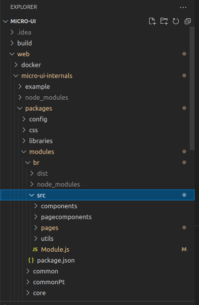

# Project Structure


Download the UI code from the link here [Birth-Registration. ](https://github.com/egovernments/DIGIT-Dev/tree/Birth\_registration)Follow the steps detailed in this doc.


## **Create Project Structure**

* [x] Go to `micro-ui--internals → packages → modules`.&#x20;
* [x] Inside the module, create a folder and provide a name for the service. For instance, the service name here is birth registration.&#x20;
* [x] Create folder `br` (you can give any name).
* [x] Add the package.json to the created folder. Mention the module name and other dependencies here.

```
{
    "name": "@egovernments/digit-ui-module-br",
    "version": "1.5.4",
    "license": "MIT",
    "description": "Birth Registration Module",
    "main": "dist/index.js",
    "module": "dist/index.modern.js",
    "source": "src/Module.js",
    "files": [
      "dist"
    ],
    "scripts": {
      "start": "microbundle-crl watch --no-compress --format modern,cjs",
      "build": "microbundle-crl --no-compress --format modern,cjs",
      "prepublish": "yarn build"
    },
    "peerDependencies": {
      "react": "17.0.2",
      "react-router-dom": "5.3.0"
    },
    "dependencies": {
      "@egovernments/digit-ui-libraries": "1.5.4",
      "@egovernments/digit-ui-react-components": "1.5.4",
      "lodash.merge": "^4.6.2",
      "react": "17.0.2",
      "react-dom": "17.0.2",
      "react-hook-form": "6.15.8",
      "react-i18next": "11.16.2",
      "react-query": "3.6.1",
      "react-redux": "7.2.8",
      "react-router-dom": "5.3.0",
      "react-table": "7.7.0",
      "redux": "4.1.2",
      "redux-thunk": "2.4.1"
    }
  }
  

```

* [x] After creating the package.json for birth registration, the project structure (as seen in the image below) is created.

<figure><figcaption></figcaption></figure>

[\_\_](http://creativecommons.org/licenses/by/4.0/)_All content on this website by_ [_eGov Foundation_ ](https://egov.org.in/)_is licensed under a_ [_Creative Commons Attribution 4.0 International License_](http://creativecommons.org/licenses/by/4.0/)_._
