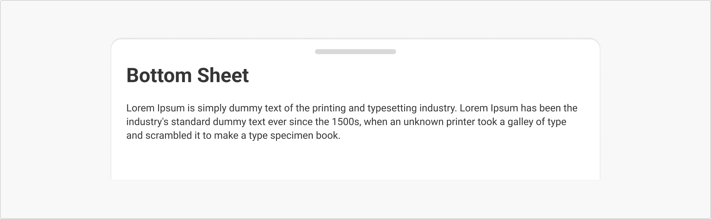

# Bottom Sheet

The Bottom Sheet is a flexible, slide-up container designed to provide supplementary content or actions without disrupting the main screen. It supports modular interactions like previews, confirmations, or micro-tasks, enhancing task efficiency and reducing navigational depth.

<figure><figcaption></figcaption></figure>



```
// Sample code

<BottomSheet
  actions={[
    <Button key="1" label="Cancel" variation="secondary"/>,
    <Button key="2" label="Submit"/>
  ]}
  className=""
  enableActions
  initialState="closed"
  style={{}}
>
  <AlertCard
    label="Info"
    populators={{
      name: 'alertcard'
    }}
    text="Application process will take a minute to complete. It might cost around Rs.500/- to Rs.1000/- to clean your septic tank and you can expect the service to get completed in 24 hrs from the time of payment."
    variant="default"
  />
  
  <AlertCard
    label="Info"
    populators={{
      name: 'alertcard'
    }}
    text="Application process will take a minute to complete. It might cost around Rs.500/- to Rs.1000/- to clean your septic tank and you can expect the service to get completed in 24 hrs from the time of payment."
    variant="default"
  />
</BottomSheet>
```



```
// Sample code

DigitAccordion(
              header: Text('Accordion'),
              content: Text('This is the content of Accordion'),
              initiallyExpanded: false,
              divider: true,
              showBorder: true,
            ),
```







## Anatomy

<figure><figcaption></figcaption></figure>

## Variants

***

<table data-header-hidden><thead><tr><th width="321"></th><th></th></tr></thead><tbody><tr><td><div><figure><figcaption></figcaption></figure></div></td><td><p><strong>Default</strong></p><p>A simple bottom sheet layout with a header, short description, and optional content. Best used for lightweight contextual information.</p></td></tr><tr><td><div><figure><figcaption></figcaption></figure></div></td><td><strong>With Actions</strong><br>Includes one or more action buttons at the bottom of the sheet, useful for tasks like confirming selections, saving changes, or proceeding to next steps.</td></tr><tr><td><div><figure><figcaption></figcaption></figure></div></td><td><p><strong>Custom</strong></p><p>Fully customizable content area with additional elements like images, forms, or dynamic content blocks. Ideal for detailed workflows or input-heavy interactions.</p></td></tr></tbody></table>

## Properties

<table data-header-hidden data-full-width="false"><thead><tr><th></th><th></th></tr></thead><tbody><tr><td><strong>Drag Enabled</strong><br>A draggable indicator allows users to pull the bottom sheet up or down, enabling smooth expand/collapse interactions on touch or mobile interfaces.<br></td><td><div><figure><figcaption></figcaption></figure></div></td></tr><tr><td><strong>Additional Widgets</strong><br>Supports the inclusion of elements like icons, images, forms, toggles, or dropdowns, depending on context and user need.</td><td><div><figure><figcaption></figcaption></figure></div></td></tr><tr><td><p><strong>Custom Height</strong></p><p>Allows for variable height adjustments based on content needs, either fixed height or auto-adjusting to fit dynamic content gracefully.</p></td><td><div><figure><figcaption></figcaption></figure></div></td></tr></tbody></table>

## Property Configuration Table

Each design component offers a range of configurable options. These options are intentionally platform-agnostic, allowing implementations to adapt and tailor them to align with the specific requirements of the chosen framework.



<table><thead><tr><th width="257">Property</th><th>Value</th><th>Default</th></tr></thead><tbody><tr><td>children</td><td>text</td><td>-</td></tr><tr><td>initialState</td><td>text</td><td>-</td></tr><tr><td>enableActions</td><td>yes/no</td><td>no</td></tr><tr><td>actions</td><td>yes/no</td><td>no</td></tr><tr><td>equalWidthButtons</td><td>number</td><td>-</td></tr><tr><td>className</td><td>yes/no</td><td>no</td></tr><tr><td>style</td><td>yes/no</td><td>no</td></tr></tbody></table>



<table><thead><tr><th>Property</th><th width="209">Value</th><th>Default</th></tr></thead><tbody><tr><td>Title</td><td>String</td><td>required(if header is not passed)</td></tr><tr><td>Number</td><td>double</td><td>-</td></tr><tr><td>Icon</td><td>Icon widget</td><td>-</td></tr><tr><td>header</td><td>Widget</td><td>-</td></tr><tr><td>content</td><td>Widget</td><td>required</td></tr><tr><td>divider</td><td>bool</td><td>false</td></tr><tr><td>initiallyExpanded</td><td>bool</td><td>false</td></tr><tr><td>showBorder</td><td>bool</td><td>false</td></tr><tr><td>onToggle</td><td>VoidCallBack Function</td><td>-</td></tr></tbody></table>



## Usage Guide

***

| <div><figure><figcaption></figcaption></figure></div> | <p><strong>Use for Mobile-Friendly Overlays</strong></p><p>Use the Bottom Sheet for short interactions like selecting options, viewing summaries, or executing simple actions.

Don’t use it for full-length forms or detailed multi-step tasks—use a full modal or side panel instead.</p> |
| --------------------------------------------------------------------------------------------------------------------- | ------------------------------------------------------------------------------------------------------------------------------------------------------------------------------------------------------------------------------------------------------------------------------------------- |
| <div><figure><figcaption></figcaption></figure></div> |                                                                                                                                                                                                                                                                                             |

## Change log

***

| Date         | Number  | Notes                                                                                           |
| ------------ | ------- | ----------------------------------------------------------------------------------------------- |
| Dec 15, 2024 | v-0.0.2 | <p>This component is added to the website.<br>This component is now individually versioned.</p> |

## Design Checklist

***

<table data-header-hidden><thead><tr><th width="129" data-type="checkbox"></th><th></th></tr></thead><tbody><tr><td>true</td><td><strong>All interactive states</strong> - Includes all interactive states that are applicable (hover, down, focus, keyboard focus, disabled).</td></tr><tr><td>true</td><td><strong>Accessible use of colours</strong> - Colour is not used as the only visual means of conveying information (WCAG 2.1 1.4.1)</td></tr><tr><td>true</td><td><strong>Accessible contrast for text</strong> - Text has a contrast ratio of at least 4.5:1 for small text and at least 3:1 for large text (WCAG 2.0 1.4.3).</td></tr><tr><td>true</td><td><strong>Accessible contrast for UI components</strong> - Visual information required to identify components and states (except inactive components) has a contrast ratio of at least 3:1 (WCAG 2.1 1.4.11).</td></tr><tr><td>true</td><td><strong>Keyboard interactions</strong> - Includes all interactive states that are applicable (hover, down, focus, keyboard focus, disabled).</td></tr><tr><td>false</td><td><strong>Screen reader accessible</strong> - All content, including headings, labels, and descriptions, is meaningful, concise, contextual and accessible by screen readers.</td></tr><tr><td>true</td><td><strong>Responsive for all breakpoints</strong> - Responsiveness for 3 breakpoints - Mobile, Tablet and Desktop</td></tr><tr><td>true</td><td><strong>Usage guidelines</strong> - Includes a list of dos and don'ts that highlight best practices and common mistakes.</td></tr><tr><td>false</td><td><strong>Content guidelines</strong> - Content standards and usage guidelines for writing and formatting in-product content for the component.</td></tr><tr><td>true</td><td><strong>Defined variants and properties</strong> - Includes relevant variants and properties (style, size, orientation, optional iconography, decorative elements, selection states, error states, etc.)</td></tr><tr><td>true</td><td><strong>Defined behaviours</strong> - Guidelines for keyboard navigation and focus, layout management (including wrapping, truncation, and overflow), animations, and user interactions.</td></tr><tr><td>true</td><td><strong>Design Kit</strong> - Access to the design file for the component in Figma, multiple options, states, colour themes, and platform scales.</td></tr></tbody></table>
