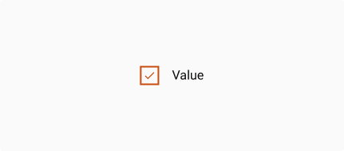
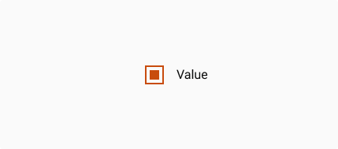
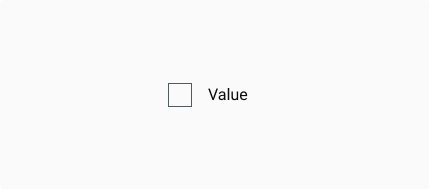
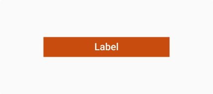
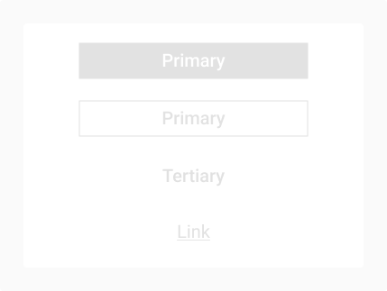
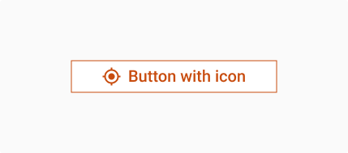
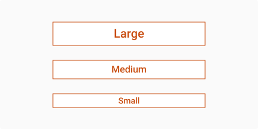
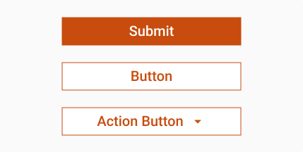
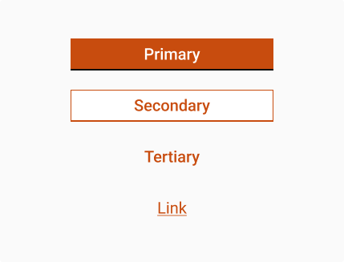
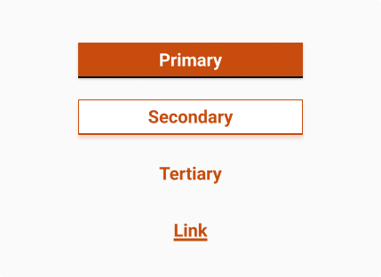

# Timeline

The Checkbox is a simple selection control that allows users to make binary choices, such as selecting or deselecting options. It is commonly used in forms, preference settings, and multi-select scenarios, providing clear visual feedback for user actions.

<figure><figcaption></figcaption></figure>



```
// Sample code

<Timeline
  additionalElements={[
    <div key="1">Lorem Ipsum is simply dummy text of the printing and typesetting industry. Lorem Ipsum has been the industry's</div>,
    <Button label="Click on the link" type="button" variation="link"/>,
    ,
    ,
    ,
    ,
    ,
    ,
    ,
    <Button icon="MyLocation" label="Button" type="button"/>,
    <Button icon="MyLocation" isSuffix label="Button" type="button" variation="secondary"/>
  ]}
  initialVisibleAdditionalElementsCount={8}
  label="Inprogress"
  showConnector
  subElements={[
    '26 / 03 / 2024',
    '11:00 PM',
    '26 / 03 / 2024 11:00 PM',
    '26 / 03 / 2024 11:00 PM Mon',
    '+91 **********'
  ]}
  variant="inprogress"
/>
```



```
// Sample code

DigitTimeline(
          currentStep: TimelineStepState.present,
          label: 'Ongoing state,
          description: const ['18 / 02 / 2025'],
        );
```







## Anatomy

***

<figure><figcaption></figcaption></figure>

## Variants

***

<table data-header-hidden><thead><tr><th width="321"></th><th></th></tr></thead><tbody><tr><td></td><td><p>Checked</p><p>The checked state indicates that the user has actively selected the option. It provides clear visual feedback with a filled checkbox, often accompanied by a checkmark. This state should be used when an option is explicitly chosen or enabled by default.</p></td></tr><tr><td></td><td><strong>Intermediate</strong><br>The indeterminate state represents a mixed selection, typically used for parent checkboxes in multi-select scenarios. It visually signals that only some child options are selected, rather than all. This state does not appear by direct user interaction but is controlled programmatically to reflect partial selections.</td></tr><tr><td></td><td><p><strong>Unchecked</strong></p><p>The unchecked state indicates that the option is not selected. It appears as an empty checkbox, providing a clear visual cue that no action has been taken. This is the default state unless specified otherwise.</p></td></tr></tbody></table>

## Properties

<table data-header-hidden data-full-width="false"><thead><tr><th></th><th></th></tr></thead><tbody><tr><td><strong>Label</strong><br>This property represents the text displayed inside the button. It is a required field and helps users understand the action that the button will trigger. The label should be concise and clear to communicate the button’s purpose effectively.<br></td><td></td></tr><tr><td><strong>Disabled</strong><br>The “isDisabled” property disables the button, preventing any user interaction. It also applies a disabled visual style (like graying out the button) to indicate that the button is not active.</td><td></td></tr><tr><td><strong>Icon</strong><br>The icon property specifies the name of the icon to be rendered inside the button. This helps provide a visual cue along with the button text. The icon placement can be either before or after the label based on the how the “Prefix” and “Suffix” properties are defined.</td><td></td></tr><tr><td><strong>Size</strong><br>The size property specifies the size of the button. You can choose between "large", "medium", and "small" to adjust the button's height and font size.</td><td></td></tr><tr><td><strong>Type</strong><br>The type property determines the HTML type attribute for the button, such as "submit", "button", or "actionButton". This is useful for form submission or defining button behavior in HTML forms.</td><td></td></tr></tbody></table>

## Property Configuration Table

Each design component offers a range of configurable options. These options are intentionally platform-agnostic, allowing implementations to adapt and tailor them to align with the specific requirements of the chosen framework.



<table><thead><tr><th width="313">Property</th><th>Value</th><th>Default</th></tr></thead><tbody><tr><td>label</td><td>string</td><td>-</td></tr><tr><td>subElements</td><td>array</td><td>-</td></tr><tr><td>variant</td><td>string</td><td>-</td></tr><tr><td>viewDetailsLabel</td><td>string</td><td>-</td></tr><tr><td>hideDetailsLabel</td><td>string</td><td>-</td></tr><tr><td>additionalElements</td><td>array</td><td>-</td></tr><tr><td>inline</td><td>boolean</td><td>-</td></tr><tr><td>indivdualElementStyles</td><td>object</td><td>{}</td></tr><tr><td>showConnector</td><td>boolean</td><td>-</td></tr><tr><td>className</td><td>string</td><td>-</td></tr><tr><td>isLastStep</td><td>boolean</td><td>-</td></tr><tr><td>isNextActiveStep</td><td>boolean</td><td>-</td></tr><tr><td>showDefaultValueForDate</td><td>boolean</td><td>-</td></tr><tr><td>isError</td><td>boolean</td><td>-</td></tr><tr><td>initialVisibleAdditionalElementsCount</td><td>number</td><td>-</td></tr></tbody></table>



<table><thead><tr><th>Property</th><th width="209">Value</th><th>Default</th></tr></thead><tbody><tr><td>lable</td><td>String</td><td>required</td></tr><tr><td>description</td><td>List&#x3C;String></td><td>-</td></tr><tr><td>currentStep</td><td>TimelineStep</td><td>-</td></tr><tr><td>additionalWidgets</td><td>List&#x3C;Widget></td><td>-</td></tr><tr><td>additionalHideWidgets</td><td>List&#x3C;Widget></td><td>-</td></tr><tr><td>capitalizedLetter</td><td>bool</td><td>false</td></tr><tr><td>isLastStep</td><td>bool</td><td>false</td></tr><tr><td>viewDetailText</td><td>string</td><td>-</td></tr><tr><td>hideDetailText</td><td>string</td><td>-</td></tr></tbody></table>



## Interaction State

***

|  | <p><strong>Hover State</strong></p><p>When a user hovers over the button, a visual cue is added to emphasize interactivity. This is achieved by introducing a subtle line below the button. The line appears as a clean, horizontal underline that complements the button's style, without overwhelming the design. The hover state enhances the button's affordance, guiding users and improving interactivity without altering the button’s primary layout or design.</p> |
| ----------------------------------------------------- | --------------------------------------------------------------------------------------------------------------------------------------------------------------------------------------------------------------------------------------------------------------------------------------------------------------------------------------------------------------------------------------------------------------------------------------------------------------------------- |
|  | <p><strong>Mousedown State</strong></p><p>The Mouse Down state of the button represents the moment when the user clicks and holds the button. This state provides immediate feedback to the user, confirming that their interaction has been registered. The text label becomes bolder, emphasizing the active interaction</p>                                                                                                                                              |

## Usage Guide

***

| .jpeg>) | <p><strong>Use for compact information display</strong></p><p>Organise dense or hierarchical content like FAQs, step-by-step instructions</p> |
| -------------------------------------------------------------------------------------------------- | --------------------------------------------------------------------------------------------------------------------------------------------- |
|                                                                                                    |                                                                                                                                               |
|                                                                                                    |                                                                                                                                               |

## Change log

***

| Date | Number | Notes |
| ---- | ------ | ----- |
|      |        |       |
|      |        |       |
|      |        |       |

## Design Checklist

***

<table data-header-hidden><thead><tr><th width="129" data-type="checkbox"></th><th></th></tr></thead><tbody><tr><td>true</td><td>All interactive states</td></tr><tr><td>true</td><td>Accessible use of colours</td></tr><tr><td>true</td><td>Accessible contrast for text</td></tr><tr><td>true</td><td>Accessible contrast for UI components</td></tr><tr><td>true</td><td>Keyboard interactions</td></tr></tbody></table>
