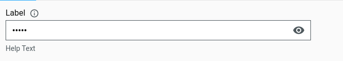
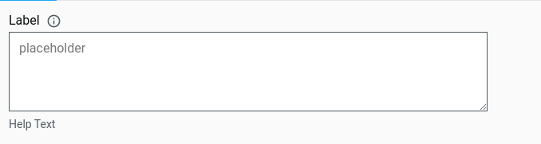
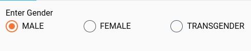
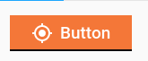

# Digit UI Core React Components

## **Introduction** <a href="#yy16fmgmik0e" id="yy16fmgmik0e"></a>

This document details the essential modifications needed in the modules for smooth integration of components from the "components-core" package. It offers precise guidelines on utilizing FormComposerV2 and InboxSearchComposer, along with updates made in the configs.

Topics covered:

* [Overview](digit-ui-core-react-components.md#xoaiwtanhl6r)
* Prerequisites
* Changes
* Example Configs
* Modifications to the Project Module
* Conclusion

### **Overview** <a href="#xoaiwtanhl6r" id="xoaiwtanhl6r"></a>

In the components-core package, several enhancements have been implemented to improve code clarity and address issues related to pixel inconsistencies. Previously, there were challenges associated with pixel-based sizing, leading to inconsistencies across different devices and screen resolutions. To mitigate this, the codebase has been updated to utilize rems as the primary unit of measurement. This transition to rems offers several advantages over pixels, including improved scalability and responsiveness across various viewport sizes.

By adopting rems, the components' styling is now more consistent and adaptable, providing a seamless user experience across different platforms and devices.

Furthermore, the components, namely TextInput, TextArea, Radio, Button, Checkbox, Toggle, Dropdown, Multiselectdropdown, InfoCard, and Toast, now offer different variants. Adding variants for these components makes them more flexible, serving a wider range of purposes and meeting different design needs effectively.

These are some of the updations made in the components-core package.

<table><thead><tr><th width="154">Atom</th><th width="210">Variants</th><th>State</th></tr></thead><tbody><tr><td>TextInput</td><td><p>Text</p><p>Date</p><p>Time</p><p>Geolocation</p><p>Numeric</p><p>Prefix</p><p>Suffix</p><p>Password</p><p>Search</p></td><td><p>Default</p><p>Filled</p><p>Disabled</p><p>NonEditable</p><p>Focus</p><p>Error</p><p>Label</p><p>Character Count</p><p>Inner Label</p><p>Info</p><p>Help Text/ Description</p></td></tr><tr><td>TextArea</td><td></td><td><p>Default</p><p>Filled</p><p>Disabled</p><p>NonEditable</p><p>Focus</p><p>Error</p><p>Label</p><p>Character Count</p><p>Inner Label</p><p>Info</p><p>Help Text/ Description</p><p>resizeSmart</p></td></tr><tr><td>Radio</td><td>Radio Selection</td><td><p>Default</p><p>Disabled</p><p>Selected</p><p>PreSelected</p></td></tr><tr><td>Toggle</td><td>Toggle</td><td><p>Default</p><p>Disabled</p><p>Selected</p><p>PreSelected</p></td></tr><tr><td>Button</td><td><p>Primary</p><p>Secondary</p><p>Teritiary</p><p>Link</p></td><td><p>Active</p><p>Disabled</p><p>Label</p><p>Interactions</p></td></tr><tr><td>Dropdown</td><td><p>Default</p><p>Nested</p><p>Tree select</p><p>Profile</p><p>Profile with nested text</p><p>Nested Text</p></td><td><p>Default</p><p>Disabled</p><p>Selected</p><p>Interactions</p></td></tr><tr><td>MultiSelect Dropdown</td><td><p>Default</p><p>Nested</p><p>Tree Multiselect</p><p>Nested Text Multiselect</p></td><td><p>Default</p><p>Disabled</p><p>Selected</p><p>Interactions</p></td></tr><tr><td>Checkbox</td><td><p>Default</p><p>Checked</p></td><td><p>Active</p><p>Disabled</p><p>Label</p><p>Interactions</p></td></tr><tr><td>Toast</td><td><p>Success</p><p>Warning</p><p>Failure</p></td><td></td></tr><tr><td>Info Card</td><td><p>Default</p><p>Success</p><p>Warning</p><p>Error</p></td><td></td></tr></tbody></table>

## **Install - Steps** <a href="#jzh2thqrkpa1" id="jzh2thqrkpa1"></a>

To install:

```
npm install -save @egovernments/digit-ui-components-core
```

Add the dependency in the frontend/micro-ui/web/package.json

```
"@egovernments/digit-ui-components-core":"0.0.1"
```

## **Apply** <a href="#obzg60wefrmr" id="obzg60wefrmr"></a>

Syntax for importing any components:

```
import {TextInput, Dropdown} from "@egovernenets/digit-ui-components-core"
```

Syntax for importing FormComposerV2:

```
import {FormComposerV2} from "@egovernenets/digit-ui-components-core"
```

```
<React.Fragment>
<Header >{t("CREATE_HEADER")}</Header>
<FormComposerV2
label={t("PROCEED")}
config={configs.map((config) => {
return {
...config,
body: config.body.filter((a) => !a.hideInEmployee),
};
})}
defaultValues={sessionFormData}
onFormValueChange={onFormValueChange}
onSubmit={onFormSubmit}
/>
</React.Fragment>
```

### **Example Configs** <a href="#ihbe789miobx" id="ihbe789miobx"></a>

#### **Config for TextInput Component (using FormComposerV2)** <a href="#id-1mwkh8rij8gt" id="id-1mwkh8rij8gt"></a>

**Type: text**

```
{
inline:true,
label:"Example",
placeholder:"Enter Text"
isMandatory: true,
type:"text",
disable:false,
nonEditable:false,
infoMessage:"Sample info message"
description:"Help Text"
charCount:true,
withoutLabel:false,
populators:{
name:"defaultText",
error:"Error Message",
validation:{minLength:2, maxLength:10},
customIcon:"DownloadIcon",
onIconSelection:{(e)=>{console.log("clicked");}}
prefix:"$",
suffix:"$",
wrapLabel:true
}
}
```

Below are the details for the type: text:

<table><thead><tr><th width="229">Label</th><th>Label for text field</th></tr></thead><tbody><tr><td>placeholder</td><td>Placeholder for the text field</td></tr><tr><td>isMandatory</td><td>Whether field is mandatory or not</td></tr><tr><td>disable</td><td>To disable the text field (no interaction will be possible if disabled)</td></tr><tr><td>nonEditable</td><td>To make text field readOnly</td></tr><tr><td>infoMessage</td><td>Information to be shown when hovered on the info icon beside the label</td></tr><tr><td>description</td><td>Help text for the text field</td></tr><tr><td>charCount</td><td>Number of characters in the input value</td></tr><tr><td>withoutLabel</td><td>Default will be false, if sent as true then label won't be shown</td></tr><tr><td>populators</td><td><p>Name : Mandatory field</p><p>Error : Error message to be shown</p><p>Validations: if required like maxlength, minlength etc</p><p>customIcon: to show any icon inside the text field (can be sent as a string)</p><p>onIconSelection: IconSelection function</p><p>Prefix: To show prefix</p><p>Suffix: to show suffix</p></td></tr><tr><td>wrapLabel</td><td>Can wrap label to the next line in desktop and tablet screens</td></tr></tbody></table>

**Example Usage of TextInput Component**

```
<TextInput
type="text"
disabled={false}
populators={{customIcon: "MyLocation"}
onIconSelection={()=>{console.log("selected")}
></TextInput>
```


For more information: [StoryBook for Text Input field](https://unified-dev.digit.org/storybook/?path=/story/atom-groups-inputfield--default)

**Type: date**

| <p><strong>{</strong><br><strong>label:"ExampleDate",</strong><br><strong>placeholder:"dd/mm/yyyy"</strong><br><strong>isMandatory: true,</strong><br><strong>type:"date",</strong><br><strong>disable:false,</strong><br><strong>nonEditable:false,</strong><br><strong>infoMessage:"Sample info message"</strong><br><strong>description:"Help Text"</strong><br><strong>charCount:true,</strong><br><strong>withoutLabel:false,</strong><br><strong>populators:{</strong><br><strong>name:"defaultDate",</strong><br><strong>error:"Error Message",</strong></p><p><strong>editableDate:true</strong><br><strong>}</strong><br><strong>}</strong></p> |
| -------------------------------------------------------------------------------------------------------------------------------------------------------------------------------------------------------------------------------------------------------------------------------------------------------------------------------------------------------------------------------------------------------------------------------------------------------------------------------------------------------------------------------------------------------------------------------------------------------------------------------------------------------- |

Usually date can be selected from the date chart, if editableDate is sent as true then date can be editable without using date chart else it cannot be.


For more information: [StoryBook for date field](https://unified-dev.digit.org/storybook/?path=/story/atom-groups-inputfield--default\&args=type:date)

**Type: time**

| <p><strong>{</strong><br><strong>label:"ExampleTime",</strong><br><strong>placeholder:"placeholder"</strong><br><strong>isMandatory: true,</strong><br><strong>type:"time",</strong><br><strong>disable:false,</strong><br><strong>nonEditable:false,</strong><br><strong>infoMessage:"Sample info message"</strong><br><strong>description:"Help Text"</strong><br><strong>charCount:true,</strong><br><strong>withoutLabel:false,</strong><br><strong>populators:{</strong><br><strong>name:"defaultTime",</strong><br><strong>error:"Error Message",</strong></p><p><strong>editableTime:true</strong><br><strong>}</strong><br><strong>}</strong></p> |
| --------------------------------------------------------------------------------------------------------------------------------------------------------------------------------------------------------------------------------------------------------------------------------------------------------------------------------------------------------------------------------------------------------------------------------------------------------------------------------------------------------------------------------------------------------------------------------------------------------------------------------------------------------- |

Usually time can be selected from the time chart, if editableTime is sent as true then time can be editable without using a time chart else it cannot be..png>)

For more information: [StoryBook for time field](https://unified-dev.digit.org/storybook/?path=/story/atom-groups-inputfield--default\&args=type:time)

**Type: geolocation**

| <p><strong>{</strong><br><strong>label:"ExampleGeolocation",</strong><br><strong>placeholder:"placeholder"</strong><br><strong>isMandatory: true,</strong><br><strong>type:"geolocation",</strong><br><strong>disable:false,</strong><br><strong>nonEditable:false,</strong><br><strong>infoMessage:"Sample info message"</strong><br><strong>description:"Help Text"</strong><br><strong>charCount:true,</strong><br><strong>withoutLabel:false,</strong><br><strong>populators:{</strong><br><strong>name:"defaultGeolocation",</strong><br><strong>error:"Error Message",</strong></p><p><strong>onIconSelection:{(e)=>{console.log(“clicked”);}}</strong></p><p><strong>}</strong><br><strong>}</strong></p> |
| ---------------------------------------------------------------------------------------------------------------------------------------------------------------------------------------------------------------------------------------------------------------------------------------------------------------------------------------------------------------------------------------------------------------------------------------------------------------------------------------------------------------------------------------------------------------------------------------------------------------------------------------------------------------------------------------------------------------- |

If the onIconSelection function is sent then that will be called when the geolocation icon is clicked. Else by default location details will be captured.


For more information: [StoryBook for Geolocation field](https://unified-dev.digit.org/storybook/?path=/story/atom-groups-inputfield--default\&args=type:geolocation)

**Type: numeric**

| <p><strong>{</strong><br><strong>label:"ExampleNumeric",</strong><br><strong>placeholder:"placeholder"</strong><br><strong>isMandatory: true,</strong><br><strong>type:"numeric",</strong><br><strong>disable:false,</strong><br><strong>nonEditable:false,</strong><br><strong>infoMessage:"Sample info message"</strong><br><strong>description:"Help Text"</strong><br><strong>charCount:true,</strong><br><strong>withoutLabel:false,</strong><br><strong>populators:{</strong><br><strong>name:"defaultGeolocation",</strong><br><strong>error:"Error Message",</strong></p><p><strong>},</strong></p><p><strong>config:{step:””}</strong><br><strong>}</strong></p> |
| ------------------------------------------------------------------------------------------------------------------------------------------------------------------------------------------------------------------------------------------------------------------------------------------------------------------------------------------------------------------------------------------------------------------------------------------------------------------------------------------------------------------------------------------------------------------------------------------------------------------------------------------------------------------------- |

Numeric value by default increases and decreases by step value 1.

But it can be configured using the step value sent as prop in the config.

.png>)

For more information: [StoryBook for Numeric field](https://unified-dev.digit.org/storybook/?path=/story/atom-groups-inputfield--default\&args=type:numeric)

**With Prefix and Suffix**

| <p><strong>{</strong><br><strong>label:"ExamplePrefix",</strong><br><strong>placeholder:"placeholder"</strong><br><strong>isMandatory: true,</strong><br><strong>type:"text",</strong><br><strong>disable:false,</strong><br><strong>nonEditable:false,</strong><br><strong>infoMessage:"Sample info message"</strong><br><strong>description:"Help Text"</strong><br><strong>charCount:true,</strong><br><strong>withoutLabel:false,</strong><br><strong>populators:{</strong><br><strong>name:"defaultText",</strong><br><strong>error:"Error Message",</strong></p><p><strong>prefix:”+91”</strong></p><p><strong>},</strong><br><strong>}</strong></p> |
| ---------------------------------------------------------------------------------------------------------------------------------------------------------------------------------------------------------------------------------------------------------------------------------------------------------------------------------------------------------------------------------------------------------------------------------------------------------------------------------------------------------------------------------------------------------------------------------------------------------------------------------------------------------- |

.png>)

| <p><strong>{</strong><br><strong>label:"ExampleSuffix",</strong><br><strong>placeholder:"placeholder"</strong><br><strong>isMandatory: true,</strong><br><strong>type:"text",</strong><br><strong>disable:false,</strong><br><strong>nonEditable:false,</strong><br><strong>infoMessage:"Sample info message"</strong><br><strong>description:"Help Text"</strong><br><strong>charCount:true,</strong><br><strong>withoutLabel:false,</strong><br><strong>populators:{</strong><br><strong>name:"defaultText",</strong><br><strong>error:"Error Message",</strong></p><p><strong>suffix:”Kg”</strong></p><p><strong>},</strong><br><strong>}</strong></p> |
| --------------------------------------------------------------------------------------------------------------------------------------------------------------------------------------------------------------------------------------------------------------------------------------------------------------------------------------------------------------------------------------------------------------------------------------------------------------------------------------------------------------------------------------------------------------------------------------------------------------------------------------------------------- |


**Type: password**

| <p><strong>{</strong><br><strong>label:"ExamplePassword",</strong><br><strong>placeholder:"placeholder"</strong><br><strong>isMandatory: true,</strong><br><strong>type:"password",</strong><br><strong>disable:false,</strong><br><strong>nonEditable:false,</strong><br><strong>infoMessage:"Sample info message"</strong><br><strong>description:"Help Text"</strong><br><strong>charCount:true,</strong><br><strong>withoutLabel:false,</strong><br><strong>populators:{</strong><br><strong>name:"defaultText",</strong><br><strong>error:"Error Message",</strong></p><p><strong>},</strong><br><strong>}</strong></p> |
| ---------------------------------------------------------------------------------------------------------------------------------------------------------------------------------------------------------------------------------------------------------------------------------------------------------------------------------------------------------------------------------------------------------------------------------------------------------------------------------------------------------------------------------------------------------------------------------------------------------------------------- |

 

For more information: [Storybook for password field](https://unified-dev.digit.org/storybook/?path=/story/atom-groups-inputfield--default\&args=type:numeric)

**Type: search**

| <p><strong>{</strong><br><strong>label:"ExampleSearch",</strong><br><strong>placeholder:"placeholder"</strong><br><strong>isMandatory: true,</strong><br><strong>type:"search",</strong><br><strong>disable:false,</strong><br><strong>nonEditable:false,</strong><br><strong>infoMessage:"Sample info message"</strong><br><strong>description:"Help Text"</strong><br><strong>charCount:true,</strong><br><strong>withoutLabel:false,</strong><br><strong>populators:{</strong><br><strong>name:"defaultSearch",</strong><br><strong>error:"Error Message",</strong></p><p><strong>onIconSelection:{(e)=>{console.log(“clicked”);}}</strong></p><p><strong>}</strong><br><strong>}</strong></p> |
| ------------------------------------------------------------------------------------------------------------------------------------------------------------------------------------------------------------------------------------------------------------------------------------------------------------------------------------------------------------------------------------------------------------------------------------------------------------------------------------------------------------------------------------------------------------------------------------------------------------------------------------------------------------------------------------------------- |


For more information: [Storybook for serach field](https://unified-dev.digit.org/storybook/?path=/story/atom-groups-inputfield--default\&args=type:search)

#### **Config for TextArea Component (using FormComposerV2)**  <a href="#gxsd3529bja3" id="gxsd3529bja3"></a>

| <p><strong>{</strong><br><strong>label:"ExampleTextArea",</strong><br><strong>placeholder:"placeholder"</strong><br><strong>isMandatory: true,</strong><br><strong>type:"textarea",</strong><br><strong>disable:false,</strong><br><strong>nonEditable:false,</strong><br><strong>infoMessage:"Sample info message"</strong><br><strong>description:"Help Text"</strong><br><strong>charCount:true,</strong><br><strong>withoutLabel:false,</strong><br><strong>populators:{</strong><br><strong>name:"defaultSearch",</strong><br><strong>error:"Error Message",</strong></p><p><strong>resizeSmart: false,</strong></p><p><strong>}</strong><br><strong>}</strong></p> |
| ------------------------------------------------------------------------------------------------------------------------------------------------------------------------------------------------------------------------------------------------------------------------------------------------------------------------------------------------------------------------------------------------------------------------------------------------------------------------------------------------------------------------------------------------------------------------------------------------------------------------------------------------------------------------ |

There are two variants for the textarea , one which has resize option and the other is resizeSmart which increases the height automatically based on the content present inside.



For more information : [Storybook for TextArea](https://unified-dev.digit.org/storybook/?path=/story/atom-groups-inputfield--default\&args=type:textarea)

#### **Config for Radio Component (using FormComposerV2)**  <a href="#f5cx7rg1qwba" id="f5cx7rg1qwba"></a>

| <p><strong>{</strong><br><strong>isMandatory: false,</strong><br><strong>type: "radio",</strong><br><strong>key: "genders",</strong><br><strong>label: "Deafult",</strong><br><strong>disable: false,</strong><br><strong>populators: {</strong><br><strong>name: "radio-Deafult",</strong><br><strong>optionsKey: "name",</strong><br><strong>error: "Error!",</strong><br><strong>required: true,</strong><br><strong>mdmsConfig: {</strong><br><strong>masterName: "GenderType",</strong><br><strong>moduleName: "common-masters",</strong><br><strong>localePrefix: "COMMON_GENDER",</strong><br><strong>},</strong><br><strong>},</strong><br><strong>}</strong></p> |
| ------------------------------------------------------------------------------------------------------------------------------------------------------------------------------------------------------------------------------------------------------------------------------------------------------------------------------------------------------------------------------------------------------------------------------------------------------------------------------------------------------------------------------------------------------------------------------------------------------------------------------------------------------------------------- |



| <p><strong>{</strong><br><strong>isMandatory: false,</strong><br><strong>key: "priority",</strong><br><strong>type: "radio",</strong><br><strong>label: "Default-2",</strong><br><strong>disable: false,</strong><br><strong>populators: {</strong><br><strong>name: "radio-Default-2",</strong><br><strong>optionsKey: "name",</strong><br><strong>error: "Error!",</strong><br><strong>required: false,</strong><br><strong>options: [</strong><br><strong>{</strong><br><strong>code: "1",</strong><br><strong>name: "P1",</strong><br><strong>},</strong><br><strong>{</strong><br><strong>code: "2",</strong><br><strong>name: "P2",</strong><br><strong>},</strong><br><strong>{</strong><br><strong>code: "3",</strong><br><strong>name: "P3",</strong><br><strong>},</strong><br><strong>],</strong><br><strong>},</strong><br><strong>}</strong></p> |
| ------------------------------------------------------------------------------------------------------------------------------------------------------------------------------------------------------------------------------------------------------------------------------------------------------------------------------------------------------------------------------------------------------------------------------------------------------------------------------------------------------------------------------------------------------------------------------------------------------------------------------------------------------------------------------------------------------------------------------------------------------------------------------------------------------------------------------------------------------------- |

While using radio component independently, and want to make is disable send the prop as disabled={true}

For more information: [Storybook for radio field](https://unified-dev.digit.org/storybook/?path=/story/atom-groups-radiofield--default)

#### **Config for Toggle Component (using FormComposerV2):** <a href="#id-77ohd4ewu8zs" id="id-77ohd4ewu8zs"></a>

| <p><strong>{</strong><br><strong>isMandatory: false,</strong><br><strong>key: "toggle",</strong><br><strong>type: "toggle",</strong><br><strong>label: "Default",</strong><br><strong>disable: false,</strong><br><strong>populators: {</strong><br><strong>name: "toggle-Default",</strong><br><strong>optionsKey: "name",</strong><br><strong>error: "Error!",</strong><br><strong>required: false,</strong><br><strong>options: [</strong><br><strong>{</strong><br><strong>code: "1",</strong><br><strong>name: "Toggle1",</strong><br><strong>},</strong><br><strong>{</strong><br><strong>code: "2",</strong><br><strong>name: "Toggle2",</strong><br><strong>},</strong><br><strong>{</strong><br><strong>code: "3",</strong><br><strong>name: "Toggle3",</strong><br><strong>},</strong><br><strong>],</strong><br><strong>},</strong><br><strong>}</strong></p> |
| ------------------------------------------------------------------------------------------------------------------------------------------------------------------------------------------------------------------------------------------------------------------------------------------------------------------------------------------------------------------------------------------------------------------------------------------------------------------------------------------------------------------------------------------------------------------------------------------------------------------------------------------------------------------------------------------------------------------------------------------------------------------------------------------------------------------------------------------------------------------------ |

.png>)

For more information: [StoryBook for toggle field](https://unified-dev.digit.org/storybook/?path=/story/atom-groups-togglefield--default)

#### **Usage of Button Component:** <a href="#id-6hwdxa6yactk" id="id-6hwdxa6yactk"></a>

**Primary Variant:**

| <p><strong>&#x3C;Button</strong><br><strong>variation="primary"</strong><br><strong>label={"Primary"}</strong><br><strong>type="button"</strong><br><strong>icon="MyLocation"</strong><br><strong>isSuffix={false}</strong><br><strong>isDisabled={false}</strong><br><strong>/></strong></p> |
| --------------------------------------------------------------------------------------------------------------------------------------------------------------------------------------------------------------------------------------------------------------------------------------------- |



**Secondary Variant:**

| <p><strong>&#x3C;Button</strong><br><strong>variation="secondary"</strong><br><strong>label={"Secondary"}</strong><br><strong>type="button"</strong><br><strong>icon="MyLocation"</strong><br><strong>isSuffix={false}</strong><br><strong>isDisabled={false}</strong><br><strong>/></strong></p> |
| ------------------------------------------------------------------------------------------------------------------------------------------------------------------------------------------------------------------------------------------------------------------------------------------------- |


**Teritiary Variant:**

| <p><strong>&#x3C;Button</strong><br><strong>variation="teritiary"</strong><br><strong>label={"Teritiary"}</strong><br><strong>type="button"</strong><br><strong>icon="MyLocation"</strong><br><strong>isSuffix={false}</strong><br><strong>isDisabled={false}</strong><br><strong>/></strong></p> |
| ------------------------------------------------------------------------------------------------------------------------------------------------------------------------------------------------------------------------------------------------------------------------------------------------- |


**Link Variant:**

| <p><strong>&#x3C;Button</strong><br><strong>variation="link"</strong><br><strong>label={"Link"}</strong><br><strong>type="button"</strong><br><strong>icon="MyLocation"</strong><br><strong>isSuffix={false}</strong><br><strong>isDisabled={false}</strong><br><strong>/></strong></p> |
| --------------------------------------------------------------------------------------------------------------------------------------------------------------------------------------------------------------------------------------------------------------------------------------- |


Usually icons can be sent as a string, added before the label. But if you want to add it as a suffix then isSuffix can be sent as true.

For more information: [StoryBook for button components](https://unified-dev.digit.org/storybook/?path=/story/atom-groups-buttonfield--primary)

#### **Config for Checkbox Component (using FormComposerV2) :**  <a href="#hoqgfvm6xrz1" id="hoqgfvm6xrz1"></a>

| <p><strong>{</strong><br><strong>inline:true,</strong><br><strong>isMandatory: true,</strong><br><strong>type:"checkbox",</strong><br><strong>disable:false,</strong><br><strong>withoutLabel:true,</strong><br><strong>populators:{</strong><br><strong>name:"checkbox",</strong><br><strong>error:"Error Message",</strong></p><p><strong>title:”Checkbox Label”,</strong></p><p><strong>isLabelFirst: false,</strong></p><p><strong>}</strong><br><strong>}</strong></p> |
| --------------------------------------------------------------------------------------------------------------------------------------------------------------------------------------------------------------------------------------------------------------------------------------------------------------------------------------------------------------------------------------------------------------------------------------------------------------------------- |

Usually the checkbox will be shown before the label, but it can be configured using isLabelFirst.

For more information: [Storybook for checkbox field](https://unified-dev.digit.org/storybook/?path=/story/atom-groups-checkboxfield--default)

#### **Usage of Toast Component (using FormComposerV2) :**  <a href="#z9xnle6d7qbw" id="z9xnle6d7qbw"></a>

**Success Toast**

| <p><strong>&#x3C;Toast</strong><br><strong>label={"Success Toast Message"}</strong><br><strong>onClose={}</strong><br><strong>transitionTime={}</strong><br><strong>/></strong></p> |
| ----------------------------------------------------------------------------------------------------------------------------------------------------------------------------------- |


**Warning Toast**

| <p><strong>&#x3C;Toast</strong><br><strong>label={"Warning Toast Message"}</strong></p><p><strong>warning={“warning”}</strong></p><p><strong>onClose={}</strong><br><strong>transitionTime={}</strong><br><strong>/></strong></p> |
| --------------------------------------------------------------------------------------------------------------------------------------------------------------------------------------------------------------------------------- |


**Error Toast**

| <p><strong>&#x3C;Toast</strong><br><strong>label={"Error Toast Message"}</strong></p><p><strong>error={true}</strong></p><p><strong>onClose={}</strong><br><strong>transitionTime={}</strong><br><strong>/></strong></p> |
| ------------------------------------------------------------------------------------------------------------------------------------------------------------------------------------------------------------------------ |


The default transitionTime for any variant of toast will be 5 seconds, but that can be configurable using the transitionTime prop (in milliseconds)

For more information: [Storybook for Toast](https://unified-dev.digit.org/storybook/?path=/story/atom-groups-toast--success-toast)

#### **Config for Dropdown Component (using FormComposerV2) :**  <a href="#id-3bsz0jtw0iwh" id="id-3bsz0jtw0iwh"></a>

**Simple Dropdown**

| <p><strong>{</strong><br><strong>isMandatory: false,</strong><br><strong>type: "dropdown",</strong><br><strong>key: "genders",</strong><br><strong>label: "With Icons",</strong><br><strong>disable: false,</strong><br><strong>populators: {</strong><br><strong>name: "dropdown-WIth Icons",</strong><br><strong>optionsKey: "name",</strong><br><strong>error: "",</strong><br><strong>required: true,</strong><br><strong>showIcon: true,</strong><br><strong>isSearchable:true,</strong><br><strong>options: [</strong><br><strong>{</strong><br><strong>code: "1",</strong><br><strong>name: "Option1",</strong><br><strong>icon: "Article",</strong><br><strong>},</strong><br><strong>{</strong><br><strong>code: "2",</strong><br><strong>name: "Option2",</strong><br><strong>icon: "Article",</strong><br><strong>},</strong><br><strong>{</strong><br><strong>code: "3",</strong><br><strong>name: "Option3",</strong><br><strong>icon: "Article",</strong><br><strong>},</strong><br><strong>],</strong><br><strong>}</strong><br><strong>}</strong></p> |
| --------------------------------------------------------------------------------------------------------------------------------------------------------------------------------------------------------------------------------------------------------------------------------------------------------------------------------------------------------------------------------------------------------------------------------------------------------------------------------------------------------------------------------------------------------------------------------------------------------------------------------------------------------------------------------------------------------------------------------------------------------------------------------------------------------------------------------------------------------------------------------------------------------------------------------------------------------------------------------------------------------------------------------------------------------------------- |

We can show icons beside each and every option, for that we need to send the showIcon prop as true and also send the icons as a string along with the options.

Usually dropdown will be searchable, but can be configured using the isSearchable prop.

After selecting any option and to clear it ,clear the option and click enter.


For more information: [StoryBook for simple dropdown](https://unified-dev.digit.org/storybook/?path=/story/atom-groups-dropdownfield--dropdown-with-icons)

**Nested Dropdown**

| <p><strong>{</strong><br><strong>isMandatory: false,</strong><br><strong>type: "dropdown",</strong><br><strong>key: "genders",</strong><br><strong>label: "With Icons",</strong><br><strong>disable: false,</strong><br><strong>variant: "nesteddropdown",</strong><br><strong>populators: {</strong><br><strong>name: "nesteddropdown-With Icons",</strong><br><strong>optionsKey: "name",</strong><br><strong>error: "",</strong><br><strong>required: true,</strong><br><strong>showIcon:true,</strong><br><strong>isSearchable:true,</strong><br><strong>options: [</strong><br><strong>{</strong><br><strong>name: "Category A",</strong><br><strong>options: [</strong><br><strong>{ code: "Category A.Option A", name: "Option A", icon: "Article" },</strong><br><strong>{ code: "Category A.Option B", name: "Option B", icon: "Article" },</strong><br><strong>{ code: "Category A.Option C", name: "Option C", icon: "Article" },</strong><br><strong>],</strong><br><strong>code: "Category A",</strong><br><strong>},</strong><br><strong>{</strong><br><strong>name: "Category B",</strong><br><strong>options: [</strong><br><strong>{ code: "Category B.Option A", name: "Option A", icon: "Article" },</strong><br><strong>{ code: "Category B.Option 2", name: "Option 2", icon: "Article" },</strong><br><strong>{ code: "Category B.Option 3", name: "Option 3", icon: "Article" },</strong><br><strong>],</strong><br><strong>code: "Category B",</strong><br><strong>},</strong><br><strong>],</strong><br><strong>},</strong><br><strong>}</strong></p> |
| ------------------------------------------------------------------------------------------------------------------------------------------------------------------------------------------------------------------------------------------------------------------------------------------------------------------------------------------------------------------------------------------------------------------------------------------------------------------------------------------------------------------------------------------------------------------------------------------------------------------------------------------------------------------------------------------------------------------------------------------------------------------------------------------------------------------------------------------------------------------------------------------------------------------------------------------------------------------------------------------------------------------------------------------------------------------------------------------------------------------------------------------------------------------------------------------------------------------------------------------------------------------------------------------------------------------------------------------------------------------------------------------------------------------------------------------------------------------------------------------------------------------------------------------------------------------------------ |

For the type dropdown, and variant “nesteddropdown” , options can be sent like the above config.

Icons are not mandatory, but if required can be sent like this.

While searching for any option, the results will be based on the main Category names.

For more information: [Storybook for nesteddropdown varinat](https://unified-dev.digit.org/storybook/?path=/story/atom-groups-dropdownfield--nested-dropdown-with-icons)

**Tree Dropdown**

| <p><strong>{</strong><br><strong>isMandatory: false,</strong><br><strong>type: "dropdown",</strong><br><strong>key: "genders",</strong><br><strong>label: "Default",</strong><br><strong>disable: false,</strong><br><strong>variant: "treedropdown",</strong><br><strong>populators: {</strong><br><strong>name: "treedropdown-Default",</strong><br><strong>optionsKey: "name",</strong><br><strong>error: "",</strong><br><strong>required: true,</strong><br><strong>options: [</strong><br><strong>{</strong><br><strong>name: "Category A",</strong><br><strong>options: [</strong><br><strong>{</strong><br><strong>code: "Category A.Option A",</strong><br><strong>name: "Option A",</strong><br><strong>options: [</strong><br><strong>{ code: "Category A.Option A.Option 1", name: "Option 1" },</strong><br><strong>{ code: "Category A.Option A.Option 2", name: "Option 2" },</strong><br><strong>],</strong><br><strong>},</strong><br><strong>{</strong><br><strong>code: "Category A.Option B",</strong><br><strong>name: "Option B",</strong><br><strong>options: [</strong><br><strong>{ code: "Category A.Option B.Option 1", name: "Option 1" },</strong><br><strong>{ code: "Category A.Option B.Option 2", name: "Option 2" },</strong><br><strong>],</strong><br><strong>},</strong><br><strong>],</strong><br><strong>code: "Category A",</strong><br><strong>},</strong><br><strong>{</strong><br><strong>name: "Category B",</strong><br><strong>options: [</strong><br><strong>{ code: "Category B.Option A", name: "Option A" },</strong><br><strong>{</strong><br><strong>code: "Category B.Option B",</strong><br><strong>name: "Option B",</strong><br><strong>options: [</strong><br><strong>{ code: "Category B.Option B.Option 1", name: "Option 1" },</strong><br><strong>{ code: "Category B.Option B.Option 2", name: "Option 2" },</strong><br><strong>],</strong><br><strong>},</strong><br><strong>],</strong><br><strong>code: "Category B",</strong><br><strong>},</strong><br><strong>{</strong><br><strong>name: "Category C",</strong><br><strong>options: [{ code: "Category C.Option A", name: "Option A" }],</strong><br><strong>code: "Category C",</strong><br><strong>},</strong><br><strong>],</strong><br><strong>},</strong><br><strong>}</strong></p> |
| -------------------------------------------------------------------------------------------------------------------------------------------------------------------------------------------------------------------------------------------------------------------------------------------------------------------------------------------------------------------------------------------------------------------------------------------------------------------------------------------------------------------------------------------------------------------------------------------------------------------------------------------------------------------------------------------------------------------------------------------------------------------------------------------------------------------------------------------------------------------------------------------------------------------------------------------------------------------------------------------------------------------------------------------------------------------------------------------------------------------------------------------------------------------------------------------------------------------------------------------------------------------------------------------------------------------------------------------------------------------------------------------------------------------------------------------------------------------------------------------------------------------------------------------------------------------------------------------------------------------------------------------------------------------------------------------------------------------------------------------------------------------------------------------------------------------------------------------------------------------------------------------------------------------------------------------------------------------------------------------------------------------------------------------------------------------------------------------------------------------------------------------------------------------------------------------------------------------------------------------------------------------------------------------------------------- |

For the type dropdown, and variant “treedropdown” , options can be sent like the above config.

For now, treedropdown does not support icons.

When the user clicks on any of the parent options, then the child options will be shown. And if user clicks on the final child option that will get selected

Only the final child options are selectable options in the tree dropdown.

For more information: [Storybook for treedropdown](https://unified-dev.digit.org/storybook/?path=/story/atom-groups-dropdownfield--tree-dropdown)

**NestedText Dropdown**

| <p><strong>{</strong><br><strong>isMandatory: false,</strong><br><strong>type: "dropdown",</strong><br><strong>key: "genders",</strong><br><strong>label: "With Icon",</strong><br><strong>disable: false,</strong><br><strong>variant: "nestedtextdropdown",</strong><br><strong>populators: {</strong><br><strong>name: "nestedtextdropdown-With Icon",</strong><br><strong>optionsKey: "name",</strong><br><strong>error: "",</strong><br><strong>required: true,</strong><br><strong>showIcon:true,</strong><br><strong>options: [</strong><br><strong>{</strong><br><strong>code: "Option1",</strong><br><strong>name: "Option1",</strong><br><strong>icon: "Article",</strong><br><strong>description:"Lorem ipsum dolor sit amet, consectetur adipiscing elit,sed do eiusmod tempor ",</strong><br><strong>},</strong><br><strong>{</strong><br><strong>code: "Option2",</strong><br><strong>name: "Option2",</strong><br><strong>icon: "Article",</strong><br><strong>description:"Lorem ipsum dolor sit amet, consectetur adipiscing elit,sed do eiusmod tempor",</strong><br><strong>},</strong><br><strong>{</strong><br><strong>code: "Option3",</strong><br><strong>name: "Option3",</strong><br><strong>icon: "Article",</strong><br><strong>description:"Lorem ipsum dolor sit amet, consectetur adipiscing elit,sed do eiusmod tempor",</strong><br><strong>},</strong><br><strong>],</strong><br><strong>},</strong><br><strong>},</strong></p> |
| ---------------------------------------------------------------------------------------------------------------------------------------------------------------------------------------------------------------------------------------------------------------------------------------------------------------------------------------------------------------------------------------------------------------------------------------------------------------------------------------------------------------------------------------------------------------------------------------------------------------------------------------------------------------------------------------------------------------------------------------------------------------------------------------------------------------------------------------------------------------------------------------------------------------------------------------------------------------------------------------------------------------------------------------------------------------------------------------------------------------------------------------------------------------------------------------------------------------------------------------------------------------------------------------------------------------------------------------------------------------------------------------------------------------------------------------------------------------- |

For the type dropdown, and variant “nestedtextdropdown” , options can be sent like the above config.

This variant can be used when you want to send a description for each option.

For more information: [StoryBook for nestedtext dropdown](https://unified-dev.digit.org/storybook/?path=/story/atom-groups-dropdownfield--nested-text-drop-down-with-icon)

**Profile Dropdown**

| <p><strong>{</strong><br><strong>isMandatory: false,</strong><br><strong>type: "dropdown",</strong><br><strong>key: "genders",</strong><br><strong>label: "With CustomIcon",</strong><br><strong>disable: false,</strong><br><strong>variant: "profiledropdown",</strong><br><strong>populators: {</strong><br><strong>name: "profiledropdown-With CustomIcon",</strong><br><strong>optionsKey: "name",</strong><br><strong>error: "",</strong><br><strong>required: true,</strong><br><strong>options: [</strong><br><strong>{</strong><br><strong>code: "Option1",</strong><br><strong>name: "Option1",</strong><br><strong>profileIcon:"</strong><a href="https://www.freeiconspng.com/uploads/am-a-19-year-old-multimedia-artist-student-from-manila-21.png"><strong>https://www.freeiconspng.com/uploads/am-a-19-year-old-multimedia-artist-student-from-manila-21.png</strong></a><strong>",</strong></p><p><br><strong>},</strong><br><strong>{</strong><br><strong>code: "Option2",</strong><br><strong>name: "Option2",</strong><br><strong>profileIcon:"</strong><a href="https://www.freeiconspng.com/uploads/am-a-19-year-old-multimedia-artist-student-from-manila-21.png"><strong>https://www.freeiconspng.com/uploads/am-a-19-year-old-multimedia-artist-student-from-manila-21.png</strong></a><strong>",</strong></p><p><br><strong>},</strong><br><strong>{</strong><br><strong>code: "Option3",</strong><br><strong>name: "Option3",</strong><br><strong>profileIcon:"</strong><a href="https://www.freeiconspng.com/uploads/am-a-19-year-old-multimedia-artist-student-from-manila-21.png"><strong>https://www.freeiconspng.com/uploads/am-a-19-year-old-multimedia-artist-student-from-manila-21.png</strong></a><strong>",</strong></p><p><br><strong>},</strong><br><strong>],</strong><br><strong>},</strong><br><strong>}</strong></p> |
| --------------------------------------------------------------------------------------------------------------------------------------------------------------------------------------------------------------------------------------------------------------------------------------------------------------------------------------------------------------------------------------------------------------------------------------------------------------------------------------------------------------------------------------------------------------------------------------------------------------------------------------------------------------------------------------------------------------------------------------------------------------------------------------------------------------------------------------------------------------------------------------------------------------------------------------------------------------------------------------------------------------------------------------------------------------------------------------------------------------------------------------------------------------------------------------------------------------------------------------------------------------------------------------------------------------------------------------------------------------------------------------------------------------------------------------------------------------------------------------------------------------------------------------------------------------------------------------------------------------------------------------------------------------------------------------------------------------------------------------------------------------------------------------------------------------------------------------------------------------- |

For the type dropdown, and variant “profiledropdown” , options can be sent like the above config.

Any image can be sent as a profileIcon as shown in the config.


For more information: [Storybook for profiledropdown](https://unified-dev.digit.org/storybook/?path=/story/atom-groups-dropdownfield--profile-dropdown-with-custom-icon)

**Profilenestedtext Dropdown**

| <p><strong>{</strong><br><strong>isMandatory: false,</strong><br><strong>type: "dropdown",</strong><br><strong>key: "genders",</strong><br><strong>label: "ProfileDropdown",</strong><br><strong>disable: false,</strong><br><strong>variant: "profilenestedtext",</strong><br><strong>populators: {</strong><br><strong>name: "profiledropdown-With NestedText",</strong><br><strong>optionsKey: "name",</strong><br><strong>error: "",</strong><br><strong>required: true,</strong><br><strong>options: [</strong><br><strong>{</strong><br><strong>code: "Option1",</strong><br><strong>name: "Option1",</strong><br><strong>profileIcon:"</strong><a href="https://www.freeiconspng.com/uploads/am-a-19-year-old-multimedia-artist-student-from-manila-21.png"><strong>https://www.freeiconspng.com/uploads/am-a-19-year-old-multimedia-artist-student-from-manila-21.png</strong></a><strong>",</strong></p><p><strong>description:"Lorem ipsum dolor sit amet, consectetur adipiscing elit,sed do eiusmod tempor",</strong></p><p><strong>},</strong><br><strong>{</strong><br><strong>code: "Option2",</strong><br><strong>name: "Option2",</strong><br><strong>profileIcon:"</strong></p><p><a href="https://www.freeiconspng.com/uploads/am-a-19-year-old-multimedia-artist-student-from-manila-21.png"><strong>https://www.freeiconspng.com/uploads/am-a-19-year-old-multimedia-artist-student-from-manila-21.png</strong></a><strong>",</strong></p><p><strong>description:"Lorem ipsum dolor sit amet, consectetur adipiscing elit,sed do eiusmod tempor",</strong><br></p><p><strong>},</strong><br><strong>{</strong><br><strong>code: "Option3",</strong><br><strong>name: "Option3",</strong><br><strong>profileIcon:"</strong><a href="https://www.freeiconspng.com/uploads/am-a-19-year-old-multimedia-artist-student-from-manila-21.png"><strong>https://www.freeiconspng.com/uploads/am-a-19-year-old-multimedia-artist-student-from-manila-21.png</strong></a><strong>",</strong></p><p><strong>description:"Lorem ipsum dolor sit amet, consectetur adipiscing elit,sed do eiusmod tempor",</strong><br><strong>},</strong><br><strong>],</strong><br><strong>},</strong><br><strong>}</strong></p> |
| ------------------------------------------------------------------------------------------------------------------------------------------------------------------------------------------------------------------------------------------------------------------------------------------------------------------------------------------------------------------------------------------------------------------------------------------------------------------------------------------------------------------------------------------------------------------------------------------------------------------------------------------------------------------------------------------------------------------------------------------------------------------------------------------------------------------------------------------------------------------------------------------------------------------------------------------------------------------------------------------------------------------------------------------------------------------------------------------------------------------------------------------------------------------------------------------------------------------------------------------------------------------------------------------------------------------------------------------------------------------------------------------------------------------------------------------------------------------------------------------------------------------------------------------------------------------------------------------------------------------------------------------------------------------------------------------------------------------------------------------------------------------------------------------------------------------------------------------------------------------------------------------------------------------------------------------------------------------------------------------------------------------------------------------------------------------------------------------------------------------------------------------------------------------------------------------------------------------------- |

For more information:[Storybook for profilenestedtext dropdown](https://unified-dev.digit.org/storybook/?path=/story/atom-groups-dropdownfield--profile-with-nested-text-with-custom-icon)

#### **Config for MultiSelectDropdown Component (using FormComposerV2) :**  <a href="#id-2mnv8mqa41wp" id="id-2mnv8mqa41wp"></a>

**Simple MultiSelect Dropdown**

| <p><strong>{</strong><br><strong>isMandatory: false,</strong><br><strong>key: "multiselect",</strong><br><strong>type: "multiselectdropdown",</strong><br><strong>label: "With Icons",</strong><br><strong>disable: false,</strong><br><strong>populators: {</strong><br><strong>name: "multiselectdropdown-With Icons",</strong><br><strong>optionsKey: "name",</strong><br><strong>error: "Error!",</strong><br><strong>required: false,</strong><br><strong>isDropdownWithChip: true,</strong><br><strong>showIcon:true,</strong><br><strong>clearLabel:"Clear All"</strong><br><strong>options: [</strong><br><strong>{</strong><br><strong>code: "Option1",</strong><br><strong>name: "Option1",</strong><br><strong>icon: "Article",</strong><br><strong>},</strong><br><strong>{</strong><br><strong>code: "Option2",</strong><br><strong>name: "Option2",</strong><br><strong>icon: "Article",</strong><br><strong>},</strong><br><strong>{</strong><br><strong>code: "Option3",</strong><br><strong>name: "Option3",</strong><br><strong>icon: "Article",</strong><br><strong>},</strong><br><strong>],</strong><br><strong>},</strong><br><strong>}</strong></p> |
| -------------------------------------------------------------------------------------------------------------------------------------------------------------------------------------------------------------------------------------------------------------------------------------------------------------------------------------------------------------------------------------------------------------------------------------------------------------------------------------------------------------------------------------------------------------------------------------------------------------------------------------------------------------------------------------------------------------------------------------------------------------------------------------------------------------------------------------------------------------------------------------------------------------------------------------------------------------------------------------------------------------------------------------------------------------------------------------------------------------------------------------------------------------------------- |

For the type multiselect dropdown, the options can be sent like this .

If icons are not needed can ignore them. Else showIcon should be sent as true.

isDropdownWithChip should be sent as true to show chips after options are selected.

The label for clear all chip can be configured using clearLabel.

For more information: [Storybook for multiselect dropdown](https://unified-dev.digit.org/storybook/?path=/story/atom-groups-dropdownfield--multi-select-dropdown-with-icons)

**Nested MultiSelect Dropdown**

| <p><strong>{</strong><br><strong>isMandatory: false,</strong><br><strong>key: "multiselect",</strong><br><strong>type: "multiselectdropdown",</strong><br><strong>label: "With Icons",</strong><br><strong>disable: false,</strong><br><strong>variant: "nestedmultiselect",</strong><br><strong>populators: {</strong><br><strong>name: "nestedmultiselect-With Icons",</strong><br><strong>optionsKey: "name",</strong><br><strong>error: "Error!",</strong><br><strong>required: false,</strong><br><strong>isDropdownWithChip: true,</strong><br><strong>showIcon:true,</strong><br><strong>options: [</strong><br><strong>{</strong><br><strong>name: "Category A",</strong><br><strong>options: [</strong><br><strong>{ code: "Category A.Option A", name: "Option A", icon: "Article" },</strong><br><strong>{ code: "Category A.Option B", name: "Option B", icon: "Article" },</strong><br><strong>{ code: "Category A.Option C", name: "Option C", icon: "Article" },</strong><br><strong>],</strong><br><strong>code: "Category A",</strong><br><strong>},</strong><br><strong>{</strong><br><strong>name: "Category B",</strong><br><strong>options: [</strong><br><strong>{ code: "Category B.Option A", name: "Option A", icon: "Article" },</strong><br><strong>{ code: "Category B.Option 2", name: "Option 2", icon: "Article" },</strong><br><strong>{ code: "Category B.Option 3", name: "Option 3", icon: "Article" },</strong><br><strong>],</strong><br><strong>code: "Category B",</strong><br><strong>},</strong><br><strong>],</strong><br><strong>},</strong><br><strong>}</strong></p> |
| ----------------------------------------------------------------------------------------------------------------------------------------------------------------------------------------------------------------------------------------------------------------------------------------------------------------------------------------------------------------------------------------------------------------------------------------------------------------------------------------------------------------------------------------------------------------------------------------------------------------------------------------------------------------------------------------------------------------------------------------------------------------------------------------------------------------------------------------------------------------------------------------------------------------------------------------------------------------------------------------------------------------------------------------------------------------------------------------------------------------------------------------------------------------------------------------------------------------------------------------------------------------------------------------------------------------------------------------------------------------------------------------------------------------------------------------------------------------------------------------------------------------------------------------------------------------------------------------------------------------- |

Multiple options can be selected for each category.

For more information: [Storybook for nested multiselect dropdown](https://unified-dev.digit.org/storybook/?path=/story/atom-groups-dropdownfield--nested-multi-select-dropdown-with-icons)

**Tree MultiSelect Dropdown**

| <p><strong>{</strong><br><strong>isMandatory: false,</strong><br><strong>key: "multiselect",</strong><br><strong>type: "multiselectdropdown",</strong><br><strong>label: "Default",</strong><br><strong>disable: false,</strong><br><strong>variant: "treemultiselect",</strong><br><strong>populators: {</strong><br><strong>name: "treemultiselect-Default",</strong><br><strong>optionsKey: "name",</strong><br><strong>error: "Error!",</strong><br><strong>required: false,</strong><br><strong>isDropdownWithChip: true,</strong><br><strong>options: [</strong><br><strong>{</strong><br><strong>name: "Category A",</strong><br><strong>options: [</strong><br><strong>{</strong><br><strong>code: "Category A.Option A",</strong><br><strong>name: "Option A",</strong><br><strong>options: [</strong><br><strong>{ code: "Category A.Option A.Option 1", name: "Option 1" },</strong><br><strong>{ code: "Category A.Option A.Option 2", name: "Option 2" },</strong><br><strong>],</strong><br><strong>},</strong><br><strong>{</strong><br><strong>code: "Category A.Option B",</strong><br><strong>name: "Option B",</strong><br><strong>options: [</strong><br><strong>{ code: "Category A.Option B.Option 1", name: "Option 1" },</strong><br><strong>{ code: "Category A.Option B.Option 2", name: "Option 2" },</strong><br><strong>],</strong><br><strong>},</strong><br><strong>],</strong><br><strong>code: "Category A",</strong><br><strong>},</strong><br><strong>{</strong><br><strong>name: "Category B",</strong><br><strong>options: [</strong><br><strong>{ code: "Category B.Option A", name: "Option A" },</strong><br><strong>{</strong><br><strong>code: "Category B.Option B",</strong><br><strong>name: "Option B",</strong><br><strong>options: [</strong><br><strong>{ code: "Category B.Option B.Option 1", name: "Option 1" },</strong><br><strong>{ code: "Category B.Option B.Option 2", name: "Option 2" },</strong><br><strong>],</strong><br><strong>},</strong><br><strong>],</strong><br><strong>code: "Category B",</strong><br><strong>},</strong><br><strong>{</strong><br><strong>name: "Category C",</strong><br><strong>options: [{ code: "Category C.Option A", name: "Option A" }],</strong><br><strong>code: "Category C",</strong><br><strong>},</strong><br><strong>],</strong><br><strong>},</strong><br><strong>}</strong></p> |
| ---------------------------------------------------------------------------------------------------------------------------------------------------------------------------------------------------------------------------------------------------------------------------------------------------------------------------------------------------------------------------------------------------------------------------------------------------------------------------------------------------------------------------------------------------------------------------------------------------------------------------------------------------------------------------------------------------------------------------------------------------------------------------------------------------------------------------------------------------------------------------------------------------------------------------------------------------------------------------------------------------------------------------------------------------------------------------------------------------------------------------------------------------------------------------------------------------------------------------------------------------------------------------------------------------------------------------------------------------------------------------------------------------------------------------------------------------------------------------------------------------------------------------------------------------------------------------------------------------------------------------------------------------------------------------------------------------------------------------------------------------------------------------------------------------------------------------------------------------------------------------------------------------------------------------------------------------------------------------------------------------------------------------------------------------------------------------------------------------------------------------------------------------------------------------------------------------------------------------------------------------------------------------------------------------------------------------------------------------------------------------------------- |

In Tree multiselect dropdown, both parent and child options can be selected.

Selecting the child option does not select the parent option.

If only some of the child options are selected then the parent option will be in an intermediate state.

If any parent option is selected, that makes all the child options to get selected.

For more information: [Storybook for treemultiselect dropdown](https://unified-dev.digit.org/storybook/?path=/story/atom-groups-dropdownfield--tree-multiselect-dropdown)

**NestedText MultiSelect Dropdown**

| <p><strong>{</strong><br><strong>isMandatory: false,</strong><br><strong>type: "multiselectdropdown",</strong><br><strong>key: "multiselect",</strong><br><strong>label: "With Icons",</strong><br><strong>disable: false,</strong><br><strong>variant: "nestedtextmultiselect",</strong><br><strong>populators: {</strong><br><strong>name: "nestedtextmultiselect-With Icon",</strong><br><strong>optionsKey: "name",</strong><br><strong>error: "Error!",</strong><br><strong>required: false,</strong><br><strong>showIcon:true,</strong></p><p><strong>isDropdownWithChip:true,</strong><br><strong>options: [</strong><br><strong>{</strong><br><strong>code: "Option1",</strong><br><strong>name: "Option1",</strong><br><strong>icon: "Article",</strong><br><strong>description:"Lorem ipsum dolor sit amet, consectetur adipiscing elit,sed do eiusmod tempor ",</strong><br><strong>},</strong><br><strong>{</strong><br><strong>code: "Option2",</strong><br><strong>name: "Option2",</strong><br><strong>icon: "Article",</strong><br><strong>description:"Lorem ipsum dolor sit amet, consectetur adipiscing elit,sed do eiusmod tempor",</strong><br><strong>},</strong><br><strong>{</strong><br><strong>code: "Option3",</strong><br><strong>name: "Option3",</strong><br><strong>icon: "Article",</strong><br><strong>description:"Lorem ipsum dolor sit amet, consectetur adipiscing elit,sed do eiusmod tempor",</strong><br><strong>},</strong><br><strong>],</strong><br><strong>},</strong><br><strong>},</strong></p> |
| --------------------------------------------------------------------------------------------------------------------------------------------------------------------------------------------------------------------------------------------------------------------------------------------------------------------------------------------------------------------------------------------------------------------------------------------------------------------------------------------------------------------------------------------------------------------------------------------------------------------------------------------------------------------------------------------------------------------------------------------------------------------------------------------------------------------------------------------------------------------------------------------------------------------------------------------------------------------------------------------------------------------------------------------------------------------------------------------------------------------------------------------------------------------------------------------------------------------------------------------------------------------------------------------------------------------------------------------------------------------------------------------------------------------------------------------------------------------------------------------------------------------------------------------- |

For more information: [Storybook for Nestedtext Multiselect Dropdown](https://unified-dev.digit.org/storybook/?path=/story/atom-groups-dropdownfield--nested-text-multi-select-with-icons)

#### **Usage of InfoCard Component:** <a href="#id-10hzicngu12k" id="id-10hzicngu12k"></a>

**Default Variant:**

| <p><strong>&#x3C;InfoCard</strong><br><strong>variant={“default”}</strong><br><strong>text={"Description Text"}</strong><br><strong>label ={“Info”}</strong><br><strong>/></strong></p> |
| --------------------------------------------------------------------------------------------------------------------------------------------------------------------------------------- |

**Success Variant:**

| <p><strong>&#x3C;InfoCard</strong><br><strong>variant={“success”}</strong><br><strong>text={"Description Text"}</strong><br><strong>label ={“Success”}</strong><br><strong>/></strong></p> |
| ------------------------------------------------------------------------------------------------------------------------------------------------------------------------------------------ |

**Waring Variant:**

| <p><strong>&#x3C;InfoCard</strong><br><strong>variant={“warning”}</strong><br><strong>text={"Description Text"}</strong><br><strong>label ={“Warning”}</strong><br><strong>/></strong></p> |
| ------------------------------------------------------------------------------------------------------------------------------------------------------------------------------------------ |

**Error Variant:**

| <p><strong>&#x3C;InfoCard</strong><br><strong>variant={“error”}</strong><br><strong>text={"Description Text"}</strong><br><strong>label ={“Error”}</strong><br><strong>/></strong></p> |
| -------------------------------------------------------------------------------------------------------------------------------------------------------------------------------------- |


The InfoCard component has four variants : default, success, error and warning.

The default labels will be Info, Success, Error and Warning respectively for each variant.\


But the label can be configurable using the label prop.

Also, we can send an array of elements that needs to be shown in the info card component.

By default the elements will be shown in vertical direction and if wants to show them in horizontal direction then the inline prop can be sent as true.

**With Additional Elements:**

| <p><strong>&#x3C;InfoCard</strong></p><p><strong>populators=</strong></p><p><strong>variant="default"</strong></p><p><strong>text={</strong></p><p><strong>"Application process will take a minute to complete. It might cost around Rs.500/- to Rs.1000/- to clean your septic tank and you can expect the service to get completed in 24 hrs from the time of payment."</strong></p><p><strong>}</strong></p><p><strong>label={"Info"}</strong></p><p><strong>additionalElements={[</strong></p><p><strong>&#x3C;p key="1">Additional Element 1&#x3C;/p>,</strong></p><p><strong>&#x3C;img</strong></p><p><strong>key="2"</strong></p><p><strong>src="https://encrypted-tbn0.gstatic.com/images?q=tbn:ANd9GcQIGMLufj86aep95KwMzr3U0QShg7oxdAG8gBPJ9ALIFQ&#x26;s"</strong></p><p><strong>alt="Additional Element 2"</strong></p><p><strong>/>,</strong></p><p><strong>&#x3C;img</strong></p><p><strong>key="3"</strong></p><p><strong>src="https://encrypted-tbn0.gstatic.com/images?q=tbn:ANd9GcQIGMLufj86aep95KwMzr3U0QShg7oxdAG8gBPJ9ALIFQ&#x26;s"</strong></p><p><strong>alt="Additional Element 3"</strong></p><p><strong>/>,</strong></p><p><strong>&#x3C;img</strong></p><p><strong>key="4"</strong></p><p><strong>src="https://encrypted-tbn0.gstatic.com/images?q=tbn:ANd9GcQIGMLufj86aep95KwMzr3U0QShg7oxdAG8gBPJ9ALIFQ&#x26;s"</strong></p><p><strong>alt="Additional Element 4"</strong></p><p><strong>/>,</strong></p><p><strong>&#x3C;img</strong></p><p><strong>key="5"</strong></p><p><strong>src="https://encrypted-tbn0.gstatic.com/images?q=tbn:ANd9GcQIGMLufj86aep95KwMzr3U0QShg7oxdAG8gBPJ9ALIFQ&#x26;s"</strong></p><p><strong>alt="Additional Element 5"</strong></p><p><strong>/>,</strong></p><p><strong>&#x3C;img</strong></p><p><strong>key="6"</strong></p><p><strong>src="https://encrypted-tbn0.gstatic.com/images?q=tbn:ANd9GcQIGMLufj86aep95KwMzr3U0QShg7oxdAG8gBPJ9ALIFQ&#x26;s"</strong></p><p><strong>alt="Additional Element 6"</strong></p><p><strong>/>,</strong></p><p><strong>&#x3C;img</strong></p><p><strong>key="7"</strong></p><p><strong>src="https://encrypted-tbn0.gstatic.com/images?q=tbn:ANd9GcQIGMLufj86aep95KwMzr3U0QShg7oxdAG8gBPJ9ALIFQ&#x26;s"</strong></p><p><strong>alt="Additional Element 7"</strong></p><p><strong>/>,</strong></p><p><strong>&#x3C;img</strong></p><p><strong>key="8"</strong></p><p><strong>src="https://digit.org/wp-content/uploads/2023/06/Digit-Logo-1.png"</strong></p><p><strong>alt="Additional Element 8"</strong></p><p><strong>/>,</strong></p><p><strong>]}</strong></p><p><strong>inline={true}</strong></p><p><strong>/></strong></p> |
| ------------------------------------------------------------------------------------------------------------------------------------------------------------------------------------------------------------------------------------------------------------------------------------------------------------------------------------------------------------------------------------------------------------------------------------------------------------------------------------------------------------------------------------------------------------------------------------------------------------------------------------------------------------------------------------------------------------------------------------------------------------------------------------------------------------------------------------------------------------------------------------------------------------------------------------------------------------------------------------------------------------------------------------------------------------------------------------------------------------------------------------------------------------------------------------------------------------------------------------------------------------------------------------------------------------------------------------------------------------------------------------------------------------------------------------------------------------------------------------------------------------------------------------------------------------------------------------------------------------------------------------------------------------------------------------------------------------------------------------------------------------------------------------------------------------------------------------------------------------------------------------------------------------------------------------------------------------------------------------------------------------------------------------------------------------------------------------------------------------------------------------------------------------------------------------------------------------------------------------------------------------------------------------------------------------------------------------------------------------------------------------------------------------------------------------------------------------------------------------------------------------------------------------------------------------------------------------------------------------------------------------------------------------------------------------------------------------------ |

For more information: [Storybook for infocard](https://unified-dev.digit.org/storybook/?path=/story/atom-groups-infocard--info)

### **Modifications to the Project Module** <a href="#p26wo0qmf5u3" id="p26wo0qmf5u3"></a>

In the micro-ui/web/micro-ui-internals/packages/modules/Project/src/pages/

employee/CreateProject/CreateProjectForm.js:

| **import** {FormComposerV2} **from** "@egovernenets/digit-ui-components-core" |
| ----------------------------------------------------------------------------- |

| <p><strong>return (</strong><br><strong>&#x3C;React.Fragment></strong><br><strong>&#x3C;Header className="works-header-create">{isModify ? t("COMMON_MODIFY_PROJECT") : t("WORKS_CREATE_PROJECT")}&#x3C;/Header></strong><br><strong>{createProjectConfig &#x26;&#x26; (</strong><br><strong>&#x3C;FormComposerV2</strong><br><strong>label={!isModify ? "WORKS_CREATE_PROJECT" : "WORKS_MODIFY_PROJECT"}</strong><br><strong>config={config?.form?.map((config) => {</strong><br><strong>return {</strong><br><strong>...config,</strong><br><strong>body: config?.body.filter((a) => !a.hideInEmployee),</strong><br><strong>};</strong><br><strong>})}</strong><br><strong>onSubmit={handleSubmit}</strong><br><strong>submitInForm={false}</strong><br><strong>inline={false}</strong><br><strong>className="form-no-margin"</strong><br><strong>defaultValues={sessionFormData}</strong><br><strong>showWrapperContainers={false}</strong><br><strong>noBreakLine={true}</strong><br><strong>showNavs={config?.metaData?.showNavs}</strong><br><strong>showFormInNav={true}</strong><br><strong>showMultipleCardsWithoutNavs={false}</strong><br><strong>showMultipleCardsInNavs={false}</strong><br><strong>horizontalNavConfig={navTypeConfig}</strong><br><strong>currentFormCategory={currentFormCategory}</strong><br><strong>onFormValueChange={onFormValueChange}</strong><br><strong>cardClassName="mukta-header-card"</strong><br><strong>/></strong><br><strong>)}</strong><br><strong>&#x3C;/React.Fragment></strong><br><strong>);</strong></p> |
| ---------------------------------------------------------------------------------------------------------------------------------------------------------------------------------------------------------------------------------------------------------------------------------------------------------------------------------------------------------------------------------------------------------------------------------------------------------------------------------------------------------------------------------------------------------------------------------------------------------------------------------------------------------------------------------------------------------------------------------------------------------------------------------------------------------------------------------------------------------------------------------------------------------------------------------------------------------------------------------------------------------------------------------------------------------------------------------------------------------------------------------------------------------------------------------------------------------------------------------------------------------------------------------------------------------------------------------------------------------------------------------------------------------------------------------------------------------------------------------------------------------------------------------------------------------------- |

In the micro-ui/web/micro-ui-internals/packages/modules/Project/package.json :

Add “@egovernments/digit-ui-components-core”:”0.0.1” in the dependencies.

And when you import any component the syntax for the import statement is:

| **import** {TextInput, Dropdown} **from** "@egovernenets/digit-ui-components-core" |
| ---------------------------------------------------------------------------------- |

In the micro-ui/web/micro-ui-internals/packages/modules/Project/src/pages/employee/ProjectWMSSearch:

| **import** {InboxSearchComposer} **from** "@egovernenets/digit-ui-components-core" |
| ---------------------------------------------------------------------------------- |

| <p>&#x3C;<strong>div</strong> className ="inbox-search-wrapper"><br>&#x3C;<strong>InboxSearchComposer</strong> configs={configs}>&#x3C;/<strong>InboxSearchComposer</strong>><br>&#x3C;/<strong>div</strong>></p> |
| ----------------------------------------------------------------------------------------------------------------------------------------------------------------------------------------------------------------- |

### **Conclusion** <a href="#a49vgx5zo9hx" id="a49vgx5zo9hx"></a>

Also Can verify these components in the sample module :

[Sample Module Integrated with new components](https://unified-dev.digit.org/core-ui/employee/user/login)

These are some of the modifications that need to be done in the modules to use the components from the components-core package.
