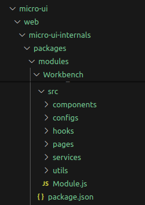

# Troubleshoot Using Browser Network Tab

## Overview

This page provides the steps to resolve issues using the network tab on the browser.

While using the application or while performing some action if something fails we get generic error messages on the UI.

<figure><figcaption></figcaption></figure>

Such as - <mark style="color:red;">Something went wrong / Please try again or contact support.</mark>

&#x20;Despite trying again, the same error message pops back up. What else could go wrong?\
The **Network tab** enables us to see more information about the Error.

## Steps

To fetch more information in context to the error message -

1. **Inspect the Page** - On the page with the error message, right-click the page and choose Inspect in the dropdown menu.
2. **Select the Network Tab** - The browser’s network tab is a way to look directly at what’s happening behind the scenes of a page. It shows us not only the type of data being requested and passed as we interact with the page, but it also let's know if there are any actions that are failing. After selecting Inspect, a new window will appear. In this new window, click the Network tab. Then, select the XHR filter option. This will hide everything except API requests.
3. **Refresh the Page** - Click the Refresh button in your browser. Since the Network tab will only show us the requests that occur after the tab has been opened, we’ll need to refresh the page so that we can view the error as it occurs. As the page reloads, you’ll see various API requests populate the panel.
4. **Re-create the Error -** In order to understand what’s causing our error, we’ll first need to go through the same steps we took to get the error so that we can watch the request happen in real-time. In this case, to recreate the error we’ll click Update again. By re-creating the error, we’ll see exactly which request is causing the issue.

<figure><figcaption></figcaption></figure>

5. **Find the Red-Line Item in the Network Panel -** This is the error that occurs when clicking Update. The status is 400, which is the error code for “bad request.” Everything else has the status 200, which is the code for “OK,” meaning nothing went wrong for those other requests.
6. **Preview the Error Details -** Click the red-line item to see the error details. Clicking that line item will open a new frame on the right-hand side, and in this frame, you’ll see a few tabs: Headers, Preview, Response, Cookies, and Timing. In this case, stick with Preview since this contains the basic information.
7. **View the Error Message -** While in some cases you won’t see a specific message here, in this case, you’ll see the following:

```
error: "Not Found"
message: "No message available"
path: "/egov-workflow-v2/egov-wf/process/_nearingslacount"
status: 404
```

Thanks to the network panel, you were able to take a look under the hood, diagnose the issue, and put a fix in place.
