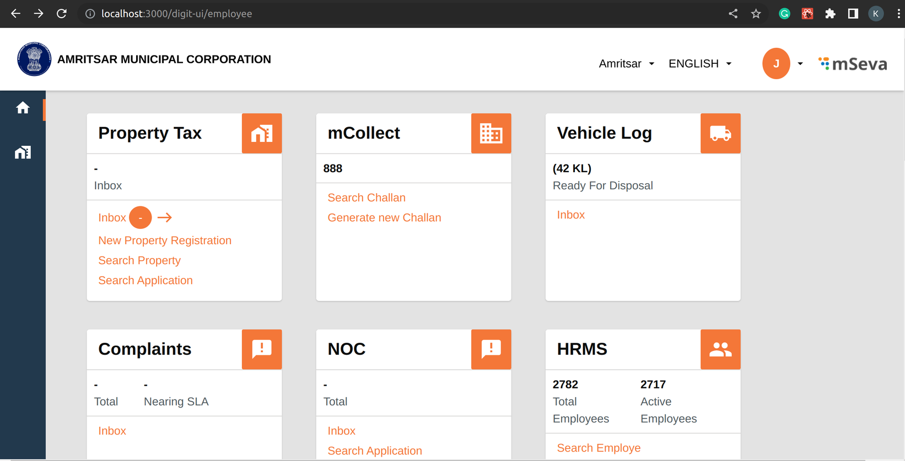
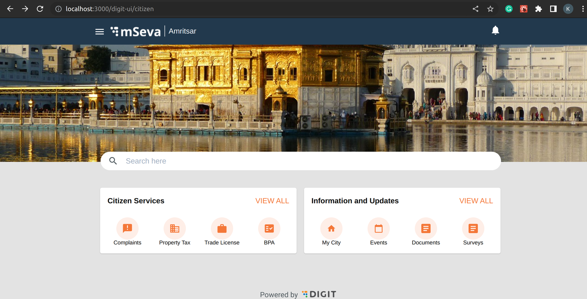

# Run Application

## Overview

Once the Local setup is completed, we have to run the application locally, This document says how to run the digit-ui in a local machine

### Step 1: Configure Environment File&#x20;

To run the application in the local environment, add the `.env` file in the `example` folder -

```
frontend/micro-ui/web/micro-ui-internals/example
```

copy the below content and add to the .env file

If the user is a citizen then we will configure the .env file as follows:-

```js-templates
SKIP_PREFLIGHT_CHECK=true
REACT_APP_USER_TYPE=EMPLOYEE
REACT_APP_EMPLOYEE_TOKEN=c835932f-2ad4-4d05-83d6-49e0b8c59f8a
REACT_APP_CITIZEN_TOKEN=7cd58aae-30b3-41ed-a1b3-3417107a993c
REACT_APP_PROXY_API=https://works-dev.digit.org
REACT_APP_PROXY_ASSETS=https://works-dev.digit.org
REACT_APP_GLOBAL=https://s3.ap-south-1.amazonaws.com/works-dev-asset/globalConfigsWorks.js
```

To run the Application as citizen, then update the value of `REACT_APP_USER_TYPE=CITIZEN`

To point the frontend to different environment Change the `REACT_APP_GLOBAL` ,add the GlobalConfig environment file of that environment

To know more about global config visit [How to configure globalconfig](https://core.digit.org/guides/developer-guide/ui-developer-guide/ui-configuration#globalconfig).

and update both `REACT_APP_PROXY_API` and `REACT_APP_PROXY_ASSETS` to that environment URL.

### Step 2: Initialise and Run the Application

To do a Yarn Initialisation, execute

```
sudo yarn install
```

once the yarn initialization is successfully performed then execute,

```
sudo yarn run start
```

Once you run the command, your application will start.

### Login As <a href="#login-as" id="login-as"></a>

There are two types of login

* **Employee:** If you log in as an employee, the below screen is displayed.

<figure><figcaption></figcaption></figure>

**HomePage Employee:** After the login is successful for employees,  users are redirected to the employee home page.

<figure><figcaption></figcaption></figure>

On the home page, users can see the cards mCollect, HRMS, NOC, Property Tax, etc These cards need to be added. Go through the [link here](run-application.md#configure-environment-file-citizen-1) to create an employee card.

**HomePage Citizen:** After the login is successful for citizens, users are redirected to the citizen homepage.

<figure><figcaption></figcaption></figure>

#### &#x20;HomePage Citizen:

<figure><figcaption></figcaption></figure>

Visit the [link here](run-application.md#configure-environment-file-citizen) to create a card for your module on the home page under "Citizen Services".


[\_\_](http://creativecommons.org/licenses/by/4.0/)_All content on this website by_ [_eGov Foundation_ ](https://egov.org.in/)_is licensed under a_ [_Creative Commons Attribution 4.0 International License_](http://creativecommons.org/licenses/by/4.0/)_._

