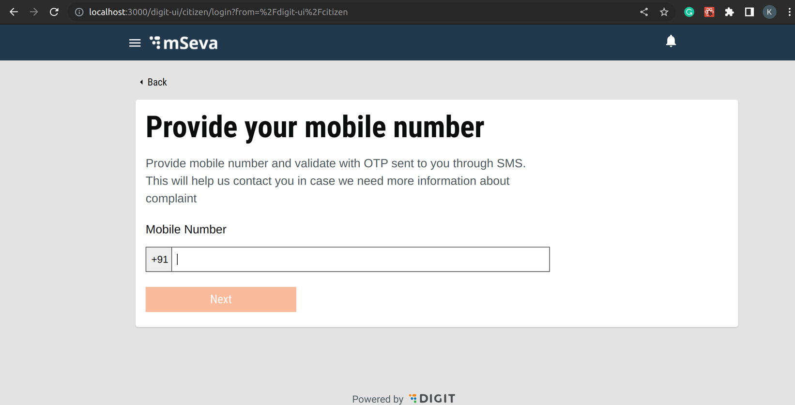

# Run Application

Now that the application is built and deployed, it is time to run and test it in the local environment.

### Configure Environment File - Citizen

To run the application in the local environment, add the `.env` file in the `example` folder -&#x20;

If the user is a citizen then we will configure the .env file as follows:-

```properties
SKIP_PREFLIGHT_CHECK=true
REACT_APP_USER_TYPE=CITIZEN
REACT_APP_EMPLOYEE_TOKEN=c835932f-2ad4-4d05-83d6-49e0b8c59f8a
REACT_APP_CITIZEN_TOKEN=7cd58aae-30b3-41ed-a1b3-3417107a993c
REACT_APP_PROXY_API=https://dev.companyname.org
REACT_APP_PROXY_ASSETS=https://dev.companyname.org
REACT_APP_GLOBAL=https://path/to/public/s3/bucket/globalConfigs.js
REACT_APP_CENTRAL_GLOBAL=https://path/to/public/s3/bucket/statebglobalConfigs.js
REACT_APP_QA_GLOBAL=https://path/to/public/s3/bucket/egov-dev-assets/globalConfigs.js
REACT_APP_UAT_GLOBAL=https://path/to/public/s3/bucket/egov-uat-assets/globalConfigs.js
REACT_APP_STATEB_GLOBAL=https://path/to/public/s3/bucket/statebglobalConfigs.js
staging=https://staging.companyname.org
```

### Configure Environment File - Employee

If the user is an employee then we configure the .env file as follows:-

```properties
SKIP_PREFLIGHT_CHECK=true
REACT_APP_USER_TYPE=EMPLOYEE
REACT_APP_EMPLOYEE_TOKEN=c835932f-2ad4-4d05-83d6-49e0b8c59f8a
REACT_APP_CITIZEN_TOKEN=7cd58aae-30b3-41ed-a1b3-3417107a993c
REACT_APP_PROXY_API=https://dev.companyname.org
REACT_APP_PROXY_ASSETS=https://dev.companyname.org
REACT_APP_GLOBAL=https://path/to/public/s3/bucket/globalConfigs.js
REACT_APP_CENTRAL_GLOBAL=https://path/to/public/s3/bucket/statebglobalConfigs.js
REACT_APP_QA_GLOBAL=https://path/to/public/s3/bucket/egov-dev-assets/globalConfigs.js
REACT_APP_UAT_GLOBAL=https://path/to/public/s3/bucket/egov-uat-assets/globalConfigs.js
REACT_APP_STATEB_GLOBAL=https://path/to/public/s3/bucket/statebglobalConfigs.js
staging=https://staging.companyname.org
open Terminal in micro-UI-internals and run the following command.
```

```
yarn start
```

Once you run the command, your application will start.

### Login As <a href="#login-as" id="login-as"></a>

There are two types of login

* **Employee:** If you log in as an employee, the below screen is displayed.

<figure><figcaption></figcaption></figure>

**HomePage Employee:** After the login is successful for employees,  users are redirected to the employee home page.

<figure><figcaption></figcaption></figure>

On the home page, users can see the cards mCollect, HRMS, NOC, Property Tax, etc These cards need to be added. Go through the [link here](run-application.md#configure-environment-file-citizen-1) to create an employee card.

**HomePage Citizen:** After the login is successful for citizens, users are redirected to the citizen homepage.

<figure><figcaption></figcaption></figure>

#### &#x20;HomePage Citizen:

<figure><figcaption></figcaption></figure>

Visit the [link here](run-application.md#configure-environment-file-citizen) to create a card for your module on the home page under "Citizen Services".


[\_\_](http://creativecommons.org/licenses/by/4.0/)_All content on this website by_ [_eGov Foundation_ ](https://egov.org.in/)_is licensed under a_ [_Creative Commons Attribution 4.0 International License_](http://creativecommons.org/licenses/by/4.0/)_._

