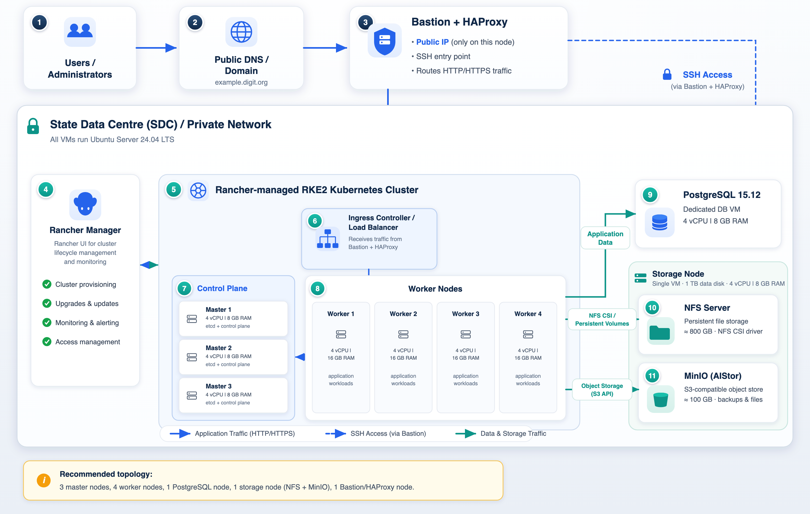

# On Premise



Running Kubernetes on a State Data Centre (SDC) gives a cloud-native experience for deploying DIGIT on infrastructure you own and operate. This page describes the recommended SDC reference architecture: a Rancher-managed RKE2 Kubernetes cluster backed by PostgreSQL 15.12, NFS-backed persistent storage, and a MinIO S3-compatible object store.

Whether States have their own on-premise data centre or have decided to forego the various managed cloud solutions, there are a few things one should know when getting started with on-premise K8s.

All virtual machines run on Ubuntu 24.04 LTS and are connected exclusively through private networking. A bastion server, equipped with HAProxy, serves as the single public entry point for accessing the cluster.

Compared with a hand-rolled Kubernetes install, RKE2 + Rancher gives you a hardened, highly available control plane, a management UI/API for cluster lifecycle operations, and a repeatable path to reproduce the same setup across environments - closing much of the gap between a managed cloud service and a self-operated SDC.

## Infrastructure Architecture

The diagram below shows how the components fit together within the SDC private network. Users reach the platform through a public DNS/domain that resolves to the Bastion + HAProxy node - the only node with a public IP. It forwards application (HTTP/HTTPS) traffic to the ingress controller on the RKE2 cluster and provides SSH access to the private network. Rancher Manager handles cluster lifecycle (provisioning, upgrades, monitoring, access). Worker nodes run the DIGIT workloads and consume the dedicated PostgreSQL 15.12 VM for application data, the NFS server (via the NFS CSI driver) for persistent volumes, and MinIO for S3-compatible object storage - with NFS and MinIO co-located on a single storage node.

<figure><figcaption></figcaption></figure>

## Installation Steps


[create-infrastructure-on-premise.md](create-infrastructure-on-premise.md)



[digit-deployment](../../../../get-started/installation-guide/digit-deployment/)



[bootstrap-digit.md](../../../data-setup-guide/bootstrap-digit.md)

