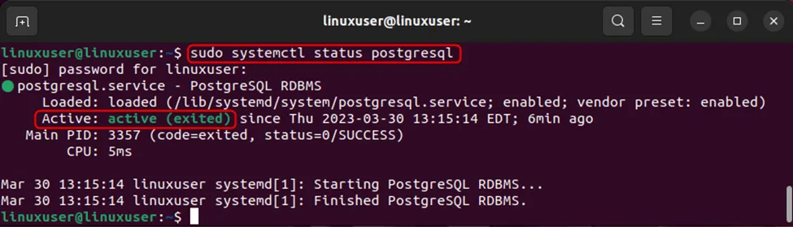

# Create Infrastructure On-Premise

## Overview

This section outlines the infrastructure setup for a data centre that hosts a Rancher-managed RKE2 Kubernetes cluster along with PostgreSQL 15.12, NFS-backed persistent storage, and a MinIO S3-compatible object store. All virtual machines run on Ubuntu 24.04 and are connected exclusively through private networking. A bastion server, equipped with HAProxy, serves as the public entry point for accessing the cluster.

## Pre-requisites

The following tools are required to complete this installation

1. Rancher RKE2
2. PostgreSQL 15.12
3. NFS
4. MinIO
5. Bastion server

## Scope & Architecture&#x20;

The objective is to provision the following components in an on‑premise environment

1. High‑availability RKE2 Kubernetes cluster (3 master + 4 worker nodes) managed by Rancher Manager.
2. PostgreSQL 15.12 database on a dedicated VM.
3. NFS server and CSI driver to back Kubernetes PersistentVolumeClaims.
4. MinIO (AIStor) S3‑compatible object storage service.
5. Bastion / HAProxy node to expose HTTP(S) traffic from the public domain to the private cluster.

RKE2 provides a highly available control plane when deployed with three server nodes and a fixed registration/load‑balancer address in front of them. NFS CSI driver runs as a Kubernetes add‑on to dynamically provision volumes for persistent workloads. MinIO provides S3‑like object storage for backups and application data.\
\
All nodes are connected to the same private subnet (for example, 10.0.0.0/24). Only the bastion/HAProxy node has a public IP address. SSH to all nodes is done via the bastion.

### Virtual Machine Sizing

This section outlines the operating system and basic assumptions applicable to all virtual machines used in the setup. Every VM runs **Ubuntu Server 24.04 LTS** to ensure long-term stability and security updates. Hostnames and IP addresses are not fixed in this guide and should be assigned according to the data centre’s naming standards and network layout.

<table><thead><tr><th width="176.1796875">Role</th><th width="89.84375">Count</th><th width="91.2421875">vCPU</th><th width="136.12890625">Memory (GB)</th><th>Notes</th></tr></thead><tbody><tr><td>RKE2 Master Nodes</td><td>3</td><td>4</td><td>8</td><td>Control plane + etcd; no public IP</td></tr><tr><td>RKE2 Worker Nodes</td><td>4</td><td>4</td><td>16</td><td>Application workloads; no public IP</td></tr><tr><td>PostgreSQL DB Node</td><td>1</td><td>4</td><td>8</td><td>PostgreSQL 15.12; single instance on local storage</td></tr><tr><td>Storage Node (NFS + MinIO)</td><td>1</td><td>4</td><td>8</td><td>1 TB data disk attached (≈800 GB NFS, ≈100 GB MinIO)</td></tr><tr><td>Bastion &#x26; HAProxy Node</td><td>1</td><td>2</td><td>4</td><td>Public IP; SSH entry point and HTTP(S) load balancer to cluster</td></tr></tbody></table>

### Networking Requirements

1. A private subnet and addressing must be defined in SDC (for example, 10.0.0.0/24).
2. A DNS record should be planned for the public domain (for example, \*.example.gov mapped to the HAProxy public IP).
3. An outbound internet connection (or controlled repository mirrors) from all nodes should be present to fetch packages and container images.
4. NTP is configured and time synchronised across all nodes.
5. There should be a passwordless SSH from the bastion node to all other nodes for operational convenience.
6. Specific firewall rules opened inside the data centre network to allow the following-&#x20;

* RKE2 control plane ports (6443/tcp)
* node‑to‑node traffic
* NFS traffic (TCP/UDP 2049)
* PostgreSQL 5432/tcp
* HTTP(S) traffic between HAProxy and Kubernetes ingress nodes.&#x20;

7. On each Ubuntu VM, perform the following baseline steps-

* Update packages: sudo apt update && sudo apt -y upgrade
* Set hostnames and /etc/hosts entries for all nodes.
* Disable swap: sudo swapoff -a and remove swap entries from /etc/fstab.
* Install basic tools: sudo apt install -y vim curl wget net-tools jq htop

## Steps

### A. Cluster Setup

Follow the Rancher "[Setting up Infrastructure for a High Availability RKE2 Kubernetes Cluster](https://ranchermanager.docs.rancher.com/how-to-guides/new-user-guides/kubernetes-cluster-setup/rke2-for-rancher)" guide for detailed reference. Follow the steps below to set up the RKE2 HA Kubernetes cluster for the data centre.



### Prepare Internal Load Balancer Address

RKE2 requires a fixed registration address in front of the server nodes. On the bastion/HAProxy node, configure a private IP (for example, 10.0.0.10) or use the HAProxy private interface IP as the RKE2 server URL. This IP will forward TCP 6443 to the three master nodes.



### Install RKE2 Server on Master Nodes

Repeat the following steps on each of the three master nodes.

* Install RKE2 server binaries -

`curl -sfL https://get.rke2.io | sudo INSTALL_RKE2_TYPE=server sh -`

* &#x20;Configure the first master node

Create /etc/rancher/rke2/config.yaml with at least:

```
server: https://10.0.0.10:6443
token: <cluster-shared-token>
tls-san:
  - 10.0.0.10
  - <any-additional-dns-names>
```

* &#x20;Start and enable the RKE2 server service:

sudo systemctl enable rke2-server && sudo systemctl start rke2-server

* Once the first master is up, copy /var/lib/rancher/rke2/server/node-token. This token will be used by the remaining master and worker nodes.



### Join Additional Masters

On master‑2 and master‑3, install RKE2 server as above and create /etc/rancher/rke2/config.yaml pointing to the same registration address and token:

```
server: https://10.0.0.10:6443
token: <cluster-shared-token>
tls-san:
  - 10.0.0.10
  - <any-additional-dns-names>
```

Start the service on each node and verify that all three masters appear as “Ready” when running kubectl from any master node.



### Install RKE2 Agent on Worker Nodes

On each of the four worker nodes, do the following-

* Install RKE2 agent:&#x20;

`curl -sfL https://get.rke2.io | sudo INSTALL_RKE2_TYPE=agent sh -`

* Configure /etc/rancher/rke2/config.yaml:

`server: https://10.0.0.10:6443`\
`token: <cluster-shared-token>`

* Start the RKE2 agent:

`sudo systemctl enable rke2-agent && sudo systemctl start rke2-agent`

After all agents join, copy /etc/rancher/rke2/rke2.yaml from any master node to your local machine as kubeconfig and use it to access the cluster with kubectl.



### B. Deploy NFS Storage Backend

The storage node is set up as an **NFS server** that provides shared storage to the Kubernetes cluster. Kubernetes uses the **NFS CSI driver** to automatically create and manage **PersistentVolumes (PVs)** when applications request storage. These volumes are provisioned through a **StorageClass**, allowing workloads to claim storage dynamically without manual volume creation.



#### Install NFS Server On Ubuntu

Perform the steps below on the storage node:

* sudo apt update
* sudo apt install nfs-kernel-server -y
* sudo mkdir -p /mnt/nfs01/NFS
* sudo chown -R nobody:nogroup /mnt/nfs01/NFS
* sudo chmod 777 /mnt/nfs01/NFS
* Edit /etc/exports and add (replace \<client-subnet> with your Kubernetes node subnet, e.g. 10.0.0.0/24):
* /mnt/nfs01/NFS  \<client-subnet>(rw,sync,fsid=1,no\_subtree\_check,insecure,no\_root\_squash,anonuid=1001,anongid=1001)
* Apply the configuration:
* sudo exportfs -rav
* Enable and restart the NFS service:
* sudo systemctl enable nfs-server
* sudo systemctl restart nfs-server
* Verify exports: sudo exportfs -v



#### Install NFS CSI Driver&#x20;

On a machine with kubectl and Helm configured for the RKE2 cluster, perform the following-

* [x] Add the NFS CSI Helm repo:

- helm repo add csi-driver-nfs [https://raw.githubusercontent.com/kubernetes-csi/csi-driver-nfs/master/charts](https://raw.githubusercontent.com/kubernetes-csi/csi-driver-nfs/master/charts)

Update Helm repo.

* [x] Install the CSI driver in the kube-system namespace:

helm install csi-driver-nfs csi-driver-nfs/csi-driver-nfs --namespace kube-system --version 4.12.0

* [x] Verify the pods

kubectl get pods -n kube-system -l app.kubernetes.io/name=csi-driver-nfs



#### Configure Storage Class&#x20;

Create a Storage class that uses the NFS CSI driver and points to the export on the storage node. Example manifest (nfs-sc.yaml):

```
apiVersion: storage.k8s.io/v1
kind: StorageClass
metadata:
  name: nfs-csi
  annotations:
    storageclass.kubernetes.io/is-default-class: "true"
provisioner: nfs.csi.k8s.io
parameters:
  server: <nfs-server-ip>
  share: /mnt/nfs01/NFS
allowVolumeExpansion: true
reclaimPolicy: Retain
volumeBindingMode: Immediate
```

Apply and verify the commands below:

```
kubectl apply -f nfs-sc.yaml
kubectl get storageclass
```



#### Test Persistent Volume Claim(PVC) and Pod

Create a test PVC and pod (test-nfs-pvc.yaml) to verify end-to-end NFS provisioning:

```
apiVersion: v1
kind: PersistentVolumeClaim
metadata:
  name: test-nfs-pvc
spec:
  accessModes:
    - ReadWriteMany
  storageClassName: nfs-csi
  resources:
    requests:
      storage: 1Gi
---
apiVersion: v1
kind: Pod
metadata:
  name: test-nfs-pvc-pod
spec:
  containers:
    - name: app
      image: busybox
      command: ["/bin/sh", "-c", "echo 'Hello from NFS CSI Driver!' > /data/hello.txt && sleep 3600"]
      volumeMounts:
        - name: nfs-vol
          mountPath: /data
  volumes:
    - name: nfs-vol
      persistentVolumeClaim:
        claimName: test-nfs-pvc

```

Execute commands below-

```
kubectl apply -f test-nfs-pvc.yaml
kubectl get pvc
kubectl get pod test-nfs-pvc-pod
```

On the NFS server, verify that a directory for the PVC has been created under /mnt/nfs01/NFS and that it contains the hello.txt file written by the pod.



### C. Configure MinIO Object Storage

MinIO will be deployed on the storage node using the remaining capacity of the 1 TB disk (approximately 100 GB).



#### Prepare the Directory for MinIO

* Create a dedicated directory for MinIO data (for example - /var/lib/minio).
* Allocate \~100 GB of the storage disk to this directory or mount a separate partition if needed.



#### Install and Configure MinIO

Follow the MinIO [AIStor Ubuntu installation](https://docs.min.io/enterprise/aistor-object-store/installation/linux/install/deploy-aistor-on-ubuntu-server/) guide. At a high level, the steps to be followed are below-

* [x] Download and install the AIStor package for Ubuntu 24.04.
* [x] Configure the MinIO service to listen on a private IP/port (for example, 9000) and store data under /var/lib/minio.
* [x] Create initial access and secret keys for S3 API access.
* [x] Configure a systemd service so that MinIO starts automatically on boot.
* [x] Expose MinIO internally through an Ingress in the Kubernetes cluster or via HAProxy for restricted external access. (optional)



### D. PostgreSQL 15.12 Database Node

A dedicated VM is used for PostgreSQL 15.12. The data directory is placed on a custom-mounted disk to separate database storage from the OS disk.



#### Prepare the Custom Mount Point

Decide where you want PostgreSQL data to live, for example,/mnt/data/postgresql. Then, create the directory by using the command below -

`sudo mkdir -p /mnt/data/postgresql`



#### Install PostgreSQL 15

* Update APT repositories by using the command&#x20;

`sudo apt update`

* Add the PostgreSQL APT repository by using the command

`sudo sh -c 'echo "deb http://apt.postgresql.org/pub/repos/apt $(lsb_release -cs)-pgdg main" > /etc/apt/sources.list.d/pgdg.list'`

* Import the PostgreSQL GPG key:

`wget --quiet -O - https://www.postgresql.org/media/keys/ACCC4CF8.asc | \`

`sudo tee /etc/apt/trusted.gpg.d/pgdg.asc > /dev/null`

* Update the package list once again by using the command

`sudo apt update`

* Install PostgreSQL 15 (15.12 or later patch version)

`sudo apt install -y postgresql-15 postgresql-client-15`

* Finally, confirm installation by running the following

`sudo systemctl status postgresql`



#### Stop PostgreSQL Before Changing Data Directory

Run the following commands-

`sudo systemctl stop postgresql`

`sudo systemctl status postgresql` &#x20;

Confirm it has stopped before you proceed.



#### Move Existing Data Directory

If PostgreSQL has initialized its default data directory at /var/lib/postgresql, copy its contents to the new mount point:

`sudo rsync -av /var/lib/postgresql /mnt/data/`

Verify the copied structure; it should look like /mnt/data/postgresql/15/main



#### Update PostgreSQL Configuration to Use New Data Directory

Edit the “postgresql.conf” file with the changes suggested below

`sudo nano /etc/postgresql/15/main/postgresql.conf`

* Find the line # data\_directory = '/var/lib/postgresql/15/main'
* Uncomment and change it to

`data_directory = '/mnt/data/postgresql/15/main'`



#### Ensure Proper Ownership on New Directory

Run the commands below to ensure the new directory has the required ownership

`sudo chown -R postgres:postgres /mnt/data/postgresql`

`sudo chmod -R 700 /mnt/data/postgresql`



#### Start PostgreSQL and Validate

Execute the commands below in the order mentioned -

`sudo systemctl start postgresql`

`sudo systemctl status postgresql`

<figure><figcaption></figcaption></figure>

Connect to PostgreSQL

`sudo -i -u postgres psql`

`SELECT version();`

`\q`

<figure><figcaption></figcaption></figure>



#### Persist Mount and Allow Remote Access

* If /mnt/data is on a dedicated disk or partition, add it to /etc/fstab so it persists after reboot:

`sudo nano /etc/fstab`

* UUID=\<UUID of your disk> /mnt/data ext4 defaults 0 2

Use the command below to get the UUID and mount

&#x20;`lsblk -f`&#x20;

`sudo mount -a`

* To allow PostgreSQL access from other nodes (for example, 10.0.0.0/24), edit postgresql.conf according to the instructions below-

`sudo nano /etc/postgresql/15/main/postgresql.conf`

* Set listen\_addresses = '\*'
* password\_encryption = 'md5'
* Edit pg\_hba.conf as per below-

`sudo nano /etc/postgresql/15/main/pg_hba.conf`

Add host all 10.0.0.0/24 md5

* Restart PostgreSQL to apply changes

`sudo systemctl restart postgresql`



#### Create database roles and users &#x20;

Follow the steps below to create a PostgreSQL superadmin user, create a database owned by that superadmin, then create a restricted read/write database user and grant the required privileges (both for existing objects and for future objects).



#### Connect as a PostgreSQL superuser

Login as a superuser on PostgreSQL.



#### Create a superadmin user

CREATE USER \<super-admin-user> WITH PASSWORD '\<super-admin-password>' SUPERUSER CREATEDB CREATEROLE



#### Create the application database owned by the superadmin

CREATE DATABASE \<db\_name> OWNER \<super-admin-user>;



#### Create a database user with read/write access only:

CREATE USER \<db\_rw\_user> WITH PASSWORD '\<db\_rw\_password>';

GRANT CONNECT ON DATABASE \<db\_name> TO \<db\_rw\_user>;

GRANT USAGE ON SCHEMA public TO \<db\_rw\_user>;

GRANT SELECT, INSERT, UPDATE, DELETE ON ALL TABLES IN SCHEMA public TO \<db\_rw\_user>;

GRANT CREATE ON SCHEMA public TO \<db\_rw\_user>;



#### Grant default privileges for future tables

Grant default privileges for future tables by executing the following

ALTER DEFAULT PRIVILEGES IN SCHEMA public GRANT SELECT, INSERT, UPDATE, DELETE ON TABLES TO \<db\_rw\_user>;





### E. Configure Bastion and HAProxy&#x20;

The bastion VM serves as the SSH entry point and also runs HAProxy to expose HTTP(S) traffic from the public internet to the private RKE2 cluster. The configuration is similar to the existing SDC HAProxy setup.



#### Install HAProxy

* Execute the command to install HAProxy

sudo apt-get install haproxy -y

* Ensure the bastion node has a public IP and appropriate firewall rules to allow inbound 80/443 and any other required ports.



#### Sample Configuration

**Sample /etc/haproxy/haproxy.cfg**

The following snippet illustrates a typical HAProxy configuration to forward HTTP, HTTPS and Kubernetes API traffic to the internal nodes. Adjust IPs and ports as per your setup.

```
global
    log /dev/log    local0
    log /dev/log    local1 notice
    chroot /var/lib/haproxy
    stats socket /run/haproxy/admin.sock mode 660 level admin expose-fd listeners
    stats timeout 30s
    user haproxy
    group haproxy
    daemon
defaults
    log     global
    mode    http
    option  httplog
    option  dontlognull
    timeout connect 5000
    timeout client  30000
    timeout server  60000
frontend http-in
    bind *:80
    mode tcp
    default_backend http-servers
    http-request redirect scheme https unless { ssl_fc }
frontend https-in
    bind *:443
    mode tcp
    default_backend https-servers
frontend kube-in
    bind *:6443
    mode tcp
    default_backend kube-servers
backend http-servers
    mode tcp
    balance roundrobin
    server worker1 10.0.0.21:32080 send-proxy
    server worker2 10.0.0.22:32080 send-proxy
backend https-servers
    mode tcp
    balance roundrobin
    server worker1 10.0.0.21:32443 send-proxy
    server worker2 10.0.0.22:32443 send-proxy
backend kube-servers
    mode tcp
    balance roundrobin
    server master1 10.0.0.11:6443 check
    server master2 10.0.0.12:6443 check
    server master3 10.0.0.13:6443 check
```



#### Restart HAProxy and configure the DNS

After updating the configuration file, restart HAProxy by executing the command below\
sudo systemctl restart haproxy

Configure public DNS records so that the desired domain (for example, \*.example.gov) points to the bastion public IP. The NGINX ingress controller in the RKE2 cluster should be configured with host‑based rules that match these domains.



## Validation Checklist

Verify the installation and readiness status of the infrastructure by following the instructions below-

1. All RKE2 master and worker nodes show Ready in kubectl get nodes.
2. Default StorageClass is set to NFS, and sample PVCs bind successfully.
3. MinIO endpoint is reachable from within the cluster, and S3 buckets can be created.
4. PostgreSQL 15.12 is running, and connectivity from Kubernetes pods is verified.
5. HAProxy forwards HTTP(S) traffic correctly to the Kubernetes ingress endpoints.

If all the validations pass, that completes the base infrastructure setup for an on‑premise environment using Rancher RKE2, PostgreSQL, NFS and MinIO.
