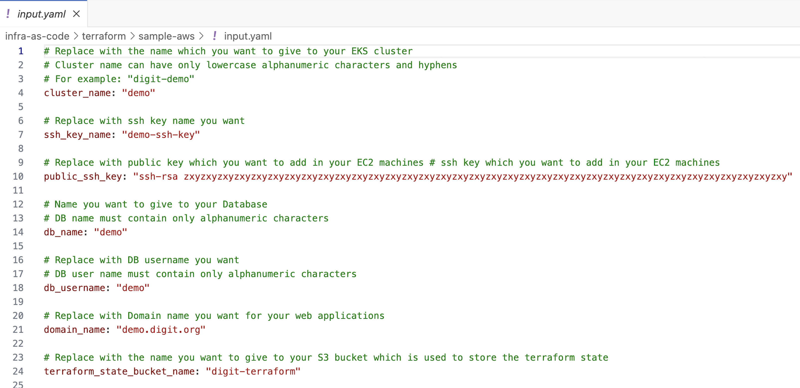

# DIGIT Installation on AWS

## Overview

This page provides the steps for installing DIGIT on AWS.

## **Pre-requisites** <a href="#id-1.-pre-requisites" id="id-1.-pre-requisites"></a>

Following are the pre-requisites and installation steps for setting up DIGIT on AWS:

1. **Install** [**Golang**](https://go.dev/doc/install#download):
   * For Linux: Follow the [instructions here](https://go.dev/doc/install#download) to install Golang on Linux.
   * For Windows: Download the installer using the [link here](https://go.dev/doc/install#download) and follow the installation instructions.
   * For Mac: Download the installer using the [link here](https://go.dev/doc/install#download) and follow the installation instructions.
2. **Install** [**Helm**](https://helm.sh/docs/intro/install/) **- DIGIT services are packaged with Helm Charts**
3. **Install** [**kubectl**](https://kubernetes.io/docs/tasks/tools/install-kubectl-linux/) **-** CLI to connect to the Kubernetes cluster on your machine
4. **Install** [**cURL**](https://help.ubidots.com/en/articles/2165289-learn-how-to-install-run-curl-on-windows-macosx-linux) **-** for making API calls
5. **Install** [**Visual Studio Code**](https://code.visualstudio.com/download) **-** for better code visualization/editing capabilities
6. **Install** [**Postman**](https://www.postman.com/downloads/) **-** to run digit bootstrap scripts
7. **Install** [**Terraform**](https://developer.hashicorp.com/terraform/tutorials/aws-get-started/install-cli) **-** to provide infrastructure on AWS
8. **Install** [**AWS CLI**](https://docs.aws.amazon.com/cli/latest/userguide/getting-started-install.html) **and** [**IAM Authenticator**](https://docs.aws.amazon.com/eks/latest/userguide/what-is-eks.html)&#x20;

Once you have installed all these pre-requisites, you are ready to set up DIGIT and its services.

## Deployment&#x20;

To provision infrastructure and set up DIGIT, follow the steps below:

1.  Clone the DIGIT-DevOps repository:

    `git clone` [`https://github.com/egovernments/DIGIT-DevOps.git`](https://github.com/egovernments/DIGIT-DevOps.git)
2.  Navigate to the cloned repository and checkout the release-1.28-kubernetes branch:

    `cd DIGIT-DevOps && git checkout release-1.28-kubernetes`
3.  For guidance on setting up your AWS CLI, please follow the instructions provided at [Installation Guide - Production Setup on AWS](https://core.digit.org/guides/installation-guide/production-setup/aws/3.-setup-aws-account). Additionally, ensure your AWS CLI is correctly configured by referring to the official AWS documentation on Configuring the AWS CLI - AWS Command Line Interface. Confirm your AWS credentials are correctly set by executing:

    ```bash
    aws configure list
    ```

    Proceed only after verifying the correct configuration of your credentials. For any uncertainties on how to set up the credentials, consult the AWS documentation for detailed instructions.

<figure><figcaption></figcaption></figure>

4.  To generate SSH key pairs, you have two methods at your disposal:

    #### Option A: Using OpenSSL on Command Line

    Execute the following commands consecutively:

    ```bash
    openssl genpkey -algorithm RSA -out private_key.pem
    openssl rsa -pubout -in private_key.pem -out public_key.pem
    ```

    This sequence generates an RSA private key and stores it in `private_key.pem`, then extracts the public key into `public_key.pem`.

    #### Option B: Using an Online Tool

    For demonstration purposes, you can use an online service such as [8gwifi.org](https://8gwifi.org/sshfunctions.jsp) to generate SSH key pairs. This method is not recommended for production environments due to potential security risks.
5. To add a public key to your GitHub account, you can follow the step-by-step guide in this video: [Add the public key to your GitHub account](https://www.youtube.com/watch?v=9C7\_jBn9XJ0). This video is a useful resource for both beginners and experienced users looking to secure their GitHub account with SSH keys.
6.  To edit the `input.yaml` file in Visual Studio Code, use the command below. If this doesn't work or you prefer another editor, simply open the file manually in the editor you choose.

    ```bash
    code infra-as-code/terraform/sample-aws/input.yaml
    ```
7. Fill in the inputs as per the regex mentioned in the comments. &#x20;

<figure><figcaption></figcaption></figure>

8. Navigate to the `sample-aws` directory within the `terraform` folder inside `infra-as-code`, and then execute the `init.go` script located in the parent's `scripts` directory by running the following command:

```
cd infra-as-code/terraform/sample-aws && go run ../scripts/init.go
```

9. To create an S3 bucket and DynamoDB table using Terraform, follow these steps:
   *   Navigate to the `remote-state` directory:

       ```
       cd remote-state
       ```
   *   Initialize Terraform in the directory:

       ```
       terraform init
       ```
   *   Generate and review the execution plan to see the resources Terraform will create/manage:

       ```
       terraform plan
       ```
   *   Apply the changes described in the plan to create the S3 bucket and DynamoDB table:

       ```
       terraform apply
       ```

Confirm the action when prompted to start the provisioning process.

10. To provision the DIGIT infrastructure using Terraform, follow these steps:
    *   **Initialize Terraform**:

        Navigate up one directory from your current location:

        ```
        cd ..
        ```

        Then initialize Terraform to install necessary plugins:

        ```
        terraform init
        ```
    *   **Create an Execution Plan**:

        Generate an execution plan in Terraform, allowing you to review what will be created:

        ```
        terraform plan
        ```
    *   **Apply Changes**:

        Apply the changes specified by the Terraform plan. You will be prompted to enter the database password during this step:

        ```
        terraform apply
        ```

**Important:**

*   #### Database Password Requirements

    When you reach the terraform plan and apply stage, you will be prompted to provide a database password. Remember to adhere to the following criteria to ensure the password meets our security standards and to avoid provisioning failures with RDS:

    * The password must be at least 8 characters in length.
    * It should only contain printable ASCII characters, except for the following: `/`, `@`, `"`, and a space ( ).

    Failure to comply with these guidelines will result in RDS provisioning failure.
* **The output of the apply command will be displayed on the console. Store this in a file somewhere. Values from this file will be used in the next step of deployment.**

11. Use this link to [get the kubeconfig from EKS](https://docs.aws.amazon.com/eks/latest/userguide/create-kubeconfig.html) to get the kubeconfig file for the cluster. The region code is the default region provided in the availability zones in variables.tf. Eg. ap-south-1. EKS cluster name also should've been filled in variables.tf.

```
aws sts get-caller-identity

# Run the below command and give the respective region-code and the cluster name
aws eks --region <region-code> update-kubeconfig --name <cluster_name>
```

12. Finally, verify that you can connect to the cluster by running the following command.

```
kubectl config use-context <cluster_name>

kubectl get nodes

NAME                                             STATUS AGE   VERSION               OS-Image           
ip-192-168-xx-1.ap-south-1.compute.internal   Ready  45d   v1.15.10-eks-bac369   Amazon Linux 2   
ip-192-168-xx-2.ap-south-1.compute.internal   Ready  45d   v1.15.10-eks-bac369   Amazon Linux 2   
ip-192-168-xx-3.ap-south-1.compute.internal   Ready  45d   v1.15.10-eks-bac369   Amazon Linux 2   
ip-192-168-xx-4.ap-south-1.compute.internal   Ready  45d   v1.15.10-eks-bac369   Amazon Linux 2 
```

At this point, your basic infra has been provisioned.

## Destroying Infra <a href="#id-48f3" id="id-48f3"></a>

To destroy the previously created infrastructure with Terraform, run the command below:

1. To remove the `nginx-ingress-controller` service and deployment from your Kubernetes cluster, execute the following commands. Ensure you replace `<namespace>` with either `egov` or `jenkins` based on your deployment configuration.
2. Delete the service:

```shell
kubectl delete svc nginx-ingress-controller -n <namespace>
```

3. Delete the deployment:

```shell
kubectl delete deployment nginx-ingress-controller -n <namespace>
```

**Note:** The Elastic Load Balancer (ELB) associated with the ingress service is not managed through Terraform. It's created automatically when setting up the Kubernetes Ingress. To remove the ELB, you must manually delete the ingress service.

1.  #### Deleting an ELB and S3 Buckets Manually from the AWS Console

    In instances where your Elastic Load Balancer (ELB) does not delete as expected, it is necessary to take manual steps to ensure both the ELB and any associated S3 buckets are completely removed from your AWS environment. Follow the steps below to manually delete your ELB and verify its removal, as well as to delete any S3 buckets connected to it.

    **How to Delete an ELB Manually:**

    1. Log in to your AWS Management Console.
    2. Navigate to the 'EC2 Dashboard'.
    3. Find the 'Load Balancers' section under the 'Load Balancing' category.
    4. Select the ELB you wish to delete.
    5. Choose the 'Actions' menu, then select 'Delete'.
    6. Confirm the deletion when prompted.

    **Verify the ELB Deletion:**

    After deletion, ensure the ELB is no longer listed in the 'Load Balancers' section. This verification step is crucial to confirm the ELB has been fully removed from your AWS account.
2. Execute the `terraform destroy` command to dismantle and remove the resources defined in your Terraform configuration. This action is irreversible and should be performed with caution to avoid unintentional data loss.

### &#x20;<a href="#destroying-the-cluster" id="destroying-the-cluster"></a>
