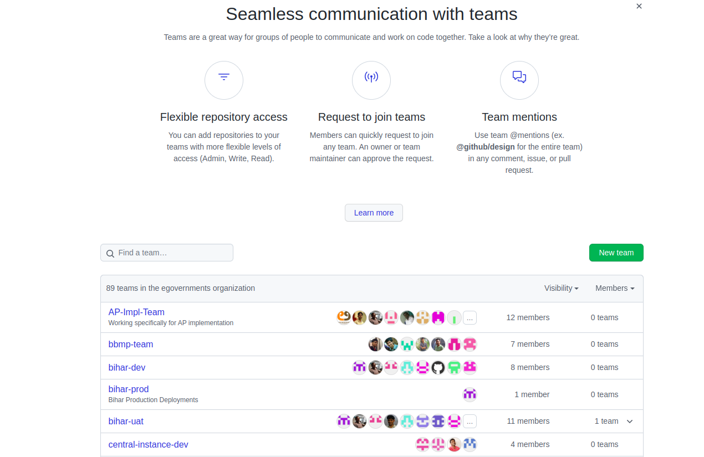
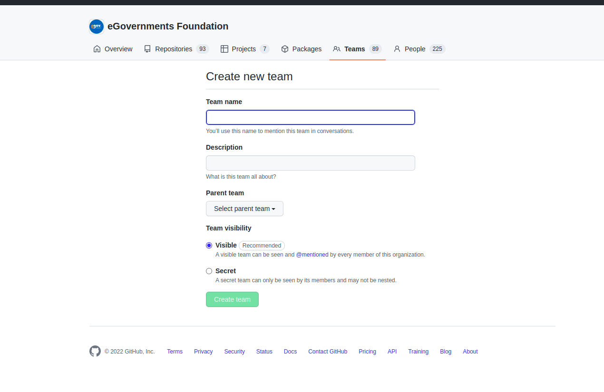
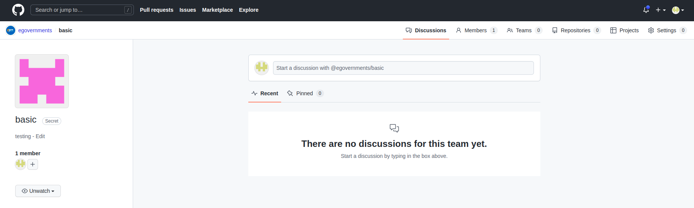

# GitHub Team creation

* In **eGovernments Foundations** we are having multiple number of Teams. we can create independent teams to manage repository permissions and mentions for groups of people.
* Only organization owners and maintainers can create team. Owners can also restrict creation permissions for all teams in an organization.
* First sign in to your organization github account.

<figure><figcaption></figcaption></figure>

* Once you sign in to your account and if you open view organization you can able to see the above page.
* Click on **Teams.** You will see the below image.

<figure><figcaption></figcaption></figure>

* Now, click on the **New team**
* Fill the details as shown in the below image:

<figure><figcaption></figcaption></figure>

* After creating team, you will able to see the below image.

<figure><figcaption></figcaption></figure>

* If you click on members.you can add members to your team by providing their github username or mail.
* Now, you have successfully created GitHub team.
