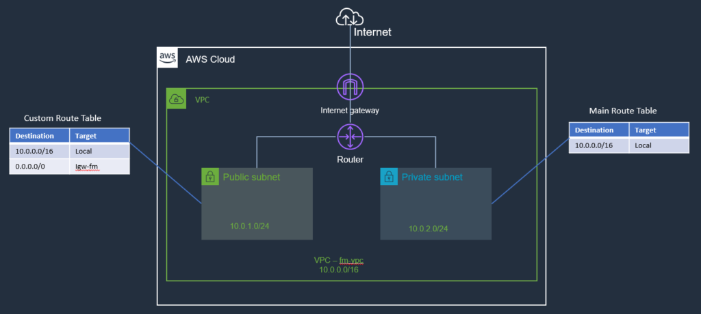

# 11.Internet Gateway

An **internet gateway** is a service that allows for internet traffic to actually enter into a **VPC**. Otherwise, a VPC is completely segmented off and then the only way to get to it is potentially through a VPN connection rather than through an internet connection.

An Internet Gateway is a logical connection between an AWS VPC and the Internet. It is not a physical device. Each VPC has only one Internet Gateway. If a VPC doesn’t have an Internet Gateway, then the resources cannot be accessed from the Internet. Conversely, resources within your VPC need an Internet Gateway to access the Internet.

