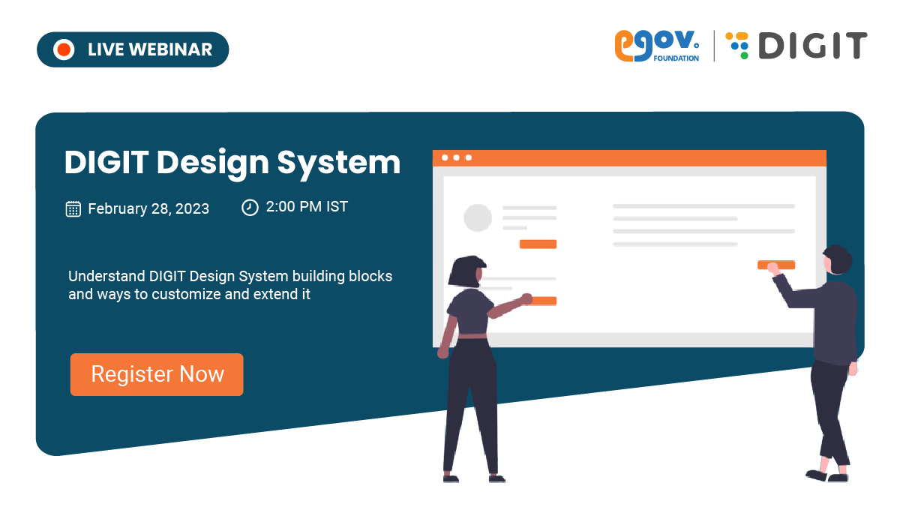

# Open Events

<figure><figcaption></figcaption></figure>

Join our virtual launch of the [**DIGIT Design System** ](https://design.digit.org/ui-docs/)on 28th Feb at 2 PM to understand the platform design principles, the scope for customization and the approach. Our Design System offers a comprehensive repository for the platform design standards and principles that shape the UI experience across channels.

[**Click here**](https://us06web.zoom.us/webinar/register/6316764422914/WN\_\_IXG9ckyQy23R8ZdVMKVZA) to register for the event.&#x20;

