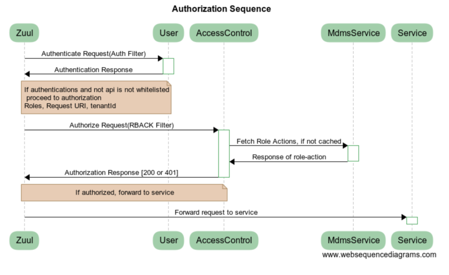

# Access Control Services

## Overview

DIGIT is an API-based platform where each API denotes a DIGIT resource. The primary job of Access Control Service (ACS) is to authorise end-user based on their roles and provide access to the DIGIT platform resources. Access control functionality is essentially based on below points:

**Actions:** Actions are events which are performed by a user. This can be an API end-point or front-end event. This is the MDMS master.

**Roles:** Roles are assigned to users. A single user can hold multiple roles. Roles are defined in MDMS masters.

**Role-Action:** Role actions are mapped between Actions and Roles. Based on roles, the action mapping access control service identifies applicable actions for the role.

## Pre-requisites

Before you proceed with the configuration, make sure the following pre-requisites are met -

* Java 8
* MDMS service is up and running

## Key Functionalities

* Serve the applicable actions for a user based on user roles (To print menu three).
* On each action performed by a user, access control looks at the roles for the user and validates actions mapping with the role.
* Support tenant-level role action. For instance, an employee from Amritsar can have the role of APPROVER for other ULBs like Jalandhar and hence will be authorised to act as APPROVER in Jalandhar.

## Deployment Details

1. Deploy the latest version of the Access Control Service
2. Deploy MDMS service to fetch the Role Action Mappings

## Configuration Details

Define the roles:


```json
{
      "code": "EMPLOYEE",
      "name": "Employee",
      "description": "Default role for all employees"
}
```


Add the Actions (URL)


```json
{
      "id": {{ACTION_ID}},
      "name": "Create TradeLicense",
      "url": "/tl-services/v1/_create",
      "parentModule": "",
      "displayName": "Create TradeLicense",
      "orderNumber": 0,
      "enabled": false,
      "serviceCode": "tl-services",
      "code": "null",
      "path": ""
}
```


Add the role action mapping


```json
{
      "rolecode": "EMPLOYEE",
      "actionid": {{ACTION_ID}},
      "actioncode": "",
      "tenantId": "pb"
    }
```



The details about the fields in the configuration can be found in the [Swagger contract](https://raw.githubusercontent.com/egovernments/egov-services/master/docs/egov-accesscontrol/contracts/v1-0-1.yml)


## Integration Details

### Integration Scope

Any microservice which requires authorisation can leverage the functionalities provided by the access control service.

### Integration Benefits

Any new microservice that is to be added to the platform will not have to worry about authorisation. It can just add its role action mapping in the master data and the Access Control Service will perform authorisation whenever the API for the microservice is called.

### Integration Steps

1. To integrate with Access Control Service the role action mapping has to be configured (added) in the MDMS service.
2. The service needs to call /actions/\_authorize API of Access Control Service to check for authorisation of any request.

## Interaction Diagram

<figure><figcaption></figcaption></figure>

## Reference Docs

### Doc Links

| Title                                                                                                                            |
| -------------------------------------------------------------------------------------------------------------------------------- |
| [API Contract](https://raw.githubusercontent.com/egovernments/egov-services/master/docs/egov-accesscontrol/contracts/v1-0-1.yml) |

### API List

| Title                  | Link                  |
| ---------------------- | --------------------- |
|  `/actions/_authorize` | \[LINK TO BE UPDATED] |

