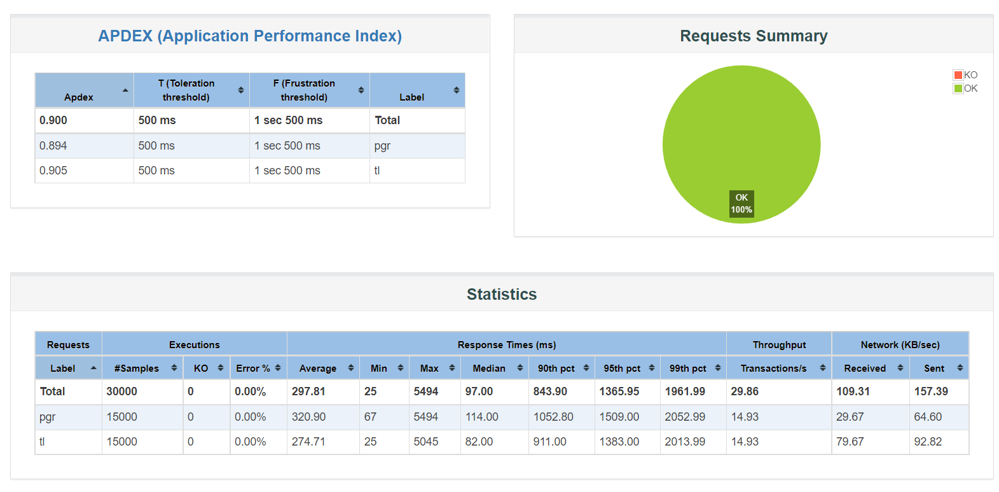

# Signed Audit Performance Testing Results

### Overview 

The signed audit service provides a one-stop framework for signing data i.e. creating an immutable data entry to track activities of an entity. Whenever an entity is created/updated/deleted the operation is captured in the data logs and is digitally signed to protect it from tampering.

### Observations and Results 

1. Infra configuration -&#x20;

* Number of concurrent users - 15000
* Duration of bombarding service with requests \~ 17 minutes
* Number of signed audit pod(s) - 1

<figure><figcaption></figcaption></figure>
