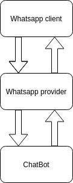
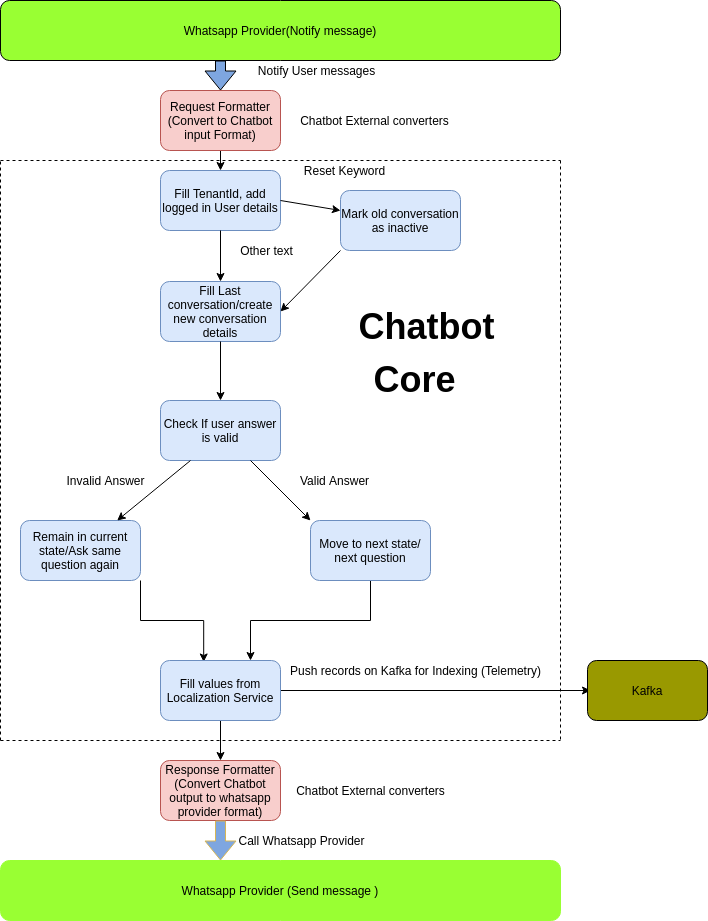
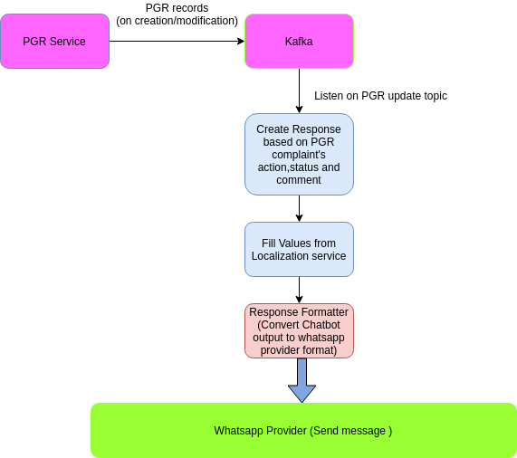

# Chatbot Service

## Overview <a href="#overview" id="overview"></a>

Chatbot service is a chatbot which provides functionality to the user to access PGR module services like filing complaints, tracking complaints, and notifications from WhatsApp. Currently, the citizen has three options - to start a conversation scan the QR code, give a missed call or directly send a message to configured WhatsApp number.

## Pre-requisites <a href="#pre-requisites" id="pre-requisites"></a>

1. Prior knowledge of Java/J2EE.
2. Prior knowledge of SpringBoot.
3. Prior knowledge of PostgreSQL.
4. Prior knowledge of REST APIs and related concepts like path parameters, headers, JSON etc.
5. Prior knowledge of JSONQuery in Postgres. (Similar to PostgreSQL with a few aggregate functions.)

### Dependencies <a href="#dependencies" id="dependencies"></a>

* `egov-user-chatbot` : For creating a user without name validation and logging in the user
* `egov-user` : For searching users
* `egov-localization` : The chatbot is made such that it will store localization codes and the actual text value will be fetched only at the end. This way we can provide multi-lingual support. Localization service is also used to construct messages from templates. This dependency can be eliminated if you want to pass values instead of localization codes.
* `egov-filestore` : It is a dependency if you want to send/receive any file. This includes sending PDF/Image files.
* `egov-url-shortening` : For shortening links sent to the user
* `egov-mdms-service` : For loading MDMS data
* `egov-location` : For loading locality data
* `rainmaker-pgr` : For creating/searching PGR complaints

## Functionalities <a href="#functionalities" id="functionalities"></a>

Chatbot service allows citizens to access PGR service through WhatsApp. Citizens can provide all details required to create a PGR complaint through the question-and-answer method. The service continuously listens to the PGR update Kafka topic and sends notifications to users associated with the PGR record. On any message from a citizen which is forwarded by a WhatsApp provider, the chatbot processes the messages by passing messages through various stages. For instance - validations, enrichment, transformations etc and at the end sends the final response to the user by calling the endpoint of the WhatsApp provider.

## Configuration Details <a href="#configurations" id="configurations"></a>

There are two types of configurations for chatbot states:-

* Configuration for each state in chatbot, ex:-

```
name : pgr.create.locality 
description : "Locality" 
nodeType : step 
optional : false 
type : text 
validationRequired : true 
typeOfValues : FixedSetValues 
displayOptionsInExternalLink: true 
message : chatbot.messages.pgrCreateLocality 
values : 
 class : org.egov.chat.xternal.valuefetch.LocalityValueFetcher 
 params : 
  tenantId : ~pgr.create.tenantId 
  authToken : /user/authToken 
  recipient: /extraInfo/recipient 
matchAnswerThreshold: 70 
errorMessage: chatbot.messages.pgrCreateLocalityError
```

* Graph adjacency list configuration:- to define flow between chatbot states,ex:-

```
root,pgr.create.tenantId,pgr.track.end
pgr.create.tenantId,pgr.create.locality
pgr.create.locality,pgr.create.landmark
```

### Flow Diagrams <a href="#flow-diagrams" id="flow-diagrams"></a>

* **High-Level diagram of chatbot interactions**

<div align="left">

<figure><figcaption></figcaption></figure>

</div>

* **Flow Diagram of Chatbot-User conversation**

<div align="left">

<figure><figcaption></figcaption></figure>

</div>

* **Flow Diagram of Chatbot notifications**

<div align="left">

<figure><figcaption></figcaption></figure>

</div>

## Deployment Details <a href="#deployment-details" id="deployment-details"></a>

1. Add configs required for chatbot service.
2. Deploy the latest version of the chatbot service.
3. Add role-action mapping for APIs.

## Integration Details <a href="#integration" id="integration"></a>

### Integration Scope <a href="#integration-scope" id="integration-scope"></a>

The chatbot service is used to communicate with the users, lodge their complaints or provide miscellaneous/ad-hoc services which citizens avail from ULBs in an interactive way over WhatsApp.

### Integration Benefits <a href="#integration-benefits" id="integration-benefits"></a>

* Can perform service-specific business logic without impacting the other module.
* In the future, if we want to expose the application to citizens then it can be done easily.
* The workflow or Service-specific workflow can be enabled at the chatbot level at any time without changing the design.

### Integration Steps <a href="#steps-to-integration" id="steps-to-integration"></a>

1. To integrate, the host of the chatbot module should be overwritten in the helm chart.
2. `POST /messages` should be added as the endpoint for receiving user-sent messages and forwarding them to the chatbot core logic for further processing and sending back the response.
3. `GET /messages` should be added as the endpoint for receiving user-sent messages and forwarding them to chatbot core logic for further processing and sending back responses.

## Reference Docs <a href="#reference-docs" id="reference-docs"></a>

### Doc Links <a href="#doc-links" id="doc-links"></a>

| Title                     | Link                                                                                                                                                               |
| ------------------------- | ------------------------------------------------------------------------------------------------------------------------------------------------------------------ |
| API Swagger Documentation | [Swagger Documentation](https://editor.swagger.io/?url=https://raw.githubusercontent.com/egovernments/DIGIT-OSS/master/core-services/docs/chatbot-contract.yml#!/) |

### API Details <a href="#api-details" id="api-details"></a>

a) `POST /messages`

Receive the user-sent messages and forward them to chatbot core logic for further processing and sending back responses.

* If the `media_type` parameter value is `text` then user input would be sent in the parameter `text`, in other cases where `media_type` have some other value ex:- image, location etc, the user input would be sent in a parameter `media_data`

b) `GET /messages`

Receive the user-sent message and forward it to the chatbot core logic for further processing and sending back responses.

* If the `media_type` parameter value is `text` then user input would be sent in the parameter `text`, in other cases where `media_type` have some other value ex:- image, location etc, the user input would be sent in a parameter `media_data`

### Kafka Consumers <a href="#kafka-consumers" id="kafka-consumers"></a>

* `update-pgr-service` : used in `update.pgr.service.topic` application property, the chatbot listens on this topic to listen for updates on PGR records and then to send notifications to users.
* The service uses consumers for internal processing also between different stages.

### Kafka Producers <a href="#kafka-producers" id="kafka-producers"></a>

* `send-message-localized` : chatbot sends data to this topic for telemetry indexing and for internal processing.
* The service uses producers for internal processing also between different stages.
