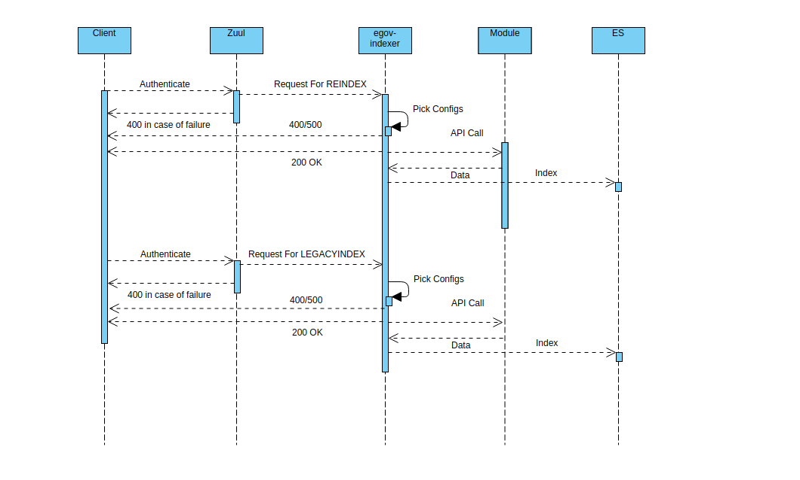

# Indexer Service

## Overview 

The Indexer Service operates independently and is responsible for all indexing tasks on the DIGIT platform. It processes records from specific Kafka topics and utilizes the corresponding index configuration defined in YAML files by each module.

**Objectives:**

* Efficiently read and process records from Kafka topics.
* Retrieve and apply appropriate index configurations from YAML files.
* To provide a one-stop framework for indexing the data to Elasticsearch.
* To create provisions for indexing live data, reindexing from one index to the other and indexing legacy data from the data store.

## Pre-requisites 

Before you proceed with the configuration, make sure the following pre-requisites are met -

1. Prior knowledge of Java/J2EE
2. Prior knowledge of SpringBoot
3. Prior knowledge of Elasticsearch
4. Prior knowledge of REST APIs and related concepts like path parameters, headers, JSON etc.
5. Prior knowledge of Kafka and related concepts like Producer, Consumer, Topic etc.

## Key Functionalities 

* Performs three major tasks namely: LiveIndex, Reindex and LegacyIndex.
  * LiveIndex: Task of indexing the live transaction data on the platform. This keeps the es data in sync with the DB.
  * Reindex: Task of indexing data from one index to the other. ES already provides this feature, the indexer does the same but with data transformation.
  * LegacyIndex: Task of indexing legacy data from the tables to ES.
* Provides flexibility to index the entire object, a part of the object or an entirely different custom object all using one input JSON from modules.
* Provides features for customizing index JSON by field mapping, field masking, data enrichment through external APIs and data denormalization using MDMS.
* One-stop shop for all the es index requirements with easy-to-write and easy-to-maintain configuration files.
* Designed as a consumer to save API overhead. The consumer configs are written from scratch for complete control over consumer behaviour.

## Deployment Details 

* **Step 1:** Write the configuration as per your requirement. The structure of the config file is explained later in the same doc.
* **Step 2:** Check in the config file to a remote location preferably Github. Currently, we check the files into this folder [https://github.com/egovernments/configs/tree/DEV/egov-indexer](https://github.com/egovernments/configs/tree/DEV/egov-indexer) -for dev
* **Step 3:** Provide the absolute path of the checked-in file to the DevOps team. They will add it to the file-read path of egov-indexer by updating the environment manifest file, ensuring it is read at the time of the application's startup.
* **Step 4:** Run the egov-indexer app. Since it is a consumer, it starts listening to the configured topics and indexes the data.

## Interaction Diagram 

<figure><figcaption></figcaption></figure>

## Configuration Details 

Click here to access the [indexer configuration ](indexer-configuration.md)details.

## API Details 

a) `POST /{key}/_index`

Receive data and index. There should be a mapping with the topic as {key} in index config files.

b) `POST /_reindex`

This is used to migrate data from one index to another index

c) `POST /_legacyindex`

This is to run the LegacyIndex job to index data from DB. In the request body, the URL of the service which would be called by the indexer service to pick data must be mentioned.


In legacy indexing and for collection-service records LiveIndex kafka-connect is used to do part of pushing records to elastic search. For more details please refer to the document mentioned in the document list.


## Reference Docs 

### Doc Links 




[indexer-configuration.md](indexer-configuration.md)

