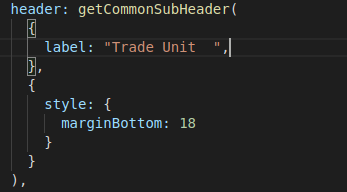

# Setup Base Product Localization

## Overview 

DIGIT supports multiple languages. To enable this feature begin with setting up the base product localisation. The multilingual UI support makes it easier for users to understand the DIGIT operations.

## Pre-requisites 

Before you proceed with the configuration, make sure the following pre-requisites are met -

* Before starting the localisation setup one should know the React and eGov FrameWork.
* Before setting up localisation, make sure that all the keys are pushed to the Create API and also get prepared with the values that need to be added to the Localisation key specific to particular languages that are being added to the product.
* Make sure you know where to add the localisation in the code.

## Key Functionalities 

After localisation, users can view DIGIT screens in their preferred language. Completing the application is simple as the DIGIT UI allows easy language selection.

## Deployment Details 

* Once the key is added to the code as per requirement, the deployment can be done in the same way as the code is deployed.

## Configuration Details 

* Select a label that needs to be localised from the Product code. Here is the example code for a header before setting up Localisation.

<figure><figcaption></figcaption></figure>

* As we see the above which supports only the English language, To set up Localisation to that header we need to the code in the following manner.

<figure><figcaption></figcaption></figure>

* When comparing the code before and after the Localisation setup, we can see that the following code has been added.

{

labelName: "Trade Unit ",

labelKey: "TL\_NEW\_TRADE\_DETAILS\_TRADE\_UNIT\_HEADER"

},

* The values here can be added to the key using two methods: either via the newly developed localisation screen or by updating the key values through the Postman application to create an API.

## Reference Docs 

#### Doc Links 

| Title                                                                                                        | Link                                                                                                                                                                   |
| ------------------------------------------------------------------------------------------------------------ | ---------------------------------------------------------------------------------------------------------------------------------------------------------------------- |
| Adding New Language to DIGIT System. You can refer to the link provided for how languages are added in DIGIT | [Adding New Language](https://urban.digit.org/platform/configure-digit/configuring-digit-services/configuring-common-services/setting-up-a-language/adding-a-language) |
