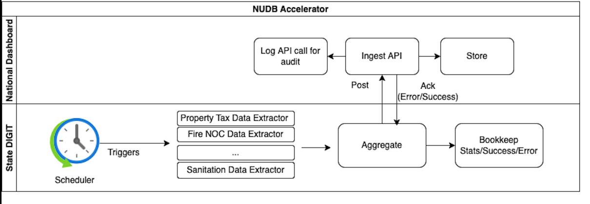

# National Dashboard Adaptor Service

## Overview

Design and develop an adaptor service which will extract data from the state DIGIT installations and push it onto the National Dashboard instance periodically.&#x20;

A list of tasks for this has been tracked for the adaptor -

[Jira - Dashboard](https://digit-discuss.atlassian.net/jira/software/projects/NDA/boards/120)

## Scope

* Adaptor to be deployed on state DIGIT installations
* Periodically, the adaptor extracts data and aggregates it from the different DIGIT modules.&#x20;
* Posts the data to the National Dashboard for the state.
* Bookkeeping is done for every adaptor data extract and pushes for audit and debugging
* Out of scope: extraction from non-DIGIT sources

A national dashboard adaptor extracts data from the state DSS at a scheduled time which can be configured and then would ingest in the National Dashboard. The adaptor ingests data at the state/ULB/Ward level for each module on a daily basis. The adapter sends the data in a batch size of 50 to the national dashboard.

<figure><figcaption>
Flow Diagram
</figcaption></figure>
