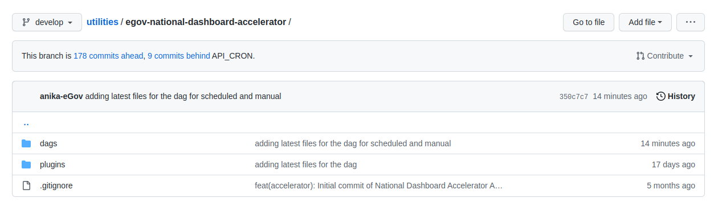
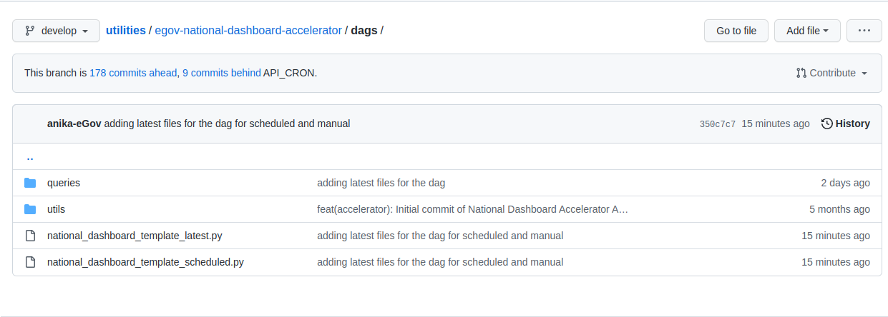
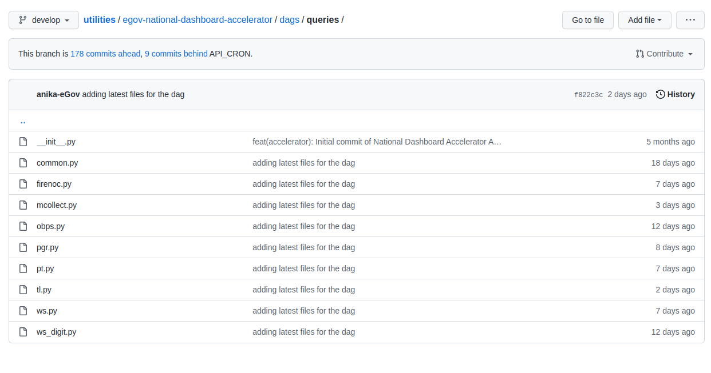

# Code Structure

The code is organised in the following code repo:

[utilities/egov-national-dashboard-accelerator at develop · pmidc-digit/utilities](https://github.com/pmidc-digit/utilities/tree/develop/egov-national-dashboard-accelerator)

Refer to the folder structure below:

* dags
* plugins

<figure><figcaption></figcaption></figure>

The dags folder is the folder which contains the DAG code.

* national\_dashboard\_template\_latest.py(manual trigger)
* national\_dashboard\_template\_scheduled.py(scheduled)

<figure><figcaption></figcaption></figure>

The queries folder contains the ES queries for the individual modules

<figure><figcaption></figcaption></figure>

For adding a new module we need to add a module-specific file in the queries folder with the transform logic and then refer to the DAG code in both manual and trigger versions.
