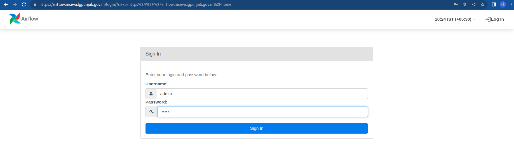
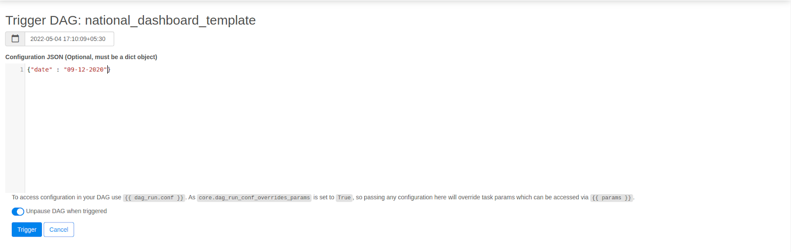
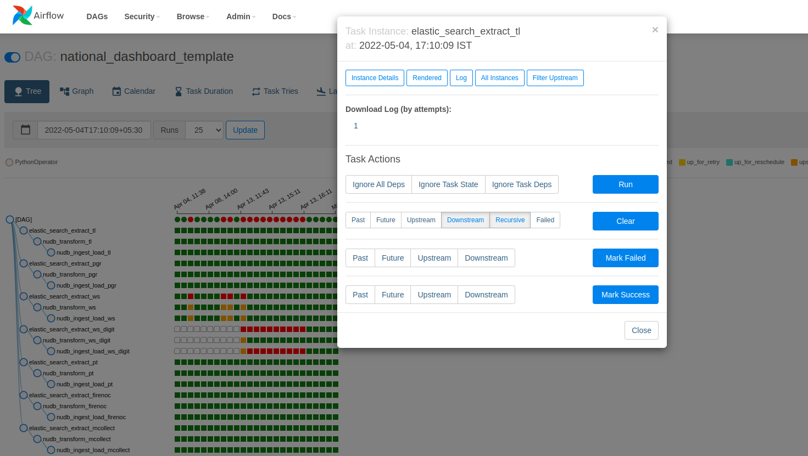
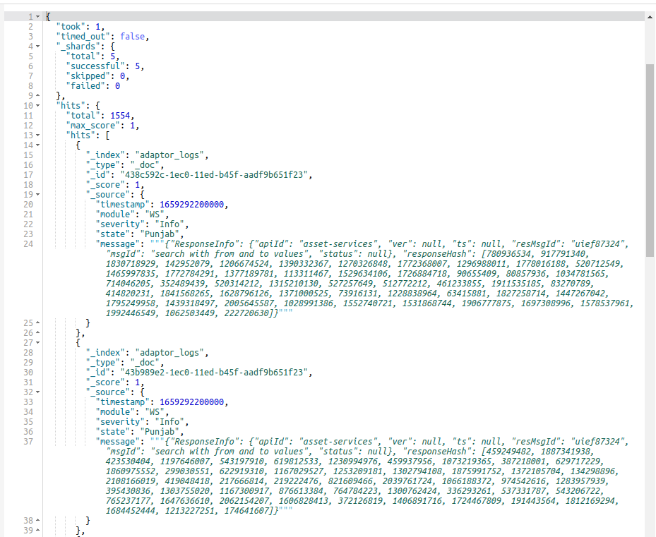
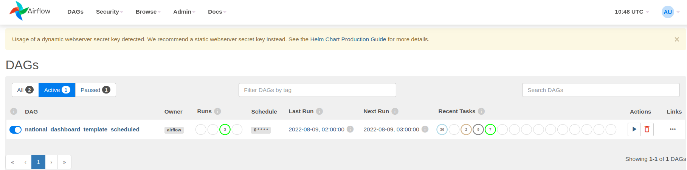

# Trigger Airflow DAG

## Overview

In Airflow, a `DAG` –Directed Acyclic Graph – is a collection of the tasks you want to run, organized in a way that reflects their relationships and dependencies.

A DAG is defined in a Python script, which represents the DAGs structure (tasks and their dependencies) as code.

### Run DAG Airflow 

**Manual Trigger**

1.Log onto the Punjab Prod server using the credentials:

URL: [Sign In - Airflow](https://airflow.mseva-qa.lgpunjab.gov.in/login/?next=http%3A%2F%2Fairflow.mseva-qa.lgpunjab.gov.in%2Fhome)

&#x20;   username: admin

&#x20;   password:  admin

<figure><figcaption></figcaption></figure>

2.Trigger the DAG by clicking on the “Trigger DAG with Config” option.

<figure><figcaption></figcaption></figure>

3.Enter date and click on Trigger button

Format {“date” : “dd-MM-yyyy”}

<figure><figcaption></figcaption></figure>

4.The Logs can be viewed by expanding on the DAG and choosing a stage for any module and&#x20;

Clicking on the Log option.

<figure><figcaption></figcaption></figure>

Logs can also be viewed in the Elastic search index adaptor\_logs

GET adaptor\_logs/\_search

the timestamp can be provided based on the day for which the logs are being searched for

<figure><figcaption></figcaption></figure>

**Scheduled DAG**

This DAG would trigger midnight everyday for the previous day

<figure><figcaption></figcaption></figure>

**Bulk Insert for a date range**

Execute this script to run the DAG for a date range for the staging NDB

sh iterate\_over\_date.sh \<start-date> \<end-date>\
ex: sh iterate\_over\_date.sh 01-03-2022 05-03-2022

* date needs to be in format of dd-mm-YYYY
* range is exclusive of last date, \[start-date, end-date), ex: in above example, script will call dag for 1, 2, 3 and 4 march. Will not do for 5 march.

[utilities/Bulk\_insert.sh at develop · pmidc-digit/utilities](https://github.com/pmidc-digit/utilities/blob/develop/egov-national-dashboard-accelerator/Bulk\_insert.sh)
