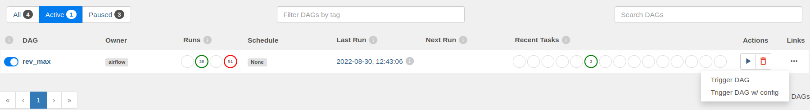

# Revenue Maximisation

**Druid digit**

[Apache Druid](https://druid-qa.ifix.org.in/unified-console.html#load-data)

**Metabase digit**

[https://metabase-qa.ifix.org.in/](https://metabase-qa.ifix.org.in/)

[devops@egov.org.in](mailto:devops@egov.org.in)

eGov@4321

**Code base:**

[utilities/egov-revenue-maximization at develop · pmidc-digit/utilities](https://github.com/pmidc-digit/utilities/tree/develop/egov-revenue-maximization)

The command for executing the DAG:

{"start":"01-04-2022","end":"04-04-2022"}

Select the rev\_max DAG right now deployed in the Punjab production

[https://airflow.mseva.lgpunjab.gov.in/home](https://airflow.mseva.lgpunjab.gov.in/home)

<figure><figcaption></figcaption></figure>

<figure><figcaption>
<strong>click trigger with config option</strong>
</figcaption></figure>

<figure><figcaption></figcaption></figure>

DAG has 3 steps

**collect-data step:**

The data is collected from ES and is converted to a JSON file.

**join\_data step:**

The json file is converted to CSV.

The tables are joined like water and trade, water and property and trade and property.

The outcome is CSV files.

**upload\_data step:**

The CSV files which are created are then uploaded to the druid by using the API.

The CSV files are converted to the format expected by the API and then uploaded to druid tables.

Postman collection for posting the data: [https://www.getpostman.com/collections/74fcabc976b2b9baac93](https://www.getpostman.com/collections/74fcabc976b2b9baac93)
