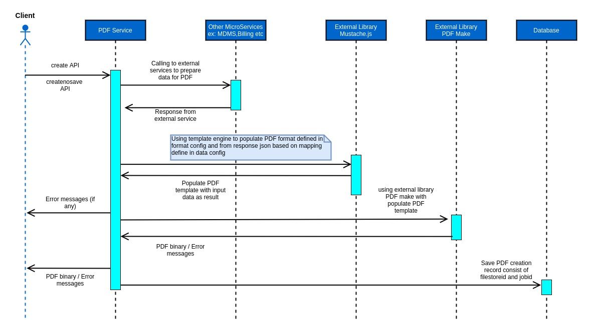

# PDF Generation Service

## Overview 

The objective of the PDF generation service is to bulk generate pdf as per requirement.

## Pre-requisites 

Before proceeding with the documentation, ensure the following prerequisites are met:

1. Install npm
2. Ensure the Kafka server is operational
3. Confirm that the egov-persister service is running and configured with a pdf generation persister path
4. Verify that the PostgreSQL (PSQL) server is running, and a database is created to store filestore IDs and job IDs of generated PDFs

## Key Functionalities 

* Provide a common framework to generate PDFs
* Provide flexibility to customise the PDF as per the requirement
* Provide functionality to add an image or QR code in a PDF
* Provide functionality to generate PDFs in bulk
* Provide functionality to specify the maximum number of records to be written in one PDF

| Environment Variables         | Description                                                                          |
| ----------------------------- | ------------------------------------------------------------------------------------ |
| `MAX_NUMBER_PAGES`            | Maximum number of records to be written in one PDF                                   |
| `DATE_TIMEZONE`               | Date timezone which will be used to convert epoch timestamp into date (`DD/MM/YYYY`) |
| `DEFAULT_LOCALISATION_LOCALE` | Default value of localisation locale                                                 |
| `DEFAULT_LOCALISATION_TENANT` | Default value of localisation tenant                                                 |
| `DATA_CONFIG_URLS`            | File path/URL'S of data config                                                       |
| `FORMAT_CONFIG_URLS`          | File path/URL'S of format config                                                     |

#### External libraries used : 

* **PDFMake: (**[https://github.com/bpampuch/pdfmake - Connect to preview](https://github.com/bpampuch/pdfmake) **):-** for generating PDFs.
* **Mustache.js: (**[https://github.com/janl/mustache.js/](https://github.com/janl/mustache.js/) **):-** as templating engine to populate format as defined in format config, from request json based on mappings defined in data config.

## Interaction Diagram 

<figure><figcaption></figcaption></figure>

## Deployment Details 

1. Create data config and format config for a PDF according to product requirements.
2. Add data config and format config files in PDF configuration.
3. Add the file path of data and format config in the environment yaml file.
4. Deploy the latest version of pdf-service in a particular environment.

## Configuration Details 

For configuration details, refer to [Customizing PDF Receipts & Certificates.](https://urban.digit.org/platform/configure-digit/configuring-digit-services/customizing-pdf-notices-and-certificates/customizing-pdf-receipts-and-certificates)

## Integration Details 

### Integration Scope 

The PDF configuration can be used by any module which needs to show particular information in PDF format that can be printed/downloaded by the user.

### Integration Benefits 

* Functionality to generate PDFs in bulk.
* Avoid regeneration.
* Support QR codes and Images.
* Functionality to specify the maximum number of records to be written in one PDF.
* Uploading generated PDF to filestore and return filestore id for easy access.

### Integration Steps 

To download and print the required PDF \_create API has to be called with the required key (For Integration with UI, please refer to the links in Reference Docs)

## Reference Docs 

### Doc Links 

| Title                                                                                                                                                                                                                                     |
| ----------------------------------------------------------------------------------------------------------------------------------------------------------------------------------------------------------------------------------------- |
| [Customizing PDF Receipts & Certificates](https://urban.digit.org/platform/configure-digit/configuring-digit-services/customizing-pdf-notices-and-certificates/customizing-pdf-receipts-and-certificates)                                 |
| [Steps for Integration of PDF in UI for download and print PDF](https://urban.digit.org/platform/configure-digit/configuring-digit-services/customizing-pdf-notices-and-certificates/integration-of-pdf-in-ui-for-download-and-print-pdf) |
| [API Swagger Documentation](https://app.swaggerhub.com/apis/eGovernment/pdf-service\_ap\_is/1.1.0)                                                                                                                                        |

### API List 

| Title                                                                                           |
| ----------------------------------------------------------------------------------------------- |
| [_`pdf-service/v1/_create`_](https://www.getpostman.com/collections/5a9bfd6fd03f9f2a6fad)       |
| [_`pdf-service/v1/_createnosave`_](https://www.getpostman.com/collections/5a9bfd6fd03f9f2a6fad) |
| [_`pdf-service/v1/_search`_](https://www.getpostman.com/collections/5a9bfd6fd03f9f2a6fad)       |


**Note:** All the APIs are in the same Postman collection, therefore, the same link is added in each row.

