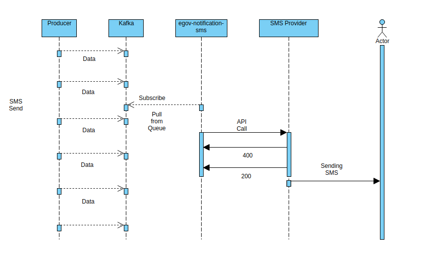

# SMS Notification Service

## Overview <a href="#overview" id="overview"></a>

The objective of this service is to create a common point to manage all the SMS notifications being sent out of the platform. Notification SMS service consumes SMS from the Kafka notification topic and processes them to send it to a third-party service. Modules like PT, TL, PGR etc make use of this service to send messages through the Kafka Queue.

## Pre-requisites <a href="#pre-requisites" id="pre-requisites"></a>

Before you proceed with the documentation, make sure the following pre-requisites are met -

* Prior knowledge of Java/J2EE
* Prior knowledge of SpringBoot
* Prior knowledge of Third party API integration
* Prior knowledge of REST APIs and related concepts like path parameters, headers, JSON etc
* Prior knowledge of Kafka and related concepts like Producer, Consumer, Topic etc.

## Key Functionalities <a href="#key-functionalities" id="key-functionalities"></a>

* Provide a common platform to send an SMS notification to the user.
* Support localised SMS.
* Easily configurable with a different SMS service provider.

## Interaction Diagram <a href="#interaction-diagram" id="interaction-diagram"></a>

<figure><figcaption></figcaption></figure>

## Configuration Details <a href="#configuration-details" id="configuration-details"></a>

This service is a consumer, which means it reads from the Kafka queue and does not provide a facility to be accessed through API calls, there’s no REST layer here. The producers willing to integrate with this consumer will be posting a JSON onto the topic configured at ‘[kafka.topics.notification.sms.name](http://kafka.topics.notification.sms.name/)’. The notification-sms service reads from the queue and sends the sms to the mentioned phone number using one of the SMS providers configured.

The implementation of the consumer is present in the directory `src/main/java/org/egov/web/notification/sms/service/impl`.

These are the current providers available

* Generic
* Console
* MSDG

The implementation to be used can be configured by setting `sms.provider.class`.

#### Console <a href="#console" id="console"></a>

The `Console` implementation just prints the message mobile number and message to the console

#### Generic implementation <a href="#generic-implementation" id="generic-implementation"></a>

This is the default implementation, which can work with most SMS providers. The generic implementation supports below

* GET or POST-based API
* Supports query params, form data, JSON Body

To configure the URL of the SMS provider use `sms.provider.url` property To configure the HTTP method use this to configure the `sms.provider.requestType` property to either `GET` or `POST`.

To configure form data or json API set `sms.provider.contentType=application/x-www-form-urlencoded` or `sms.provider.contentType=application/json` respectively

To configure which data needs to be sent to the API below property can be configured:

* `sms.config.map`={'uname':'$username', 'pwd': '$password', 'sid':'$senderid', 'mobileno':'$mobileno', 'content':'$message', 'smsservicetype':'unicodemsg', 'myParam': '$extraParam' , 'messageType': '$mtype'}
* `sms.category.map`={'mtype': {'\*': 'abc', 'OTP': 'def'\}}
* `sms.extra.config.map`={'extraParam': 'abc'}

`sms.extra.config.map` is not used currently and is only kept for custom implementation which requires data that doesn't need to be directly passed to the REST API call

`sms.config.map` is a map of parameters and their values

Special variables that are mapped

* `$username` maps to `sms.provider.username`
* `$password` maps to `sms.provider.password`
* `$senderid` maps to `sms.senderid`
* `$mobileno` maps to `mobileNumber` from kafka fetched message
* `$message` maps to the `message` from the kafka fetched message
* `$<name>` any variable that is not from the above list, is first checked in `sms.category.map` and then in `application.properties` and then in the environment variable with full upper case and `_` replacing `-`, space or `.`

So if you use `sms.config.map={'u':'$username', 'p':'password'}`. Then the API call will be passed `<url>?u=<$username>&p=password`

**Message Success or Failure**

Message success delivery can be controlled using the below properties

* `sms.verify.response` (default: false)
* `sms.print.response` (default: false)
* `sms.verify.responseContains`
* `sms.success.codes` (default: 200,201,202)
* `sms.error.codes`

If you want to verify some text in the API call response set `sms.verify.response=true` and `sms.verify.responseContains` to the text that should be contained in the response.

**Blacklisting or Whitelisting numbers**

It is possible to whitelist or blacklist phone numbers to which the messages should be sent. This can be controlled using below properties:

* `sms.blacklist.numbers`
* `sms.whitelist.numbers`

Both of them can be given a `,` separated list of numbers or number patterns. To use patterns use `X` for any digit match and `*` for any number of digits match.

`sms.blacklist.numbers=5*,9999999999,88888888XX` will blacklist any phone number starting with `5`, or the exact number `9999999999` and all numbers starting from `8888888800` to `8888888899`

**Prefixing**

Few 3rd parties require a prefix of `0` or `91` or `+91` with the mobile number. In such a case you can use `sms.mobile.prefix` to automatically add the prefix to the mobile number coming into the message queue.

**Error Handling**

There are different topics to which the service will send messages. Below is a list of the same:

`1kafka.topics.backup.sms 2kafka.topics.expiry.sms=egov.core.sms.expiry 3kafka.topics.error.sms=egov.core.sms.error`

In an event of a failure to send an SMS, if `kafka.topics.backup.sms` is specified, then the message will be pushed onto that topic.

Any SMS which expires due to Kafka lags, or some other internal issues, they will be passed to the topic configured in `kafka.topics.expiry.sms`

If a `backup` the topic has not been configured, then in an event of an error the same will be delivered to `kafka.topics.error.sms`

Following are the properties in the application.properties file in the notification sms service which are configurable.

| Property                                                                                                   | Value                                                                                                                                                                                         | Remarks                                                                                                                                                                                                                                                                                                                                                                                                                                                                                                                                                                                                                                                        |
| ---------------------------------------------------------------------------------------------------------- | --------------------------------------------------------------------------------------------------------------------------------------------------------------------------------------------- | -------------------------------------------------------------------------------------------------------------------------------------------------------------------------------------------------------------------------------------------------------------------------------------------------------------------------------------------------------------------------------------------------------------------------------------------------------------------------------------------------------------------------------------------------------------------------------------------------------------------------------------------------------------- |
| <p><a href="http://kafka.topics.notification.sms.name/">kafka.topics.notification.sms.name</a></p><p> </p> | egov.core.notification.sms                                                                                                                                                                    | It is the topic name to which the notification sms consumer would subscribe. Any module wanting to integrate with this consumer should post data on this topic only.                                                                                                                                                                                                                                                                                                                                                                                                                                                                                           |
| <p>sms.provider.class</p><p> </p>                                                                          | Generic                                                                                                                                                                                       | This property decides which SMS provider is to be used by the service to send messages. Currently, Console, MSDG and Generic have been implemented.                                                                                                                                                                                                                                                                                                                                                                                                                                                                                                            |
| sms.provider.contentType                                                                                   | application/x-www-form-urlencoded                                                                                                                                                             | To configure form data or json api set sms.provider.contentType=application/x-www-form-urlencoded or sms.provider.contentType=application/json respectively                                                                                                                                                                                                                                                                                                                                                                                                                                                                                                    |
| sms.provider.requestType                                                                                   | POST                                                                                                                                                                                          | Property to configure the http method used to call provider                                                                                                                                                                                                                                                                                                                                                                                                                                                                                                                                                                                                    |
| <p>sms.provider.url</p><p> </p>                                                                            | [http://abc.in](http://abc.in/)                                                                                                                                                               | URL of the provider. This will be given by the SMS provider only.                                                                                                                                                                                                                                                                                                                                                                                                                                                                                                                                                                                              |
| sms.provider.username                                                                                      | egovsms                                                                                                                                                                                       | Username as provided by the provider which is passed during the API call to the provider.                                                                                                                                                                                                                                                                                                                                                                                                                                                                                                                                                                      |
| <p>sms.provider.password</p><p> </p>                                                                       | abc123                                                                                                                                                                                        | Password as provided by the provider which is passed during the API call to the provider. This has to be encrypted and stored                                                                                                                                                                                                                                                                                                                                                                                                                                                                                                                                  |
| <p>sms.senderid</p><p> </p>                                                                                | EGOV                                                                                                                                                                                          | SMS sender id provided by the provider, this will show up as the sender on receiver’s phone.                                                                                                                                                                                                                                                                                                                                                                                                                                                                                                                                                                   |
| sms.config.map                                                                                             | {'uname':'$username', 'pwd': '$password', 'sid':'$senderid', 'mobileno':'$mobileno', 'content':'$message', 'smsservicetype':'unicodemsg', 'myParam': '$extraParam' , 'messageType': '$mtype'} | <p>Map of parameters to be passed to the API provider. This is provider-specific. <strong>$username</strong> maps to sms.provider.username</p><p><strong>$password</strong> maps to sms.provider.password</p><p><strong>$senderid</strong> maps to sms.senderid</p><p><strong>$mobileno</strong> maps to mobileNumber from kafka fetched message</p><p><strong>$message</strong> maps to the message from the kafka fetched message</p><p>$&#x3C;name> any variable that is not from above list, is first checked in sms.category.map and then in application.properties and then in environment variable with full upper case and _ replacing -, space or</p> |
| sms.category.map                                                                                           | {'mtype': {'\*': 'abc', 'OTP': 'def'\}}                                                                                                                                                       | replace any value in sms.config.map                                                                                                                                                                                                                                                                                                                                                                                                                                                                                                                                                                                                                            |
| sms.blacklist.numbers                                                                                      | 5\*,9999999999,88888888XX                                                                                                                                                                     | For blacklisting, a “,” separated list of numbers or number patterns. To use patterns use X for any digit match and \* for any number of digits match                                                                                                                                                                                                                                                                                                                                                                                                                                                                                                          |
| sms.whitelist.numbers                                                                                      | 5\*,9999999999,88888888XX                                                                                                                                                                     | For whitelisting, a “,” separated list of numbers or number patterns. To use patterns use X for any digit match and \* for any number of digits match                                                                                                                                                                                                                                                                                                                                                                                                                                                                                                          |
| sms.mobile.prefix                                                                                          | 91                                                                                                                                                                                            | add the prefix to the mobile number coming in the message queue                                                                                                                                                                                                                                                                                                                                                                                                                                                                                                                                                                                                |

## Deployment Details <a href="#deployment-details" id="deployment-details"></a>

1. Add the variables present in the above table in a particular environment file
2. Deploy the latest version of egov-notification-sms service.

## Integration Details <a href="#integration" id="integration"></a>

### Integration Scope <a href="#integration-scope" id="integration-scope"></a>

Notification SMS service consumes SMS from the Kafka notification topic and processes them to send it to a third-party service. Modules like PT, TL, PGR etc make use of this service to send messages through the Kafka Queue.

### Integration Benefits <a href="#integration-benefits" id="integration-benefits"></a>

* Provide an interface to send notification SMS on user mobile number.
* Support SMS in various languages.

### Integration Steps <a href="#steps-to-integration" id="steps-to-integration"></a>

1. To integrate, create the SMS request body given in the example below.\
   Provide the correct mobile number and message in the request body\
   and send it to the Kafka topic:- egov.core.notification.sms
2. The notification-sms service reads from the queue and sends the sms to the mentioned phone number using one of the SMS providers configured.

```
{
  "mobileNumber": "9480411228",
  "message": "Hey, how you doing?"
}
```

## Reference Docs <a href="#reference-docs" id="reference-docs"></a>

### Doc Links <a href="#doc-links" id="doc-links"></a>

| Title                                                                |
| -------------------------------------------------------------------- |
| [SMS Template Approval Process](../sms-template-approval-process.md) |
