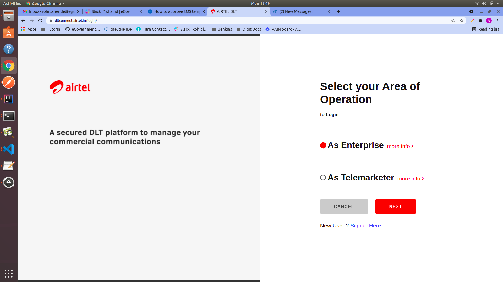
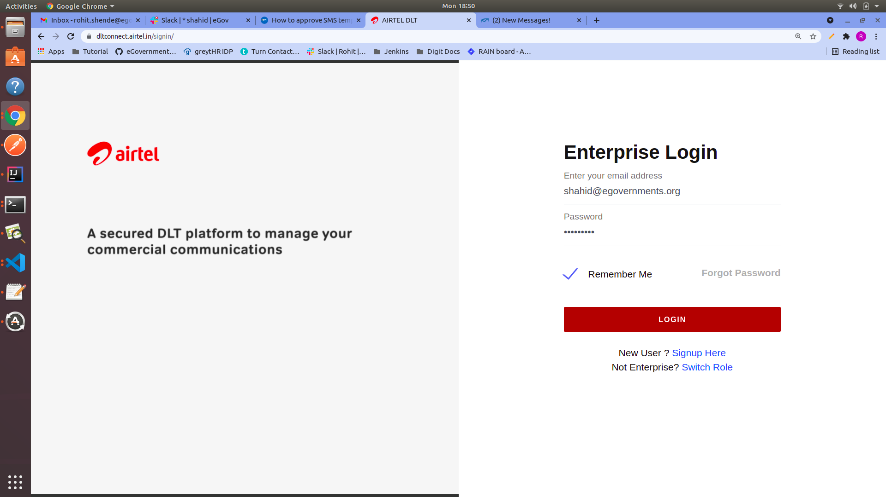
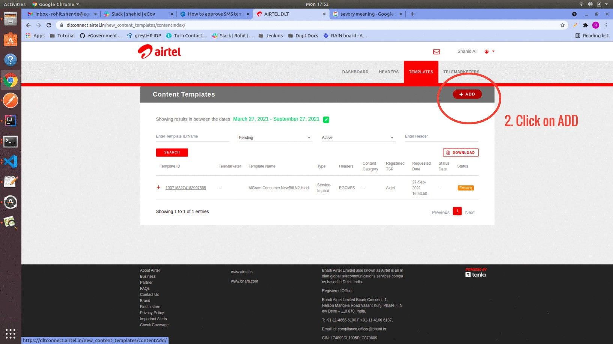
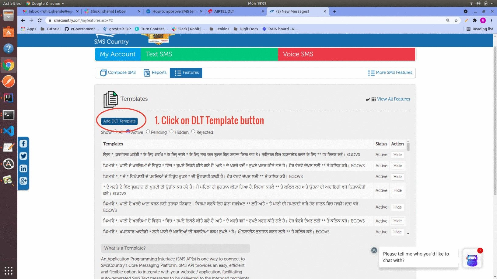

# SMS Template Approval Process

## Overview

According to TRAI’s regulation on unsolicited commercial communication, all teleco's must verify every sms content before delivering it (Template scrubbing). For this all the businesses using SMS need to register Entities, SenderIDs, SMS templates in a centralised DLT portal.

Below are the steps to register the SMS template in a centralised DLT portal and to add the template in the SMS country portal (Service provider).

**Step 1:** Visit **Airtel DLT portal**([AIRTEL DLT](https://dltconnect.airtel.in/login/) ) and select your area of operation as **Enterprise** then click on next.

<figure><figcaption></figcaption></figure>

**Step 2:** Login into the portal by entering the proper credentials and OTP.


Please contact the HR manager for the credentials and the OTP.


<figure><figcaption></figcaption></figure>

<figure><figcaption></figcaption></figure>

**Step 3:** Now select the **Template** from option and then click on **content templates**.

<figure><figcaption></figcaption></figure>

Now click on **Add** button to go to next section

<figure><figcaption></figcaption></figure>

**Step 4:** Select the option mentioned in the image below.

<figure><figcaption></figcaption></figure>


Note:\
a) For placeholder text (dynamic text in message) mention **{#var#}** in the message. Each **{#var#}** can contains 0-30 character. If dynamic text is supposed to go more than 30 characters in length, then two **{#var#}** have to mention side by side. Now the dynamic text can be up to 60 characters.\
**Example**:- _Hi Citizen,_\
_Click on this link to pay the bill {#var#}{#var#}_\
\
_EGOVS_\
\
b) It is mandatory to mention _**EGOVS**_ at the end of every message.\
\
c) Select Template message Type as Regional if the message is in other language rather than english.


After clicking on Save button, template is added in the portal, Now wait for the approval of the template.\
Once the template get approved save the template id and the message.

<figure><figcaption></figcaption></figure>

**Step 5:** Repeat process from **Step 3** to **Step 4** to register template in DLT portal.


Note: The below steps are to add approved templates in the SMS Country web portal. These steps might be different for other service providers but the data required for any service provider would be the same.


**Step 6:** Now, login into SMS Country portal ([SMS Marketing Solution Provider | SMS & Voice Marketing APIs - SMSCountry](https://www.smscountry.com/Index.aspx?msg=Logged%20out%20successfully) ) by entering proper credentials.


Please contact the HR manager for the credentials.


<figure><figcaption></figcaption></figure>

**Step 7:** Select option Features, then click on Manage button under Template section.

<figure><figcaption></figcaption></figure>

Then click on **Add DLT Template** button.

<figure><figcaption></figcaption></figure>

**Step 8:** Mention the template id and message of approved template which we have saved earlier in step 4. And select sender id as **EGOVFS**

<figure><figcaption></figcaption></figure>

After adding all the above details click on **Add Template** button.\
Now the DLT approved template get added into SMS Country portal and it is ready to use.


Select ISLanguage check box if the message is in other language rather than english.


**Step 9:** Repeat process from **Step 7** to **Step 8** to add approved template in SMS Country portal.
