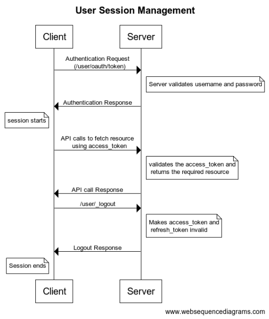

# User Session Management

## Overview

Whenever any user logs an authorization token, a refresh token is generated for the user. Using the auth token the client can make rest API calls to the server to fetch data. The auth token has an expiry period. Once the authorization token expires, it cannot be used to make API calls. The client has to generate a new authorization token. This is done by authenticating the refresh token with the server which then generates and sends a new authorization token to the client. The refresh token avoids the need for the client to log in again whenever the authorization token expires.

<figure><figcaption></figcaption></figure>

Refresh token also has an expiry period and once it gets expired it cannot be used to generate new authorization tokens. The user has to log in again to get a new pair of authorization tokens and refresh tokens. Generally, the duration before the expiry of the refresh token is more as compared to that of authorization tokens. If the user logs out of the account both authorization tokens and refresh tokens become invalid.

## Environment Variables  

Variables to configure expiry time:

| Param                               | Description                                                    |
| ----------------------------------- | -------------------------------------------------------------- |
| `access.token.validity.in.minutes`  | Duration in minutes for which the authorization token is valid |
| `refresh.token.validity.in.minutes` | Duration in minutes for which the refresh token is valid       |

## API List 

| API                 | Description                                                                                                                                                                                                                                                                                        |
| ------------------- | -------------------------------------------------------------------------------------------------------------------------------------------------------------------------------------------------------------------------------------------------------------------------------------------------- |
| `/user/oauth/token` | Used to start the session by generating Auth token and refresh token from username and password using grant\_type as password. The same API can be used to generate new auth token from refresh token by using grant\_type as refresh\_token and sending the refresh token with key refresh\_token |
| `/user/_logout`     | This API is used to end the session. The access token and refresh token will become invalid once this API is called. Auth token is sent as param in the API call                                                                                                                                   |

