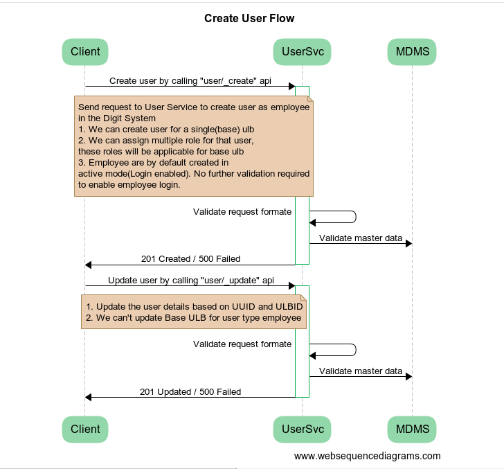
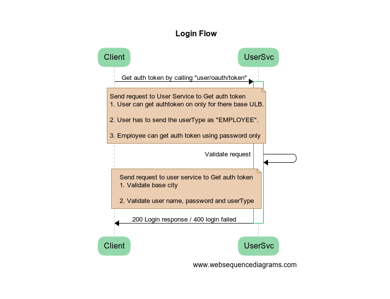

# User

## Overview

User service is responsible for user data management and providing functionality to login and logout into the DIGIT system

## Pre-requisites

Before you proceed with the configuration, make sure the following pre-requisites are met&#x20;

* Java 17
* [Encryption](../encryption-service/) and [MDMS](../mdms-master-data-management-service/) services are running
* PostgreSQL server is running&#x20;
* Redis is running

## Key Functionalities

* Store, update and search user data
* Provide Authentication
* Provide login and logout functionality into the DIGIT platform
* Store user data PIIs in encrypted form

## Play around with the API's : [DIGIT-Playground](https://digit-api.apidog.io/doc-507201)&#x20;

## Interaction Diagram

<figure><figcaption></figcaption></figure>

<div align="left">

<figure><figcaption></figcaption></figure>

</div>

## Deployment Details

1. Setup the latest version of [egov-enc-service](../encryption-service/) and [egov-mdms- service](../mdms-master-data-management-service/)&#x20;
2.  [Deploy](../../../guides/installation-guide/digit-deployment/deployment-key-concepts/deploying-digit-services.md) the latest version of egov-user service

    &#x20;**Note**: This video will give you an idea of how to deploy any Digit-service. Further you can find the latest builds for each service in out latest [release document](../../releases/digit-2.9-lts/service-build-updates.md) here.
3.  Add [role-action mapping](https://github.com/egovernments/playground-mdms-data/blob/master/data/pg/ACCESSCONTROL-ROLEACTIONS/roleactions.json) for APIs

    **Note** : This is a sample JSON file containing role-action mapping , If you don't have any of the master data setup yet you can you this to create on for you and then add all these files and start making changed in your repo.

## Configuration Details

The following application properties file in user service are configurable.

| Property                                    | Value  | Remarks                                            |
| ------------------------------------------- | ------ | -------------------------------------------------- |
| `egov.user.search.default.size`             | 10     | default search record number limit                 |
| `citizen.login.password.otp.enabled`        | true   | whether citizen login otp based                    |
| `employee.login.password.otp.enabled`       | false  | whether employee login otp based                   |
| `citizen.login.password.otp.fixed.value`    | 123456 | fixed otp for citizen                              |
| `citizen.login.password.otp.fixed.enabled`  | false  | allow fixed otp for citizen                        |
| `otp.validation.register.mandatory`         | true   | whether otp compulsory for registration            |
| `access.token.validity.in.minutes`          | 10080  | validity time of access token                      |
| `refresh.token.validity.in.minutes`         | 20160  | validity time of refresh token                     |
| `default.password.expiry.in.days`           | 90     | expiry date of a password                          |
| `account.unlock.cool.down.period.minutes`   | 60     | unlock time                                        |
| `max.invalid.login.attempts.period.minutes` | 30     | window size for counting attempts for lock         |
| `max.invalid.login.attempts`                | 5      | max failed login attempts before account is locked |
| `egov.state.level.tenant.id`                | pb     |                                                    |

## Integration Details

### Integration Scope

User data management and functionality to log in and log out into the DIGIT system using OTP and password.

### Integration Benefits

Providing the following functionalities to citizen and employee-type users

Employee:

* User registration
* Search user
* Update user details
* Forgot password
* Change password
* User role mapping(Single ULB to multiple roles)
* Enable employees to login into the DIGIT system based on a password.

Citizen:

* Create user
* Update user
* Search user
* User registration using OTP
* OTP based login

### Integration Steps

* To integrate, the host of egov-user should be overwritten in the helm chart.
* Use `/citizen/_create` endpoint for creating users into the system. This endpoint requires the user to validate his mobile number using OTP. First, the OTP is sent to the user's mobile number and then the OTP is sent as `otpReference` in the request body.
* Use `/v1/_search` and `/_search` endpoints to search users in the system depending on various search parameters.
* Use `/profile/_update` for updating the user profile. The user is validated (either through OTP-based validation or password validation) when this API is called.
* `/users/_createnovalidate` and `/users/_updatenovalidate` are endpoints to create user data into the system without any validations (no OTP or password required). They should be strictly used only for creating/updating users internally and should not be exposed outside.
* **Forgot password:** In case the user forgets the password it can be reset by first calling `/user-otp/v1/_send` which generates and sends OTP to the employee’s mobile number. The password is then updated using this OTP by calling the API `/password/nologin/_update` in which a new password along with the OTP is sent.
* Use `/password/_update` to update the existing password by logging in. Both old and new passwords are sent to the request body. Details of the API can be found in the attached swagger documentation.
* Use `/user/oauth/token` for generating tokens, `/_logout`for logout and `/_details` for getting user information from the token.
* **Multi-Tenant User**: The multi-tenant user functionality allows users to perform actions across multiple ULBs. For example, employees belonging to Amritsar can perform the role of say Trade License Approver for Jalandhar by assigning them the tenant-level role of tenantId pb.jalandhar.&#x20;
* Following is an example of the user:


```json
{
        "id": 24226,
        "uuid": "11t0e02b-0145-4de2-bc42-c97b96264807",
        "userName": "xyz",
        "name": "abc",
        "mobileNumber": "9999999999",
        "emailId": "abc@gmail.com",
        "locale": null,
        "type": "EMPLOYEE",
        "roles": [
            {
                "name": "Employee",
                "code": "EMPLOYEE",
                "tenantId": "pb.amritsar"
            },
            {
                "name": "TL Approver",
                "code": "TL_APPROVER",
                "tenantId": "pb.jalandhar"
            }
        ],
        "active": true,
        "tenantId": "pb.amritsar"
    }
```


If an employee has a role with statelevel `tenantId` they can perform actions corresponding to that role across all tenants.

* **Refresh Token:** Whenever the `/user/oauth/token` is called to generate the `access_token` along with `access_token,` one more token is generated called `refresh_token` . The refresh token is used to generate a new `access_token` whenever the existing one expires. Till the time the refresh token is valid, users will not have to log in even if their `access_token`  expires since this is generated using `refresh_token`. The validity time of the refresh token is configurable and can be configured using the property: `refresh.token.validity.in.minutes`&#x20;

### User Data Privacy <a href="#user-data-privacy" id="user-data-privacy"></a>

Since User service handles PII (Personal Identifiable information) encrypting the data before saving in DB becomes crucial.

&#x20;DIGIT manages these as security policy in Master Data which is then referred by encryption service to encrypt the data before persisting it to DB.&#x20;

#### MDMS Configuration For Security Policy <a href="#mdms-configuration-for-security-policy" id="mdms-configuration-for-security-policy"></a>

There are two security policy models for user data - **User** and **UserSelf**.

**User model**

* &#x20;`attributes` contains a list of fields from the user object that needs to be secured and the field &#x20;
* `roleBasedDecryptionPolicy` is an attribute-level role-based policy. It defines visibility for each attribute.&#x20;
* User security model is used for Search API response

**UserSelf**

* &#x20;**It** contains the same structure of security policy but the UserSelf is used for Create/Update API response.

<pre class="language-json" data-line-numbers><code class="lang-json">{
  "tenantId": "pb",
  "moduleName": "DataSecurity",
  "SecurityPolicy": [
    {
      "model": "User",
      "uniqueIdentifier": {
        "name": "uuid",
        "jsonPath": "/uuid"
      },
      "attributes": [
        {
          "name": "name",
          "jsonPath": "name",
          "patternId": "002",
          "defaultVisibility": "PLAIN"
        },
        {
          "name": "mobileNumber",
          "jsonPath": "mobileNumber",
          "patternId": "001",
          "defaultVisibility": "PLAIN"
        },
        {
          "name": "emailId",
          "jsonPath": "emailId",
          "patternId": "004",
          "defaultVisibility": "PLAIN"
        },
        {
          "name": "username",
          "jsonPath": "username",
          "patternId": "002",
          "defaultVisibility": "PLAIN"
        },
        {
          "name": "altContactNumber",
          "jsonPath": "altContactNumber",
          "patternId": "001",
          "defaultVisibility": "PLAIN"
        },
        {
          "name": "alternatemobilenumber",
          "jsonPath": "alternatemobilenumber",
          "patternId": "001",
          "defaultVisibility": "PLAIN"
        },
        {
          "name": "pan",
          "jsonPath": "pan",
          "patternId": "001",
          "defaultVisibility": "PLAIN"
        },
        {
          "name": "aadhaarNumber",
          "jsonPath": "aadhaarNumber",
          "patternId": "001",
          "defaultVisibility": "PLAIN"
        },
        {
          "name": "guardian",
          "jsonPath": "guardian",
          "patternId": "002",
          "defaultVisibility": "PLAIN"
        },
        {
          "name": "permanentAddress",
          "jsonPath": "permanentAddress/address",
          "patternId": "003",
          "defaultVisibility": "PLAIN"
        },
        {
          "name": "correspondenceAddress",
          "jsonPath": "correspondenceAddress/address",
          "patternId": "003",
          "defaultVisibility": "PLAIN"
        },
        {
          "name": "fatherOrHusbandName",
          "jsonPath": "fatherOrHusbandName",
          "patternId": "002",
          "defaultVisibility": "PLAIN"
        },
        {
          "name": "searchUsername",
          "jsonPath": "userName",
          "patternId": "002",
          "defaultVisibility": "PLAIN"
        }
      ],
      "roleBasedDecryptionPolicy": [
        {
          "roles": [
            "PGR_LME",
            "GRO"
          ],
          "attributeAccessList": [
            {
              "attribute": "name",
              "firstLevelVisibility": "MASKED",
              "secondLevelVisibility": "PLAIN"
            },
            {
              "attribute": "mobileNumber",
              "firstLevelVisibility": "MASKED",
              "secondLevelVisibility": "PLAIN"
            },
            {
              "attribute": "username",
              "firstLevelVisibility": "MASKED",
              "secondLevelVisibility": "PLAIN"
            },
            {
              "attribute": "permanentAddress",
              "firstLevelVisibility": "MASKED",
              "secondLevelVisibility": "PLAIN"
            }
          ]
        },
        {
          "roles": [
            "TLCEMP"
          ],
          "attributeAccessList": [
            {
              "attribute": "mobileNumber",
              "firstLevelVisibility": "MASKED",
              "secondLevelVisibility": "PLAIN"
            }
          ]
        }
      ]
    },
    {
      "model": "UserSelf",
<strong>      "uniqueIdentifier": {
</strong>        "name": "uuid",
        "jsonPath": "/uuid"
      },
      "attributes": [
<strong>        {
</strong>          "name": "name",
          "jsonPath": "name",
          "patternId": null,
          "defaultVisibility": "PLAIN"
        },
        {
          "name": "mobileNumber",
          "jsonPath": "mobileNumber",
          "patternId": null,
          "defaultVisibility": "PLAIN"
        },
        {
          "name": "emailId",
          "jsonPath": "emailId",
          "patternId": null,
          "defaultVisibility": "PLAIN"
        },
        {
          "name": "username",
          "jsonPath": "username",
          "patternId": null,
          "defaultVisibility": "PLAIN"
        },
        {
          "name": "altContactNumber",
          "jsonPath": "altContactNumber",
          "patternId": null,
          "defaultVisibility": "PLAIN"
        },
        {
          "name": "alternatemobilenumber",
          "jsonPath": "alternatemobilenumber",
          "patternId": null,
          "defaultVisibility": "PLAIN"
        },
        {
          "name": "pan",
          "jsonPath": "pan",
          "patternId": null,
          "defaultVisibility": "PLAIN"
        },
        {
          "name": "aadhaarNumber",
          "jsonPath": "aadhaarNumber",
          "patternId": null,
          "defaultVisibility": "PLAIN"
        },
        {
          "name": "guardian",
          "jsonPath": "guardian",
          "patternId": null,
          "defaultVisibility": "PLAIN"
        },
        {
          "name": "permanentAddress",
          "jsonPath": "permanentAddress/address",
          "patternId": null,
          "defaultVisibility": "PLAIN"
        },
        {
          "name": "correspondenceAddress",
          "jsonPath": "correspondenceAddress/address",
          "patternId": null,
          "defaultVisibility": "PLAIN"
        },
        {
          "name": "fatherOrHusbandName",
          "jsonPath": "fatherOrHusbandName",
          "patternId": null,
          "defaultVisibility": "PLAIN"
        }
      ],
      "roleBasedDecryptionPolicy": []
    }
  ]
}
</code></pre>


The visibility of the PII data is based on the above MDMS configuration. There are three types of visibility mentioned in the config.

1. **PLAIN** - Show text in plain form.
2. **MASKED** - The returned text contains masked data. The masking pattern is applied as defined in the Masking Patterns master data.
3. **NONE** - The returned text does not contain any data. It contains strings like _“Confidential Information”_.

### Plain Access Request <a href="#plain-access-request" id="plain-access-request"></a>


```json
{
  "RequestInfo": {
    "plainAccessRequest": {
      "recordId": "d5ee3d45-13a1-4aa5-bd86-9b8dae34b900"
      "fields": [ "name", "mobileNumber" ]
    }
  }
}

```


Any user can get plain access to the secured data (citizen’s PII) by requesting through the `plainAccessRequest` parameter. It takes the following parameters:

1. `recordId` - It is the unique identifier of the record that is requested for plain access.
2. `fields` - It defines a list of attributes that are requested for plain access.

To know more about the encryption policy, refer to the document [**Encryption Service**](../encryption-service/) docs.

## Reference Docs

### Doc Links


User data encryption promotion document



[encryption-service](../encryption-service/)


### API List

| APIs                                                                                      |
| ----------------------------------------------------------------------------------------- |
| [/citizen/\_create](https://www.getpostman.com/collections/15443fcb25c8aacd8897)          |
| [/users/\_createnovalidate](https://www.getpostman.com/collections/15443fcb25c8aacd8897)  |
| [/\_search](https://www.getpostman.com/collections/15443fcb25c8aacd8897)                  |
| [/v1/\_search](https://www.getpostman.com/collections/15443fcb25c8aacd8897)               |
| [/\_details](https://www.getpostman.com/collections/15443fcb25c8aacd8897)                 |
| [/users/\_updatenovalidate](https://www.getpostman.com/collections/15443fcb25c8aacd8897)  |
| [/profile/\_update](https://www.getpostman.com/collections/15443fcb25c8aacd8897)          |
| [/password/\_update](https://www.getpostman.com/collections/15443fcb25c8aacd8897)         |
| [/password/nologin/\_update](https://www.getpostman.com/collections/15443fcb25c8aacd8897) |
| [/\_logout](https://www.getpostman.com/collections/15443fcb25c8aacd8897)                  |
| [/user/oauth/token](https://www.getpostman.com/collections/15443fcb25c8aacd8897)          |

