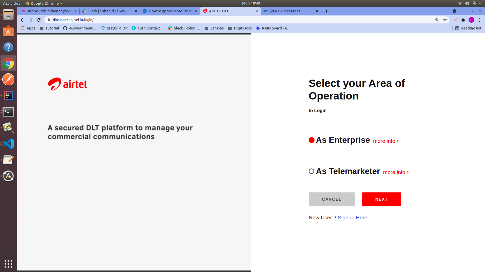
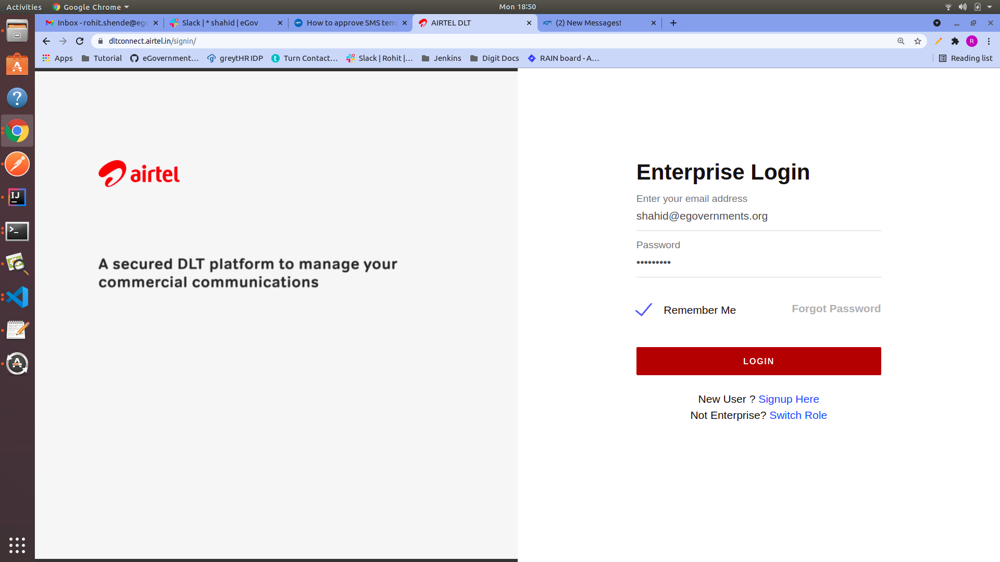
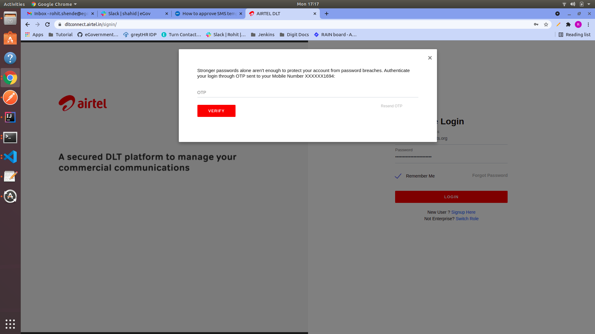
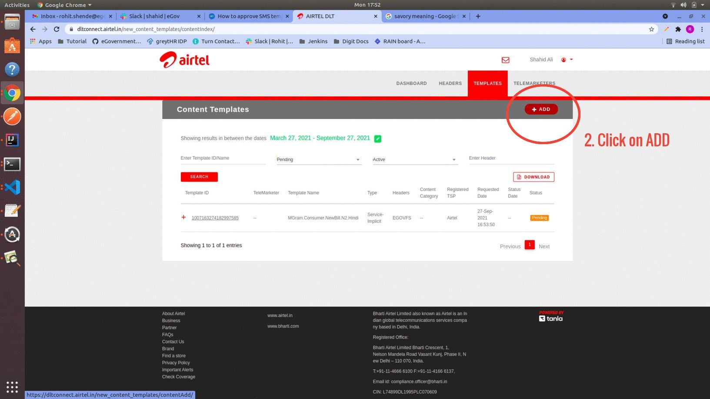
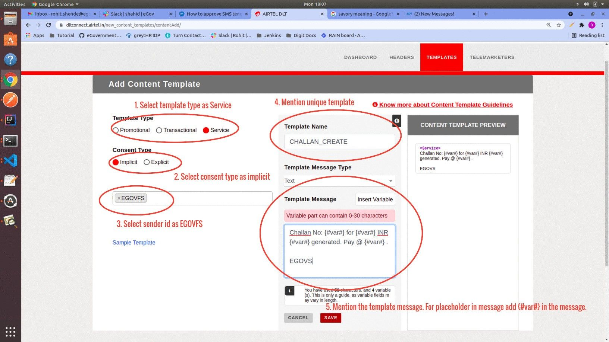
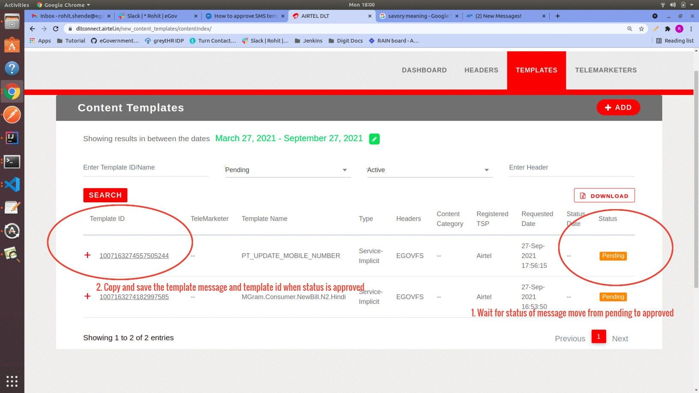
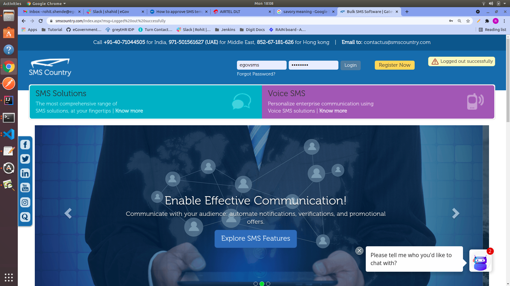
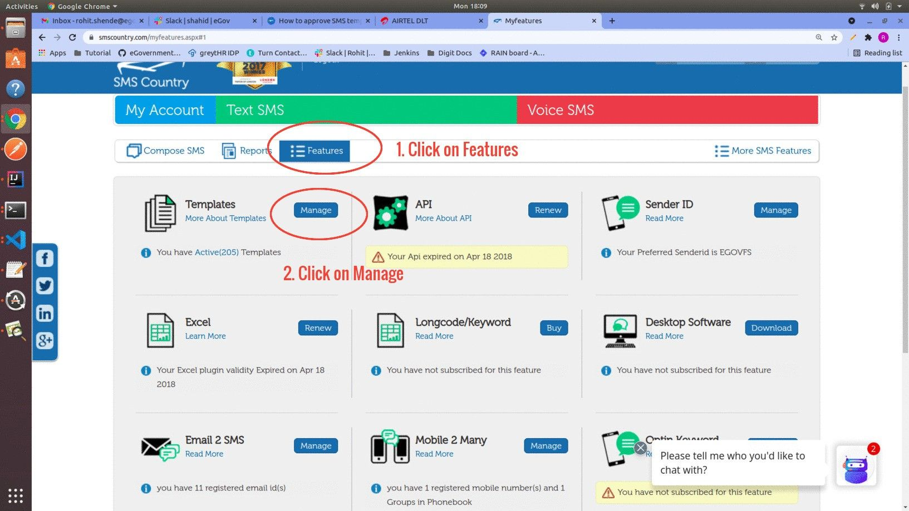
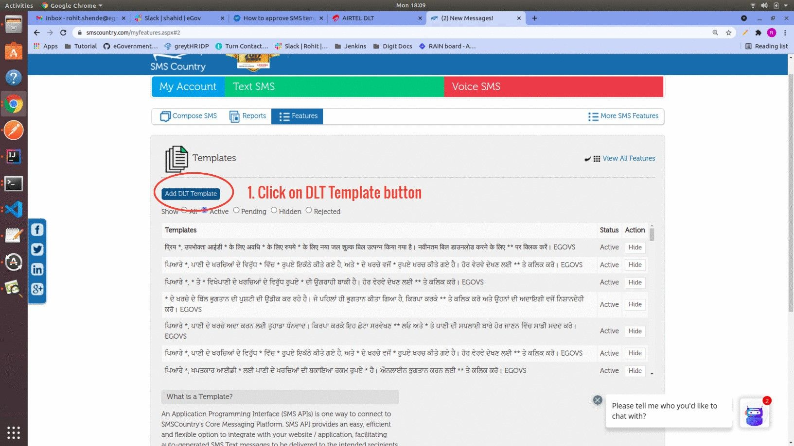
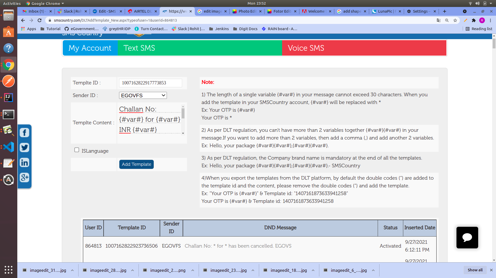

# SMS Template Approval Process

## Overview

According to TRAI’s regulation on unsolicited commercial communication, all telecoms must verify every SMS content before delivering it (Template scrubbing). For this, all the businesses using SMS must register Entities, SenderIDs, and SMS templates on a centralised DLT portal.

## Steps

Below are the steps to register the SMS template in a centralised DLT portal and to add the template in the SMS country portal (Service provider).

**Step 1:** Visit the **Airtel DLT portal** ([AIRTEL DLT](https://dltconnect.airtel.in/login/) ) and select your area of operation as **Enterprise** then click on next.

<figure><figcaption></figcaption></figure>

**Step 2:** Login into the portal by entering the proper credentials and OTP.


Contact the HR manager for the credentials and the OTP.


<figure><figcaption></figcaption></figure>

<figure><figcaption></figcaption></figure>

**Step 3:** Select the **Template** from the option and click on **Content Templates**.

<figure><figcaption></figcaption></figure>

Click on the **Add** button to go to the next section.

<figure><figcaption></figcaption></figure>

**Step 4:** Select the option mentioned in the image below.

<figure><figcaption></figcaption></figure>


Note:\
a) For placeholder text (dynamic text in message) mention **{#var#}** in the message. Each **{#var#}** can contain 0-30 characters. If dynamic text is supposed to cross 30 characters in length, then two **{#var#}** have to be mentioned side by side. Now the dynamic text can be up to 60 characters.\
**Example**:- _Hi Citizen,_\
_Click on this link to pay the bill {#var#}{#var#}_\
\
_EGOVS_\
\
b) Mentioning EGOVS at the end of every message is mandatory.\
\
c) Select the Template message Type as Regional if the message is in any other language besides English.


After clicking on the Save button, the template is added to the portal. Wait for the approval of the template.\
Once the template gets approved save the template ID and the message.

<figure><figcaption></figcaption></figure>

**Step 5:** Repeat the process from **Step 3** to **Step 4** to register the template in the DLT portal.


Note: The below steps are to add approved templates in the SMS Country web portal. These steps might vary between service providers but the data required for any service provider would be the same.


**Step 6:** Enter the credentials to log into the SMS Country portal ([SMS Marketing Solution Provider | SMS & Voice Marketing APIs - SMSCountry](https://www.smscountry.com/Index.aspx?msg=Logged%20out%20successfully) ).


Contact the HR manager for the credentials.


<figure><figcaption></figcaption></figure>

**Step 7:** Select the option Features, then click on the Manage button under the Template section.

<figure><figcaption></figcaption></figure>

Then click on the **Add DLT Template** button.

<figure><figcaption></figcaption></figure>

**Step 8:** Mention the template ID and message of the approved template which we saved earlier in step 4. Select the Sender ID as **EGOVFS.**

<figure><figcaption></figcaption></figure>

After adding all the above details click on **Add Template** button.\
The DLT-approved template is added to the SMS Country portal and is ready to use.


Select the ISLanguage check box if the message is in any other language besides English.


**Step 9:** Repeat the process from **Step 7** to **Step 8** to add the approved template in the SMS Country portal.
