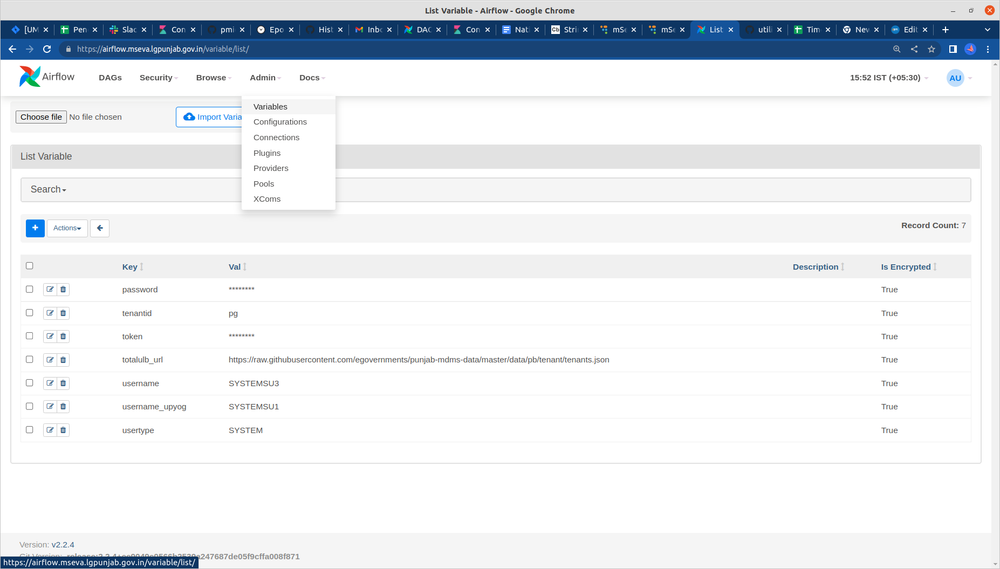
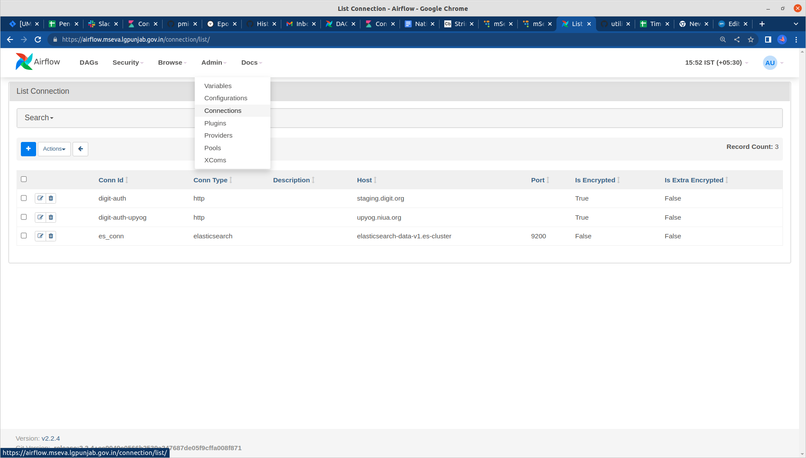

# Configure Airflow

## Configure Airflow Variables 

<figure><figcaption></figcaption></figure>

| Key             | Value                                                                                                                                                                                                    | Remark                          |
| --------------- | -------------------------------------------------------------------------------------------------------------------------------------------------------------------------------------------------------- | ------------------------------- |
| password        | eGov@123                                                                                                                                                                                                 |                                 |
| username        | SYSTEMSU1                                                                                                                                                                                                | for Upyog                       |
| username\_state | SYSTEMSU3                                                                                                                                                                                                | for staging                     |
| token           | ZWdvdi11c2VyLWNsaWVudDo=                                                                                                                                                                                 |                                 |
| tenantid        | pg                                                                                                                                                                                                       |                                 |
| usertype        | SYSYTEM                                                                                                                                                                                                  |                                 |
| totalulb\_url   | [https://raw.githubusercontent.com/egovernments/punjab-mdms-data/master/data/pb/tenant/tenants.json](https://raw.githubusercontent.com/egovernments/punjab-mdms-data/master/data/pb/tenant/tenants.json) | for reading the ulb’s of punjab |

## Configure Connections 

<figure><figcaption></figcaption></figure>

| ConnectionId      | Connection Type     | Host                                                                               |      |                      |                                                      |
| ----------------- | ------------------- | ---------------------------------------------------------------------------------- | ---- | -------------------- | ---------------------------------------------------- |
| es\_conn          | ElasticSearch       | elasticsearch-data-v1.es-cluster                                                   | 9200 |                      | For the ES server                                    |
| digit -auth-state | 
HTTP

 
 | [http://staging.digit.org](http://staging.digit.org/)                              |      | 
https

 
 | 
For the auth api conenction - Staging

 
 |
| digit-auth        |                     | [NUGP](http://upyog.niua.org/) |      |                      | For the auth api conenction - UPYOG                  |
