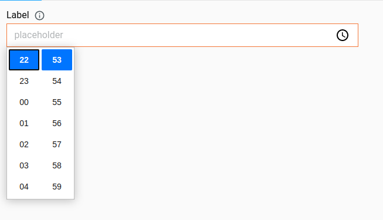
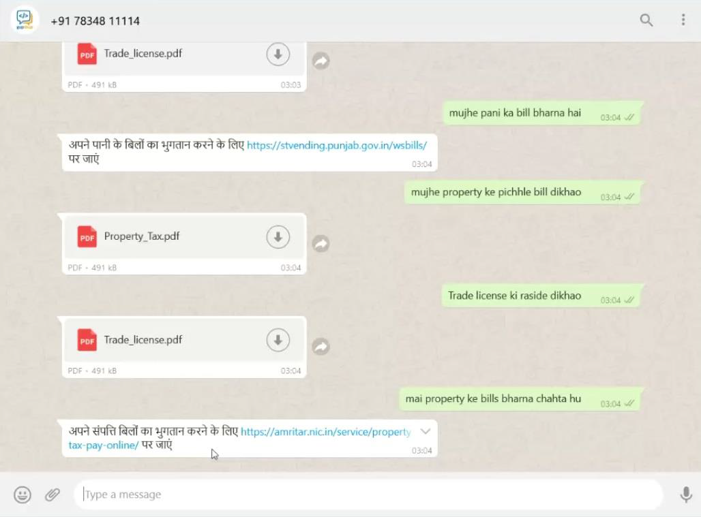
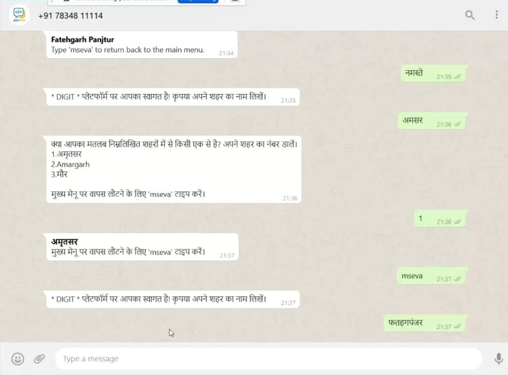

# NLP Chatbot

## **Overview**

NLP \[Natural Language Processing] is a branch of artificial intelligence that deals with the interactions between humans and computers. The primary task is to interpret the intent of the user (speech or text) and provide the user with the appropriate output. Challenges in Natural language frequently involve speech recognition, audio transcription, natural language understanding and natural language generation.

In this project, we are trying to empower regular chatbots with NLP. This will significantly increase user convenience and in turn, help us to enhance our customer reach. On the other hand, this is a cost-efficient approach as the number of dialogues between the user and the chatbot would also reduce and there would be a huge saving on messaging charges.

## **Use Cases**

* [x] **Bill payment/ Receipt retrieval**

This is one of the most insightful use cases of this project. Instead of bombarding the user with subsequent messages consisting of a menu to select from, we can just ask the user to enter his query. Using intent classification and entity recognition, the chatbot can return the appropriate output.

* [x] **Complaint Classification**

Another area where this concept can be used is complaint classification. Instead of visiting a link and selecting a complaint category from a huge list of complaint categories, the user would at any time prefer to just type in the complaint and leave it to the chatbot to identify the category of the complaint using NLP techniques.

* [x] **Type and Search API**

The third use case is regarding the city recognition algorithm. In the existing version of the Punjab UAT chatbot, the process of user locality recognition is a bit inconvenient. The user needs to visit a link, select his/her city from a drop-down menu consisting of around 170 cities, and then return back to WhatsApp to continue the chat further. Using NLP, we can just ask the user to enter his city name and we can detect the user's location using NLP techniques.

## **Concepts**

* **Preparing a virtual dataset**

One of the major challenges in this project was the absence of a real-time dataset, which is of utmost importance in any NLP-based project. The first phase of the project consisted of recognizing the user intent and classifying whether the user wants to pay bills or he simply wants to retrieve receipts. The idea was to exploit the fact that the inputs corresponding to the intent of paying bills, on average have a certain number of past tense verbs and present tense verbs in the sentence. The same goes for the intent of retrieving the paid bills. The tense of the words was figured out using _**POS tagging**_ and _**tokenization**_ in-built functions in nltk.

The sentences present in the brown corpus of the nltk library were segregated into two files namely _‘paid.txt’_ and _‘unpaid.txt’_ The criteria used for segregation were as follows:

A. If a certain sentence consists of one or more words synonymous with ‘paid’ in its past tense, the sentence is added to ‘paid.txt’.

B. If the sentence consists of one or more words synonymous with ‘paid’ but in the present tense, the sentence is added to ‘unpaid.txt’.

C. If a certain sentence consists of one or more words synonymous with ‘unpaid’ in its past tense, the sentence is added to ‘unpaid.txt’.

D. If a certain sentence consists of one or more words synonymous with ‘unpaid’ in its present tense, the sentence is added to ‘paid.txt’.

Thus, we had our virtual dataset ready. Sentences consisting of negative words such as ‘not’, ‘non’ etc were taken care of in the _**n-gram analysis**_, which is explained in the subsequent parts of the documentation.

* **Classification:**

The classifier used here is the _**Decision Tree Classifier**_ available in the nltk library. ‘paid.txt’ and ‘unpaid.txt’ files were used as training data sets for the model. The following have been used as training features:

1\. The number of simple past tense verbs in the sentence.

2\. The number of past perfect tense verbs in the sentence.

3\. The number of simple present tense verbs in the sentence.

4\. The number of past perfect continuous tense verbs in the sentence.

5\. The number of present perfect tense verbs in the sentence.

6\. The number of words synonymous with ‘paid’.

7\. The number of words synonymous with ‘unpaid’.

The classifier was then stored in a _**pickle**_ file so that the classifier is not trained from scratch every time the program is executed, and hence a lot of compilation time is saved. The run time however remains the same.

* **Text pre-processing**

The following refinements are carried out on the text before sending it through the classifier.

1. Remove all the punctuations in the sentence, or convert them into a string if possible. For example, convert n’t to not. Other punctuations such as , . / ? ; etc can be removed safely from the string.
2. Remove _**stop-words**_ from the sentence. Stop-words in nltk are a list of trivial words like ‘I’, ‘me’, ‘myself’, ‘and’, ‘or’, ‘not’ etc. However, the words ‘are’, ‘to’, ‘be’ and ‘not’ are not removed from the sentence as they are useful in n-gram analysis.
3. If any character in the sentence appears consecutively more than two times, then remove the extra occurrences and limit the consecutive characters to two. For example, if there is ‘iiii’ present in the string, then remove the extra i’s and convert it to ‘ii’. This is done based on the fact that there are hardly any words in the English vocabulary where there are more than two consecutive repeating characters. Moreover, this also helps to remove the extra spaces in the input.
4. Convert the entire sentence to lowercase. As we know, Python is case-sensitive and so are the functions in many of the libraries.

The latter half of the text pre-processing comprises _**Fuzzy String Matching.**_

This is accomplished using the ratio function in the fuzzy-wuzzy library of Python. Each word in the sentence is checked against each word in the master list. (the master list is a list containing all the keywords used for training the classifier). If the match ratio is above a certain threshold, the word in the sentence is replaced by the word from the master list. Else, the word is replaced by its closest matching word from the English vocabulary.

* **Intent Recognition**

After text pre-processing, the input sentence is checked for words matching with synonyms of ‘quit’. If such a word is found, then the program assumes the user to have entered the bill payment section mistakenly, and the program exits. Else, the program continues to be executed.

The input sentence is then checked for **n-grams**. N-grams are nothing but a set of n consecutive words in a sentence. For example, the list of 2-grams in the sentence “I want to pay property taxes” will look like \[(‘I’, ‘want’), (‘want’, ‘to’), (‘to’, ‘pay’), (‘pay’, ‘property’), (‘property’, ‘taxes’)]. Some of the 2-grams considered for analysis are \[ 'not paid', 'not complete', 'not done', 'not given']. Some of the 3-grams considered are \['not to be paid', 'not to be given']. It has been observed that the n-grams dominate the user intent more than the tenses of the verbs. Hence, the n-gram analysis is done prior to classification. If the text does not contain any relevant n-grams, the text is then classified using the Decision Tree Classifier.

* **Entity Recognition**

Entity recognition is all about finding the entity mentioned in the user’s input statement. For example, in the statement “I want to pay property taxes”, the entity mentioned is ‘property’. At this point, we are dealing with three entities, namely ‘water and sewerage’, ‘property’, ‘and trade license’. Every word in the user's input is checked with every word in the list of entities. If the fuzzy match ratio between these words is above a certain threshold, the entity is marked. Then, out of all the marked entities, the entity with the highest fuzz ratio is chosen. For example, if the threshold is 60 and the fuzzy match ratios for the entities are as follows:

Water and sewerage = 65 Property= 75

Trade license= 70

Then ‘Property’ will be identified as the entity which the user is talking about. If none of the entities has a match ratio above the threshold, then the program prompts the user to re-enter the entity. For example, if the threshold in the above example is set to 80, then we see that none of the entities actually has a match ratio above 80 and hence the user is prompted to re-enter his input. The concept of fuzzy match ratio is used for dealing with spelling mistakes in the user’s input.

* **Audio transcription**

Audio transcription is the process of converting an audio file to written text. Several pre-trained models are available in various languages in Python for audio transcription. In this project, I have used _**pydub**_ and _**speech recognition**_ libraries. The audio message sent on WhatsApp is transferred in the form of .ogg files. However, the Python libraries in use accept only .wav files. So, initially, we convert the received .ogg files to .wav files. The second important step is _**Audio Segmentation**_. Audio Segmentation is the process of breaking the audio files into chunks based on the pause between two words in the sentence. This helps to analyze the meaning of the sentence precisely and increases the accuracy of the system. In this way, the audio message is converted to plain text and further analysis is carried out in the same way as mentioned above.

**Bill payment chatbot working:**

.png>)

.png>)

**Complaint classification chatbot working:**

## **Type & Search API**

In the existing version of the chatbot, the user has to select his/her city from a drop-down menu by visiting the mSeva website. This significantly reduces user convenience as the user is required to constantly switch pages. Thus, we have implemented an algorithm which uses _**fuzzy matching**_ and _**pattern recognition**_ to recognize the city input by the user. A list comprising all the city names in English, Punjabi and Hindi was used as a reference tool for this project. Based on the user input, the cities having the highest match ratio with the input are being returned as the output list to select from. The user should then enter the option number of his /her desired city. If the user does not find their city in the list, he/she can go back to the main menu and start all over again. This API works in Hindi and Punjabi as well. A one-time integration was done with WhatsApp using the GupShup platform. Here are some snapshots of the type and search API.

## **Scope & Limitations**

As evident from the above discussions, we are now able to:

1. Classify user intent and recognize entities for facilitating bill payments/ receipt retrievals in multiple languages.
2. Categorize user complaints into appropriate categories based on the keywords present in the user input.
3. Locate the user city by using fuzzy string matching and pattern recognition requiring minimum efforts from the user’s side and the bot being implemented in English, Hindi and Punjabi as well.
4. Respond appropriately to audio messages from the user regarding bill payment queries.

However, the project has some limitations too. They are as follows:

1. Due to the scarcity of data, rigorous testing could not be performed and tangible accuracy metrics could not be produced.
2. The city recognition algorithm works on the basis of the information provided by the MDMS database. However, there are some anomalies in the data and some missing cities as well. Due to these reasons, the algorithm is not yet foolproof.
3. The audio transcription feature could not be implemented in regional languages due to some limitations in Python modules such as scarce data corpus in regional languages and a lack of pre-trained models in Indian languages.
