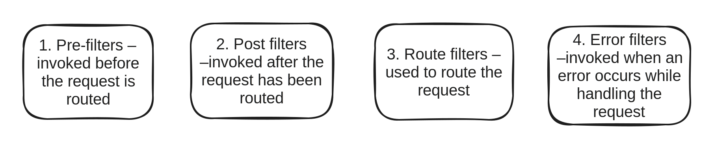

# API Gateway

## Overview

API Gateway provides a unified interface for a set of microservices so that clients do not need to know about all the details of microservices internals.&#x20;

**DIGIT** uses [**Netflix** **ZUUL**](../../core-services/zuul-service.md) as API Gateway. It serves as an edge service that proxies requests to multiple back-end services. It provides a unified “front door” to our ecosystem. This allows any browser, mobile app or any other user interface to consume underlying services.

| Reasons for using ZUUL                                                                                                                                                                                                                                                                                                                                                                                                                                                                                                                                                                                                                                                                                                                                                                                                                                                                                                                                                                                                                              |
| --------------------------------------------------------------------------------------------------------------------------------------------------------------------------------------------------------------------------------------------------------------------------------------------------------------------------------------------------------------------------------------------------------------------------------------------------------------------------------------------------------------------------------------------------------------------------------------------------------------------------------------------------------------------------------------------------------------------------------------------------------------------------------------------------------------------------------------------------------------------------------------------------------------------------------------------------------------------------------------------------------------------------------------------------- |
| 

<ul><li><strong>Easier API interface for clients:</strong> Zuul provides a simplified and standardized interface for clients to interact with microservices, streamlining the process of accessing various functionalities.</li></ul><ul><li><strong>Protection of internal microservices structure:</strong> Zuul acts as a gateway, preventing the exposure of the internal microservices architecture to external clients, enhancing security and maintaining system integrity.</li></ul><ul><li><strong>Facilitates microservices refactoring:</strong> Zuul allows for seamless refactoring of microservices without requiring clients to modify their consuming logic, ensuring flexibility and minimizing disruptions during updates or changes.</li></ul><ul><li><strong>Centralisation of cross-cutting concerns:</strong> Zuul enables the centralization of common functionalities such as security, monitoring, and rate limiting, simplifying management and ensuring consistent implementation across microservices.</li></ul> |

## Zuul Components

Zuul has mainly four types of filters that enable us to intercept the traffic in different timelines of the request processing for any particular transaction. We can add any number of filters for a particular URL pattern.

## Zuul Features

1. Microservice authentication and security
2. Authorization
3. API Routing
4. Open APIs using Whitelisting
5. RBAC filter
6. Logout filter for the finance module
7. Property module tax calculation filter for firecess
8. Request enrichment filter:
   * Addition of co-relation id
   * Addition of authenticated user’s userinfo to requestInfo.
9. Error filter:
   * Error response formatting

Feature enhancements in the latest version -

1. **Validation filter:** to check if a tenant of a particular module is enabled or not.
2. **Multi-tenancy validation filter:** Take the tenant id from the Req body or Query Param and validate against the additional tenant role or primary tenant role.
3. **DevOps efficiency:** API response time logging and sending notifications if it is taking more time.

