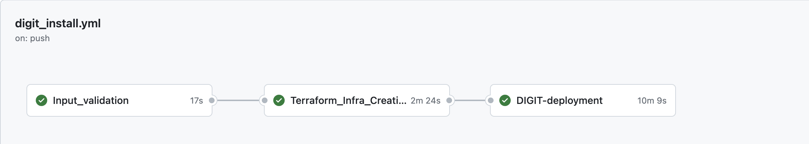
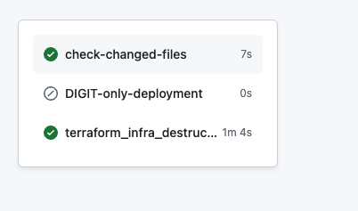

# DIGIT Deployment Using GitHub Actions

## Installation Guide for DIGIT via GitHub Actions in AWS

This guide provides step-by-step instructions for installing DIGIT using GitHub Actions within an AWS environment.

### Prerequisites

* AWS account
* Github account

### Installation Steps:

#### Prepare AWS IAM User

1. Create an IAM User in your AWS account.
2. Generate `ACCESS_KEY` and `SECRET_KEY` for the IAM user.
3. Assign Administrator Access to the IAM user for necessary permissions.

#### Configure GitHub Repository

1. Fork the Repository into your organization account on GitHub.
2.  Navigate to the repository settings, then to Secrets and Variables, and add the following repository secrets:

    * `AWS_ACCESS_KEY_ID: <GENERATED_ACCESS_KEY>`
    * `AWS_SECRET_ACCESS_KEY: <GENERATED_SECRET_KEY>`
    * `AWS_DEFAULT_REGION: ap-south-1`
    * `AWS_REGION: ap-south-1`

    #### Enable GitHub Actions

    1. Open the GitHub Actions workflow file.
    2. Specify the branch name you wish to enable GitHub Actions for.

    #### Configure Infrastructure-as-Code

    1. Navigate to `infra-as-code/terraform/sample-aws`.
    2. Open `input.yaml` and enter details such as `domain_name`, `cluster_name`, `bucket_name`, and `db_name`.

    #### Configure Application Secrets

    1. Navigate to `config-as-code/environments`.
    2. Open `egov-demo-secrets.yaml`.
    3. Enter `db_password` and `ssh_private_key`. Add the `public_key` to your GitHub account.

    #### Generate SSH Key Pair

    Choose one of the following methods to generate an SSH key pair:

    * **Method a:** Use an online website (Note: This is not recommended for production setups, only for demo purposes): `https://8gwifi.org/sshfunctions.jsp`
    *   **Method b:** Use OpenSSL commands:

        ```
        openssl genpkey -algorithm RSA -out private_key.pem
        openssl rsa -pubout -in private_key.pem -out public_key.pem
        ```

#### Finalize Installation

After entering all the details, push these changes to the remote GitHub repository. Open the `Actions` tab in your GitHub account to view the workflow. You should see that the workflow has started, and the pipelines are completing successfully.

<figure><figcaption><p>Github actions workflow that gets created after committing the inputs</p></figcaption></figure>

This indicates that your setup is correctly configured, and your application is ready to be deployed. Monitor the output of the workflow for any errors or success messages to ensure everything is functioning as expected.

### Cleanup and Uninstallation of DIGIT Infrastructure

As you wrap up your work with DIGIT, ensuring a smooth and error-free cleanup of the resources is crucial. Regular monitoring of the GitHub Actions workflow's output is essential during the destruction process. Watch out for any error messages or signs of issues. A successful job completion will be confirmed by a success message in the GitHub Actions window, indicating that the infrastructure has been effectively destroyed.

When you're ready to remove DIGIT and clean up the resources it created, proceed with executing the `terraform_infra_destruction` job. This action is designed to dismantle all setup resources, clearing the environment neatly.

We hope your experience with DIGIT was positive and that this guide makes the uninstallation process straightforward.

#### How to Run the Terraform Infrastructure Destruction Job

To initiate the destruction of a Terraform-managed infrastructure, follow these steps:

1. Navigate to **Actions**.
2. Click **DIGIT-Install workflow**.
3. Select **Run workflow**.
4. When prompted, type **"destroy"**. This action starts the `terraform_infra_destruction` job.

You can observe the progress of the destruction job in the actions window.

**Note:** For DIGIT configurations created using the master branch

<figure><figcaption><p>Destroying the created DIGIT Infrastructure via Terraform</p></figcaption></figure>

If DIGIT is installed from a branch other than the main one, ensure that the branch name is correctly specified in the workflow file. For instance, if the installation is done from the **digit-install** branch, the following snippet should be updated to reflect that.

```github-actions-workflow
name: DIGIT-Install workflow
# Workflow branch creating cluster against the input.yaml file  
on:
  push:
    branches:
      - master
      - digit-install
  workflow_dispatch:
    inputs:
      destroyCommand:
        description: 'Type "destroy" to run the terraform_infra_destruction job.'
        required: true
        default: ''  
```

&#x20;

